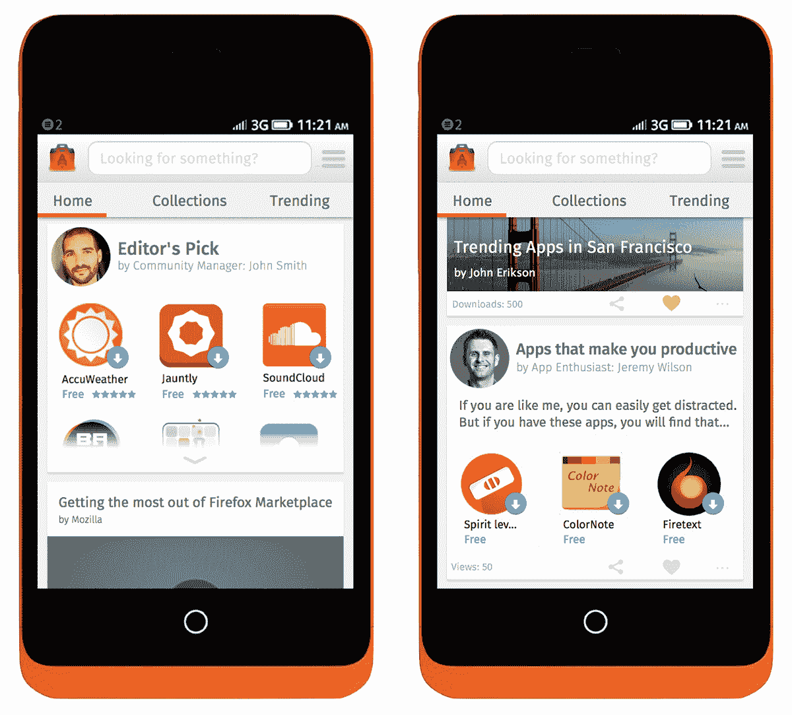

# 苹果、微软和谷歌可以从 Mozilla 的应用商店原型 TechCrunch 中学到一些东西

> 原文：<https://web.archive.org/web/http://techcrunch.com/2013/09/02/apple-microsoft-and-google-could-learn-something-from-mozillas-app-store-prototype/?utm_source=dlvr.it&utm_medium=feed>

# 苹果、微软和谷歌可以从 Mozilla 的应用商店原型中学到一些东西

应用商店都坏了。几乎不可能在成千上万的低质量应用中找到有趣的应用。如果一款应用不在各自类别的前十名，你很可能找不到它。苹果的“天才”功能太蠢了，它在 iOS 7 中被取消了，取而代之的是一个更没意思的“我附近的应用程序”功能，它向你显示你周围的人正在使用的应用程序。微软试图通过在 Windows 8.1 中推出更具策划性的应用商店体验来修复前 10 名近视，但即使在那里，现有的排名仍然发挥着主要作用。

由于火狐操作系统的推出，Mozilla 现在才开始涉足手机游戏，它有优势看到竞争对手在过去几年里的所作所为。虽然当前的 Firefox OS 市场并不完全是革命性的(尽管它对网络应用的关注给了它一个有趣的关于应用商店概念的新旋转)，该组织上周为应用商店原型制定了[计划，对其竞争对手正在做的事情进行了一些有趣的新扭曲。](https://web.archive.org/web/20230130003140/https://blog.mozilla.org/ux/2013/08/firefox-marketplace-in-the-future-customized-app-store-experience/)

Mozilla 认为，在今天的应用商店中，“你只能看到由维护应用商店的人挑选的内容。很难感受到那种个人联系。”即使你想浏览新的应用程序，你也不知道该搜索什么，除非你的朋友告诉你一个应用程序，或者你在某个地方读到过它。

【T2

在其原型中，Firefox OS Marketplace 团队正在使用一种类似新闻源的体验来为个人用户定制应用商店体验。这里的想法是允许用户关注他们感兴趣的内容，而不需要实现复杂的“关注”机制。在原型中，用户只需点击一个小心形图标来表达他们的兴趣，“以查看未来的更新和相关内容。”

然而，从长远来看，Mozilla 预计用户将管理大部分提要。目前还不清楚这种监管流程到底会是什么样子——这也是一些第三方应用商店尝试过的事情——但鉴于社交信号的重要性，迄今为止很少有其他供应商商店尝试过这个概念。当然，Android 的商店会告诉你一个应用程序何时也被你的朋友下载了，但这仍然是一种与从你的朋友那里提供精选列表非常不同的体验。

Mozilla 团队还指出，在其研究中，用户对应用商店的参与度往往会随着时间的推移而下降(我在自己使用应用商店时肯定注意到了这一点)。使用它们没什么乐趣。Mozilla 认为拥有“异想天开”的微型副本和动画将有助于它留住用户，但在很大程度上，我认为它让用户“不断发现商店中的各种内容，包括应用程序、收藏、文章、评论、视频等”的想法可能是这里的制胜概念。