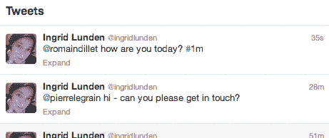

# 有了 Twitterspirit，Twitter 有了自己的 Snapchat:一个消失的 Tweet Hack，由一位前 Twitter 工程师 TechCrunch 提供

> 原文：<https://web.archive.org/web/http://techcrunch.com/2013/09/02/with-twitterspirit-twitter-gets-its-own-snapchat-a-disappearing-tweet-hack-courtesy-of-an-ex-twitter-engineer/>

[Twitter](https://web.archive.org/web/20230129085127/http://www.twitter.com/) 正在努力从其庞大的用户内容宝库中获得更多价值——例如，新的[“蓝线”对话线程](https://web.archive.org/web/20230129085127/https://techcrunch.com/2013/08/28/twitter-reverses-the-flow-of-its-timeline-in-effort-to-humanize-it-for-newbies/)是一种让旧对话重新浮出水面的方式——所以我不知道它对此会有什么感觉:一位名叫 Pierre Legrain 的开发人员，曾经是群体中的[成员，已经提出了](https://web.archive.org/web/20230129085127/http://www.linkedin.com/in/pierrelegrain) [Twitterspirit](https://web.archive.org/web/20230129085127/http://twitterspirit.com/) ，这是一种让用户通过简单的标签为他们的推文设置到期时间的服务。你可以把它想象成 Twitter 的 Snapchat，拥有自己鲜明的形象(对于 Snapchat 的可爱幽灵，用一种同样难以确定的精神来代替)。

在我们的数据似乎正从我们的直接控制中滑出的时候，Snapchat 为消费者提供了一种互相发送消息的方式，这些消息在一段时间后会消失。当然，Twitter 已经允许用户删除推文。Twitterspirit 的不同之处在于，它让用户可以更多地控制他们希望自己的推文持续多长时间——你可以设置为#1m、#6h 或#2y，然后继续你的生活。

噗！

在此之前，其他服务也使用标签来触发推文的消失，特别是 [Efemr](https://web.archive.org/web/20230129085127/https://www.efemr.com/) ，它也使用缩写数字/字母来倒计时。当我问及这两种服务的不同之处时，勒格兰没有对 Efemr 发表评论，但他确实表示，从总体上来说，“从长远来看，我对‘隐形软件’(不下载、不安装、不接口)以及为推文添加额外的定制功能感到兴奋。”

这是一个有趣的小技巧，但是当你仔细想想，这里有一些更严重的含义。

在我看来，这是一个缺点:如果 Twitter 的部分商业模式是基于用户输入的数据——例如，将它作为品牌情绪分析的一种手段，或者让品牌证明他们的促销活动在 Twitter 上传播得有多好——那么鼓励人们删除他们所发推文的服务就与此背道而驰。

考虑到 Twitterspirit 创建者的背景，这也有点厚脸皮。根据他在 LinkedIn 上的简介，勒格兰在 Twitter 的时候是一名产品营销经理，负责监管收入。在 2010 年 6 月至 2011 年 4 月期间，他在那里“发布了推广的推文，推广了趋势，推广了账户和分析”，他说他“还构思、设计、编写和开发了 http://business.twitter.com。”

他过去的其他经历包括在广告巨头 WPP 工作的时间。

至于好处，首先，信息可能会在短暂的服务中消失，但这并不意味着金钱会消失。当 Snapchat 以 8 亿美元的估值为其服务筹集到 8000 万美元时，其联合创始人告诉我们，[广告和应用内购买](https://web.archive.org/web/20230129085127/https://techcrunch.com/2013/06/24/snapchats-first-monetization-move-will-be-in-app-purchases/)将是其赚钱的两个关键途径。为 Twitter 提供一个类似的调整也可以被品牌用来达到他们自己的目的。

勒格兰自己称 Twitterspirit 是一个“副业”。

“动力是学习 Python、PostgreSQL、Redis 和 Twitter 的 API，”他在一封电子邮件中告诉我。他同时在做一些完全不相关的事情。他指出，自推出以来，他已经开发了该服务的其他几个应用程序:在签到和其他基于位置的推文中添加 Spirit 标签。举个例子，你只在那家餐馆呆一个小时。另一个与天气有关。将这些标签放入推文中可以帮助气象学家掌握天气模式的发展，确保不再准确的推文传播开来。

看看 Twitterspirit 在 Twitter 上如何受到用户的欢迎，以及它是否会被允许留下来，或者它是否会像它帮助你标记的那些带标签和定时信息一样，消失在空气中，这将是一件有趣的事情。