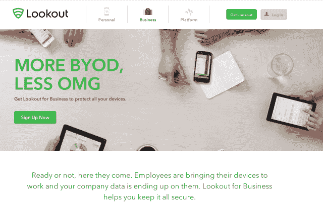

# 借助新的 Business Suite 和三星合作伙伴关系，移动安全公司 Lookout 准备与企业 TechCrunch 展开较量

> 原文：<https://web.archive.org/web/https://techcrunch.com/2013/09/03/mobile-security-company-lookout-prepares-to-take-on-the-enterprise/>

以前专注于消费者保护和反恶意软件服务的移动安全公司 Lookout ，今天采取措施进一步扩大其业务范围，推出了一款新的独立企业产品。今年晚些时候推出的 Lookout for Business 旨在让大型组织能够保护连接到网络的移动设备，例如通过 BYOD(自带设备)计划到达的员工拥有的智能手机和平板电脑。

对于那些不熟悉的人来说，Lookout 的 Android(包括 Kindle)和 iOS 设备移动安全应用程序历来有助于识别和阻止消费者手机和平板电脑上的威胁，包括阻止和警告移动恶意软件、网络钓鱼企图、恶意网站和试图获取过多用户个人信息的应用程序。该公司还提供移动备份解决方案，以及自己对苹果公司“查找我的 iPhone”的理解，这项服务可以跟踪并远程擦除丢失或被盗的移动设备。

 对于如今旗舰产品拥有 4500 万用户的 Lookout 来说，现在将更多注意力转向商业世界是有意义的，因为随着消费设备成为员工的手机和平板电脑，消费者和企业之间的界限正在变得模糊。在这里，Lookout for Business platform 将允许 it 部门增强其现有的 MDM(移动设备管理)计划，以抵御间谍软件、恶意软件、网络钓鱼攻击等移动威胁，以及即将到来的新威胁。

## Lookout 的消费者第一战略是企业的一种手段

Lookout 选择了一条与众不同的进入移动安全企业市场的道路，首先开发了一种消费者可以自行采用的产品。当该公司在 2007 年成立时，它的重点是 Windows Mobile(不，不是 Windows Phone！)安全解决方案。但当 iPhone 和 Android 后来出现时，Lookout 意识到它已经走到了一个岔路口。

据 Lookout 首席技术官凯文·马哈菲(Kevin Mahaffey)称，尽管专注于商业似乎是显而易见的下一步，但 Lookout 选择首先解决消费者市场。“这有点奇怪——至少从外面看是这样。他解释道:“我们对信息技术工作方式的转变下了赌注。

换句话说，Lookout 押注于现在通常被称为“it 消费化”的趋势。it 部门将不再能够像曾经锁定 PC 那样锁定员工的设备，尽管第一代 MDM 公司可能肯定已经尝试过。这是组织中一个显著的权力转移，在此之前，it 决定政策。现在，首席执行官们告诉 it 人员:“嗯，我在用我的 iPhone。搞清楚。”(是的，从[个人的](https://web.archive.org/web/20221201224717/http://www.linkedin.com/in/sarahintampa)经历上讲的那一个。)

但是，如果员工带着自己的设备去上班，他们要么会发现自己的私人数据和设备在信息技术部门的手中，因为他们已经提交了保护个人手机的申请，要么就会带着两部手机。两种解决方案都不理想。

这是了望的机会。它的第一个目标是建立一个消费者会自己采用的服务，然后用它来穿梭于商业世界。部分归功于 Android 的*先发布，后提问* app marketplace(这个市场[就在上个月](https://web.archive.org/web/20221201224717/http://thenextweb.com/google/2013/08/23/google-updates-play-policies-to-ban-apps-and-ads-modifying-devices-require-games-use-its-in-app-billing-service/)才获得了最基本的保护，禁止应用程序在未经用户同意的情况下做出改变！)，很快就很容易说服消费者，智能手机设备也需要保护。

据 Mahaffey 称，大约一年半前，该公司的消费者第一战略开始见效。他说，它开始收到希望批量购买许可证的企业的入站请求，到目前为止，他们已经收到了“数千个入站请求”。此外，该公司声称，超过一半的财富 1000 强已经有员工在他们的工作设备上使用 Lookout。

## Lookout 与传统反恶意软件服务有何不同

虽然该公司尚未讨论 Lookout for Business 产品的具体功能集，但显然会与 Lookout 已经开发的技术有很多重叠。例如，该公司提供远程擦除和丢失设备定位服务(正如许多 MDM 一样)，但它也开发了一种不同的策略来对抗移动恶意软件和威胁。

传统的个人电脑反病毒供应商通过下载病毒定义文件来使用基于签名的保护。Mahaffey 解释说，Lookout 在为移动设备构建时不想使用相同的方法，因为移动设备变化太快了。事实证明，解决方案是为世界上的每一个应用程序(每一个二进制文件)建立一个数据集。今天，Lookout 使用这些数据开发自己的匹配技术，可以识别已知与恶意软件相关或甚至类似的坏代码块。它也能更早地发现它。

“例如，如果一个企业的网络上有一个应用程序不匹配任何签名，但也没有做任何坏事，大多数反病毒软件会说没问题，”Mahaffey 说。“但我们的后端系统可以告诉我们，它有一个指纹，类似于在中国编写恶意软件的人，而且这个应用程序在世界上其他地方都没有。”然后，it 部门可以标记并屏蔽该应用，甚至在它开始罢工之前。

当然，Lookout 比其他人晚到达企业是冒了风险的。它将面临业内各种移动安全产品的激烈竞争，包括赛门铁克、趋势科技、迈克菲等传统公司的反恶意软件产品。以及 IBM、MobileIron、Air-Watch 和其他 MDM 制造商等更大的老牌公司。但 Lookout 现在的赌注是，企业将寻求移动设备的最佳产品(它认为是这样)，或者企业将在已经包括现有 MDM 系统的阵容中看到适合 Lookout 的空间。

但公司进入企业的秘密实际上可能是后门:员工。就像任何好的“it 消费化”产品一样，这场战斗首先是为了争夺消费者的心智份额，而不是为了争夺 it 预算的空间。寻找商业产品可能会有一些功能，将有助于打开或关闭这些消费设备，使设备的各个方面处于信息技术的管理之下。(当然还是在尊重用户隐私的同时，以免出现反弹。)

在公开推出 Lookout for Business 之前，该公司表示，它还与三星建立了合作关系，将在所有新的三星 KNOX T1 设备上预装其服务，这是三星为企业提供的安全设备。在 KNOX 上，Lookout 将提供实时的基于云的扫描，以防止恶意软件、基于网络的威胁和隐私泄露。如果[的安卓是新的 Windows](https://web.archive.org/web/20221201224717/https://beta.techcrunch.com/2013/07/30/android-is-the-new-windows/) ，而三星是领先的 OEM 厂商，那么这是 Lookout 手头上的一个好伙伴。

Lookout for Business 在 Lookout 网站上悄悄地推出了一个页面，详细介绍了其在这一领域即将推出的产品路线图，目前正处于私人测试阶段。该公司将在年底前提供更多的产品细节和价格。