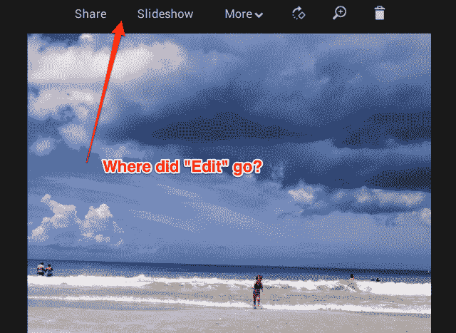

# Google+照片编辑器已经关闭好几天了，还没有修复的预计时间

> 原文：<https://web.archive.org/web/http://techcrunch.com/2013/09/04/the-google-photo-editor-has-been-down-for-days-no-eta-for-a-fix/>

Google+用户想知道该服务的照片编辑器发生了什么，它已经关闭了几天。具体来说，用户以前可以访问他们在 Google+网站上分享的照片上的“编辑”按钮，以执行编辑功能，如裁剪、添加效果、文本或装饰照片等。

这个按钮曾经出现在 Google+ Photos 的“分享”选项旁边，一直保留到今天。照片页面顶部的“更多”菜单下还有更高级的“自动增强”和“高亮”功能。此外，用户可以通过菜单上的按钮旋转、缩放和删除照片。

Chromebook 和 Chromebox 用户(运行谷歌 Chrome OS 的电脑)在他们的特殊[谷歌+照片应用](https://web.archive.org/web/20230328031050/https://chrome.google.com/webstore/detail/google%2B-photos/efjnaogkjbogokcnohkmnjdojkikgobo)上没有“编辑”功能，这使得访问当前缺失功能的选项有限。现在，编辑照片只能在手机应用程序上运行，而且只能通过旧版的 Picasa 桌面软件程序。

根据 TechCrunch 读者的各种报道和提示，“编辑”按钮似乎在美国劳动节周末消失了，这可能会让试图在 Google+服务上调整和分享假期照片的用户感到沮丧。中断似乎并不局限于美国或任何特定地区。

昨天晚上，Google+的“帮助”账户回应了一位用户关于这个问题的[关注帖子](https://web.archive.org/web/20230328031050/https://plus.google.com/u/0/108059114686877527512/posts/iWXrHc29mfF)，称:“*我们知道这个问题，目前正在调查，*”但拒绝提供更多细节，说明是什么导致了这个问题，或者他们什么时候会得到解决。然而，一个更长的帖子[没有看到来自谷歌的官方评论。](https://web.archive.org/web/20230328031050/https://plus.google.com/u/0/114671987025117237215/posts/LpA8fun5GSw)

解决这个问题的延迟可能是由于假期，因为包括谷歌员工在内的许多美国员工在周末和周一都休假。这意味着，在其他努力的追赶中，这个问题可能只进行了一天。尽管如此，人们不得不怀疑是哪个周末战士发布了破坏这个东西的代码，而不是像我们其他人一样烧烤。

我们已经询问谷歌是否可以提供更多关于正在进行的中断的细节，如果我们得到回复，将会更新。

谷歌回应了以下声明，但没有其他信息或修复的预计时间:

*我们收到了关于桌面照片编辑工具的报告，其中的编辑按钮可能不可用。我们的团队已经意识到这个问题，我们正在努力尽快恢复这一功能。Android 和 iOS 的 Google+应用程序仍然提供丰富的照片编辑功能。*

**更新，2013 年 9 月 6 日:谷歌+照片编辑功能似乎在美国东部时间早上 4:30 左右或之后恢复了。**