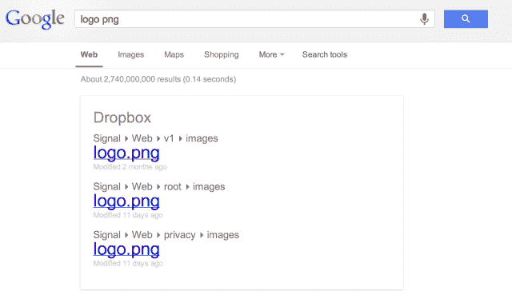
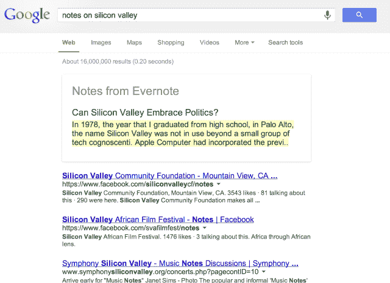

# Context 让你可以在 Dropbox、Evernote、Spotify 等网站上搜索，所有这些都来自 Google.com TechCrunch

> 原文：<https://web.archive.org/web/https://techcrunch.com/2013/09/08/context-lets-you-search-across-dropbox-evernote-spotify-more-all-from-google-com/>

# 通过 Context，你可以在 Dropbox、Evernote、Spotify 以及更多来自 Google.com 的网站上进行搜索

一段时间以来，谷歌一直在尝试通过其[搜索“现场试验”](https://web.archive.org/web/20230129223121/https://www.google.com/experimental/gmailfieldtrial/)使用个人数据来增加搜索结果，但这仅限于存储在谷歌自己的服务中的数据。大多数用户也将他们的数据存储在其他地方。在今天的 TechCrunch Disrupt SF 2013 黑客马拉松上，一个名为“Context”的浏览器插件旨在使用 Evernote、Dropbox、Spotify 和 Trakt 的 API 添加更多个性化搜索选项，后者用于搜索关于你最喜欢的电影和电视节目的信息。

Chrome 浏览器扩展是由 Salesforce 实习生 Kartik Talwar 和 Y Combinator 支持的初创公司 [Flutter](https://web.archive.org/web/20230129223121/http://www.crunchbase.com/company/flutter-io) 的设计师 Seungho Yang 创建的，Kartik tal war 在湾区工作了八个月，现在正返回滑铁卢大学。该团队似乎对实用工具情有独钟，最近他们为一个名为 [TrySignal](https://web.archive.org/web/20230129223121/http://www.trysignal.com/) 的 Gmail 收件箱组织者赢得了 Angelhack 硅谷黑客马拉松。

有了上下文，扩展拦截谷歌搜索结果，寻找特定的触发器。除了上面列出的服务，Context 还可以访问 Google Contacts。例如，您可以输入朋友的姓名，然后输入单词“电子邮件”、“号码”或“地址”，让这些信息立即出现在 Google.com 搜索结果的顶部。但是挖掘你的地址簿是谷歌已经可以做的事情，这就是为什么与 Dropbox、Evernote 和其他服务的集成可能更有趣，也更实用。

要触发对 Evernote 笔记的搜索，您需要在笔记的标题中输入关键字以及单词“notes”对于 Dropbox 来说，这是一个将关键字和文件扩展名结合起来的问题(例如，“简历 pdf”)。Context 还可以调出 Spotify 预览，可以告诉你你最喜欢的节目今晚是否在电视上播放，等等。该团队只有 10 个小时来处理上下文，所以它还没有发布到 Google Chrome 商店。但他们计划在未来几周内发布扩展——Kartik([@ there alkartik](https://web.archive.org/web/20230129223121/http://www.twitter.com/therealkartik))表示，当 Context 准备好推出时，他会发推特。

有一些搜索个人数据的服务，例如包括 CloudMagic、FindIt 和 Younity，这表明人们对这种个性化搜索空间有些兴趣。当然，Google Now 是另一个备受瞩目的例子。但是，假设环境使它启动，这里的好处将是，它是一种设置，然后忘记它的东西。安装后，你基本上可以回到你通常的搜索行为，但会得到更好的结果。