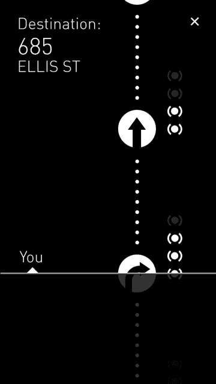

# Kovert 是一个全球定位系统，可以让你把手机放在口袋里，以挫败潜在的抢劫者 TechCrunch

> 原文：<https://web.archive.org/web/http://techcrunch.com/2013/09/08/kovert-is-a-gps-that-lets-you-keep-your-phone-in-your-pocket-to-foil-would-be-muggers/>

# Kovert 是一个全球定位系统，让你把手机放在口袋里，以挫败潜在的抢劫犯

当走过一个你不太熟悉的街区时，把手机拿出来并不总是一个好主意。Disrupt Hackathon 参赛者 Kovert 是一款应用程序，可以让你将手机藏在看不见的地方，同时通过蜂鸣信号为你提供行走方向。

正如制作人斯科特·琼斯和安德鲁·阿斯克尔在台上指出的那样，手里拿着一个 GPS 应用程序说明了几件事:我不知道我在哪里，我有钱和昂贵的电子产品。

“我们在街尾的酒吧试图想出主意，”琼斯说。“这实际上是因为我们为 Disrupt 住的旅馆在田德隆区(T1)。”

Kovert 超级简单。输入你的终点地址，当你到达十字路口时，你的手机会发出蜂鸣声来指引你:一次左转，两次直行，三次右转，十次到达目的地。你所要做的就是记住哪个蜂鸣器代表什么(但是让我们现实一点，这比莫尔斯电码简单多了。)如果你错过了目标，科弗特会把你绕回来。

Jones 和 Askedall 目前正在为另一款名为 Kronicle 的应用筹集种子资金，他们表示，他们希望开发一款包含指南针计算功能的 Kovert，当你指向正确的方向时，它会振动。

这款应用不仅适用于试图找到去仓库派对的路的潮人，也有可能成为视力受损者的工具。无论哪种方式，这肯定是一个有用的应用程序。但不是在手里的*。*