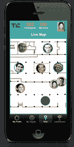

# 塔吉特是活动中商业网络的“掠夺者地图”

> 原文：<https://web.archive.org/web/https://techcrunch.com/2013/09/08/targit-is-a-marauders-map-for-business-networking-at-events/>

# 塔吉特是活动中商业网络的“活点地图”

你是否曾希望自己有一张像《哈利·波特》中的活点地图一样的东西，用于活动中的商务网络？这是今天在 TechCrunch Disrupt SF 2013 黑客马拉松上出现的名为 TARGiT 的应用程序的承诺。该应用最初是为 iOS 设计的，将使用 [NewAer](https://web.archive.org/web/20221005144008/https://www.newaer.com/developers) 平台，使用智能手机无线电信号而不是耗电的 GPS 来实时定位活动参与者，然后在地图上将参与者绘制为移动的化身。与此同时，该应用的用户可以搜索他们感兴趣的技能组合，并通过 LinkedIn 与他们联系……或者，你知道，就在活动现场跟踪他们。

 塔吉特是由来自悉尼的 Theresa Lim 和来自墨西哥蒙特雷的 Carlos Mosqueda 建造的。两人第一次见面是在旧金山的黑客马拉松上。Lim 白天是一名管理顾问，他的观众互动投票服务 [Play2Lead](https://web.archive.org/web/20221005144008/http://www.play2lead.com.au/ "Play2Lead") 在今年早些时候的悉尼 Angelhack 黑客马拉松中获得第二名。Mosqueda 目前是处于原型阶段的智能水传感器 Driblet 的联合创始人，该传感器也在今天的黑客马拉松上展示。

Lim 解释说，TARGiT 实际上是作为 Play2Lead 之上的一层工作，play 2 lead 是一种融入社交媒体的服务，可以实现观众投票和参与活动。移动应用程序可以是这个整体平台的一个附加方面，它也可以在活动主办方使用之前选择性地贴上白色标签。

鼓励用户通过 LinkedIn 登录，以便在应用程序中获得更多积分。然后，他们可以配置他们在活动中搜索的技能类型，地图将根据输入内容立即更新，删除那些不符合所需资格的人的头像。例如，一个设计师可以指定他们想要与其他设计师联网，地图会改变以显示这些人现在在哪里，以及他们要去哪里。对于在给定时间段内不想联网的事件用户，他们可以“隐藏”自己，从地图上删除他们的头像。

TARGiT 包括许多游戏化元素，包括排行榜和积分，如添加社交媒体档案或“偶遇”其他参与者(根据接近程度确定)。用户还可以看到一个名为“我的同伴”的列表，其中显示了其他以同样方式和同样效率进行社交的活动参与者。

Lim 认为 TARGiT 类似于约会应用 Tinder。该应用程序本身仍处于设计阶段，但计划在 10 月份之前将 TARGiT 发布到苹果的应用商店。

【YouTube http://www.youtube.com/watch?v = lso ghl 2 teil？feature=player_detailpage]