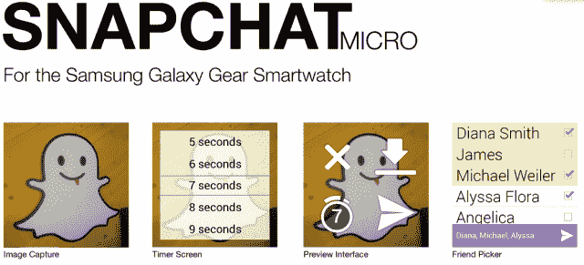
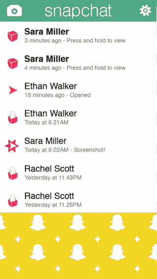

# Snapchat 的前景如何？首席执行官埃文·斯皮格尔在 Disrupt Talk TechCrunch 上透露线索

> 原文：<https://web.archive.org/web/https://techcrunch.com/2013/09/09/snapchat-future-disrupt-hints/>

Snapchat 联合创始人兼首席执行官[埃文·斯皮格尔](https://web.archive.org/web/20221005225214/https://twitter.com/evanspiegel)今天在 TechCrunch Disrupt 上发表演讲，透露了一些关于 Snapchat 未来产品的暗示，从可穿戴技术到社交媒体。

特别有趣的是 Snapchat 作为一个产品有多成功(Spiegel 今天宣布[用户每天在 Snapchat 上发送 3.5 亿张照片](https://web.archive.org/web/20221005225214/https://beta.techcrunch.com/2013/09/09/snapchat-now-sees-350m-photos-shared-daily-up-from-200m-in-june/)，在不到一年的时间里每天的照片增加了 1750%)，而 Snapchat 公司实际上仍处于第一阶段。

### 衣服

Spiegel 指出，Snapchat 对可穿戴技术很感兴趣，这是“我们将继续在各种产品中探索的东西。”

他说，该公司目前没有在为谷歌眼镜开发应用程序，甚至没有考虑过。斯皮格尔告诉我们自己的乔丹·克鲁克，他认为谷歌眼镜是“侵入性的”，有时感觉像“一把枪指着你。”

这对公司来说是一个有趣的矛盾。Snapchat 一直致力于实时捕捉并与朋友分享精彩瞬间。据推测，没有比谷歌眼镜更好的工具来捕捉和分享你所看到的一切。但与此同时，该应用程序一直与隐私和亲密时刻有关。在舞台上，斯皮格尔建议在玻璃上安装一盏录音灯，这样人们就能知道他们在被录音。

该公司已经[发布了用于三星 Galaxy Gear 智能手表的应用 Snapchat Micro](https://web.archive.org/web/20221005225214/https://beta.techcrunch.com/2013/09/09/snapchat-releases-snapchat-micro-an-app-for-the-galaxy-gear-smartwatch/) 。

斯皮格尔说:“我们服务的一个关键部分是减少看到你真正想分享的东西和能够分享之间的时间。”“我们真的发现玩手表的原型真的很有趣，而且很容易在手表上抓住它……非常高兴的是，那是两秒钟而不是七秒钟。”

对于 Snapchat 来说，速度是巨大的。这家[公司拥有](https://web.archive.org/web/20221005225214/https://beta.techcrunch.com/2013/06/21/snapchat-has-a-patent-that-could-help-it-become-the-defacto-camera-app/)、[、](https://web.archive.org/web/20221005225214/https://beta.techcrunch.com/?p=836722&preview=true)“单模式视觉媒体捕捉”的技术专利，用户可以通过点击相机按钮来拍照，也可以通过按住同一个相机按钮来拍摄视频。这项技术和应用程序总是直接打开记录屏幕，让用户可以非常快速地捕捉瞬间。

### 数字二元论

Spiegel 谈到了他认为迄今为止太多的技术已经将数字和模拟世界分开，以及 Snapchat 如何更好地弥合现实世界和数字世界。

“事实证明，视频聊天有点蹩脚，因为当你真正可以利用数字世界的所有这些伟大方面时，连接中断了，”斯皮格尔说。“就像 Snapchat 一样，你不需要设定和某人交谈的时间，也不需要说再见。因此，我们看到了这样一个未来，人们会认识到数字和模拟的混合，并欣赏和理解它们相互影响。产品将按照这种思路生产。”

虽然 Spiegel 用视频聊天作为现实世界和技术之间差距的例子，但它肯定会是 Snapchat 进入的一个有趣的空间。

### 快照:一个非永久性的饲料

Spiegel 说:“关于一个 feed 有趣的事情是，你消费的内容越多，你看的照片和视频越多，你和你的朋友在时间上就越远……这不会让你感觉很好，”他谈到了大多数社交 feed 的年表。“我们真的花了很多时间来考虑提要。”

Snapchat 目前没有订阅源，仅仅依靠收件箱中的照片。该应用程序有一个好友功能，该公司最近将好友数量从 3 个增加到 5 个，这是一个对时间非常敏感的功能，取决于你最近给谁发了消息。

Snapchat 订阅源会是什么样子？这必须是一种让事情与 Snapchat 的核心任务真正相似的方式:实时分享非永久性内容。

一个真正简单的方法是想象一下你的 Instagram feed，如果所有照片都必须在拍摄后立即上传，如果一张照片在一个小时后过期(或其他一些小的时间增量)。用户可以喜欢和/或评论照片和视频，所有内容，包括喜欢和评论，在一段时间后到期。评论可以仅限于照片或视频回复，以保持 Snapchat 风格的视觉交互。

人们已经发送了大量的“团体”照片，向十几个或更多的联系人发送相同的照片，但该公司尚未发布任何允许人们在集体团体环境中与内容互动的功能。

“我认为总的来说，我们正在走向一个与传统社交媒体完全不同的方向，所以我不确定我们是否将他们视为直接竞争对手，”Spiegel 说。“我认为，如果有什么，我们希望确保人们仍然有那些空间来创建和保存真正漂亮的照片或他们真正自豪的东西。我想支持那些喜欢这样做的公司的发展。”

如果 Spiegel 看起来过于自信，那可能是因为 Snapchat [已经击败了脸书的克隆应用](https://web.archive.org/web/20221005225214/https://beta.techcrunch.com/2013/03/08/facebook-snapchat/)[【Poke】](https://web.archive.org/web/20221005225214/https://beta.techcrunch.com/2012/12/28/data-shows-online-buzz-about-snapchat-is-skyrocketing-after-the-launch-of-facebook-poke/)，并引起了首席执行官马克·扎克伯格的注意。虽然 Spiegel 说该公司“没有收到正式的收购要约”，但他确实提到他“与马克谈过几次”

### 回到起点

克鲁克就该公司正面临的来自所谓的联合创始人雷吉·布朗(Reggie Brown)的诉讼向斯皮格尔施压，特别是关于斯皮格尔发给布朗(Brown)的一条[短信，该短信称赞他的](https://web.archive.org/web/20221005225214/https://beta.techcrunch.com/2013/07/01/new-snapchat-docs/)提出了非永久性信息的想法。

“我感到很幸运，雷吉[布朗]与我分享了这一愿望，”斯皮格尔说。评论很简短，Spiegel 很好地将讨论引回到 Snapchat 产品上，但这是布朗早期参与的重要公开承认。

斯皮格尔继续解释说，当 Snapchat 处于早期阶段时，他看到了很多专注于分享秘密的竞争对手。

“我们真的认为这是一个围绕自我表达做些事情的机会，”斯皮格尔说。

随着公司的发展，这种无常和自我表达的结合可以应用于任何事情，尤其是消费品。显然，我想到了社交媒体，因为 Spiegel 在舞台上提到了它。但这位年轻的首席执行官非常老练，可能会将下一次产品发布会保密，更喜欢讨论理论产品或更广泛的领域。

这就是为什么我们听到的关于 Snapchat 电子邮件的传言最让我感兴趣。当克鲁克在舞台上问他关于“快照电子邮件”的问题时，斯皮格尔以视频聊天为例，将话题引向了更广泛的数字二元论。

Snap Email 对我来说是很有意义的个人邮件地址。通过帮助我们更好地管理我们的收件箱，Mailbox 在让我们的电子邮件收件箱不那么麻烦方面做得很好。Twitter Direct Messages 降低了发送电子邮件的门槛，将我们限制在 140 个字符以内。脸书信息促使我们在阅读完信息后，通过向收件人展示来立即回复。

我们听说 Mailbox 的联合创始人 Gentry Underwood 对非永久性电子邮件的想法非常感兴趣，但不知道 Mailbox 团队是否有时间去做这件事。有什么公司比 Snapchat 更适合处理非永久性电子邮件呢？

Snap Email 可以在你打开它后的一段时间内自动删除，迫使你立即回复邮件。这对于大多数工作邮件账户来说显然是一场灾难(嘿，约翰，你拿到季度财务报告了吗？它不见了。)，但可能是个人电子邮件的一个很好的选择，尤其是对许多大学和 20 出头的 Snapchat 核心用户来说。