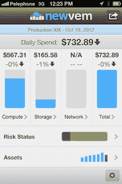

# Datapipe 收购 Newvem，这是一项用于监控 AWS TechCrunch 的分析服务

> 原文：<https://web.archive.org/web/https://techcrunch.com/2013/09/10/datapipe-acquires-newvem-an-analytics-service-for-monitoring-aws/?utm_source=dlvr.it&utm_medium=linkedin>

# Datapipe 收购了用于监控 AWS 的分析服务 Newvem

[Datapipe，](//web.archive.org/web/20230129220313/https://datapipe.com/)一家托管服务提供商，已经收购了 [Newvem](https://web.archive.org/web/20230129220313/http://newvem.com/) ，一家为 AWS 客户提供热图和其他形式分析的公司。交易条款没有披露。

Newvem 提供的服务通过为客户提供一个平台来管理他们在云服务上的工作负载，从而简化了 AWS 和其他云服务的使用。该服务旨在取代 AWS 提供的工具，为客户提供跟踪电子表格的替代方法。相反，客户可以在一个视图中全面了解他们的使用情况。

Newvem 现在将完全集成到 Datapipe 中，以便客户获得实时分析。这两家公司在过去的几个月里一直是合作伙伴。

Datapipe 在其 15 年的历史中已经收购了两家公司，但现在这种情况可能会改变，因为云服务是该公司业务增长最快的方面。

“这是一个从 M&A 的角度出发的机会，”Datapipe 云服务高级副总裁 Ed Laczynski 说。

他说，机会在于购买提供单点功能的服务。安全性、数据库即服务(DbaaS)、流程编排和开发运维工具是重点关注的领域。

Datapipe 与 Rackspace 和 Savvis 等公司竞争。Newvem 与 [Cloudability](https://web.archive.org/web/20230129220313/http://cloudability.com/) 等公司相比，后者也在帮助客户可视化他们的云支出。