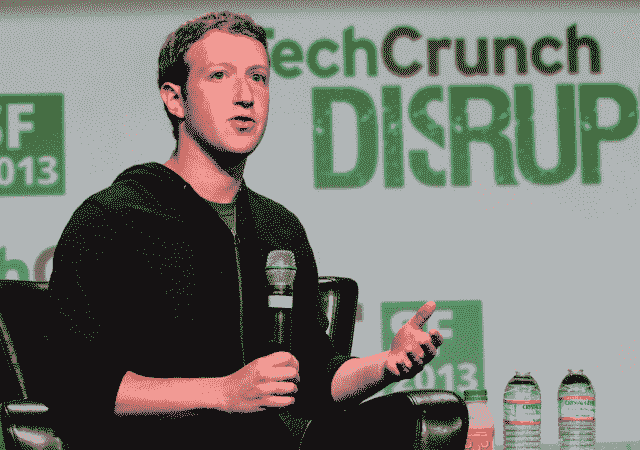

# 扎克伯格的天定命运:在没有互联网的情况下连接 50 亿人

> 原文：<https://web.archive.org/web/https://techcrunch.com/2013/09/11/everybody-wants-to-be-connected-thats-why-were-here/>

当脸书达到 10 亿用户时，它并没有停止。即使它将每个人与网络连接起来，它也不会停止。“让世界更加开放和互联”实际上意味着*世界*——每个人，无论其位置或收入如何。这就是为什么首席执行官马克·扎克伯格说他正在“重组公司，以应对许多更困难的问题”——特别是传播互联网本身。

上个月，扎克伯格用他自己写的 10 页白皮书启动了 Internet.org[。这是一个网络接入项目，与六家电信和移动公司合作。他们将共同构建新的数据压缩技术、网络基础设施和商业模式，不仅让每个人都拥有智能手机成为可能，还能让支持他们的数据变得经济实惠。这一点至关重要，因为拥有智能手机的大部分成本是数据，而不是硬件。](https://web.archive.org/web/20230404120525/https://techcrunch.com/2013/08/20/facebook-internet-org/)

有些人会说这只是脸书获得更多用户的阴谋，但从本质上来说，这个任务是真正无私的。互联网接入带来教育、赋权和经济流动性。它所到之处都增加了 GDP，帮助人们与他们所爱的人保持更密切的联系。它能为脸书挣钱吗？当然可以。但这并不构成驾驶动机。

尽管扎克伯格支持这项事业，但这不仅仅是他的某种爱好。这是脸书的新任务。但实际上，这是社交网络自 2004 年以来所做工作的延伸。

马克·扎克伯格在台上说，“战术一直在变”，但任务不会变。你可以在下面观看完整的采访

这位仍然年轻的首席执行官讨论了企业如何分成两类。“有些公司通过做事的方式来定义自己，有些公司通过改变世界的具体方式来定义自己。”后者对他来说更好。这就是为什么扎克伯格从小就崇拜比尔·盖茨和他的使命，让“每张桌子和每个家庭都有一台电脑。”

创建一个重要的使命需要做一些大胆的事情，而让你实现目标的价值观并不总是普遍受欢迎的。“我相信价值观只有在有争议的时候才有用，”扎克伯格说。他指责公司张贴像“诚实”这样空洞的价值观清单，说你当然必须诚实。

脸书有争议的价值观是[“快速行动，打破常规](https://web.archive.org/web/20230404120525/https://techcrunch.com/2012/02/01/facebook-ipo-letter/)”员工被鼓励去构建、实验和迭代新产品，而不是坐在那里直到它们变得完美。扎克伯格笑了。“这会给我们带来很多麻烦，”他承认“放慢脚步，解决你的问题”仍然很重要。但这种理念帮助脸书快速发展，避免被打乱。

这也让脸书拥有了 10 亿活跃用户。但是扎克伯格说“10 亿不是一个神奇的数字。没有人醒来后会说‘我想让世界上七分之一的人做点什么。’"

然而，出于谦逊，当迈克尔·阿灵顿问扎克伯格是否希望脸书的所有人都加入时，他说“我们当然希望，但我认为这不现实。”总会有人不喜欢某个特定的工具。你不用在网上找太多讨厌脸书的人，但是我们很乐意分享。无论是通过短信、电子邮件、Twitter，还是自己的社交网络，Internet.org 和脸书的任务是给人们提供接入，让他们选择如何沟通。

扎克伯格总结道，所有人都希望相互联系。扎克伯格眼中闪烁着他自己和他的公司在这个星球上的目的，他喊道:“这就是我们在这里的原因。”

*【图片来自安东·巴拉日/Shutterstock.com】*