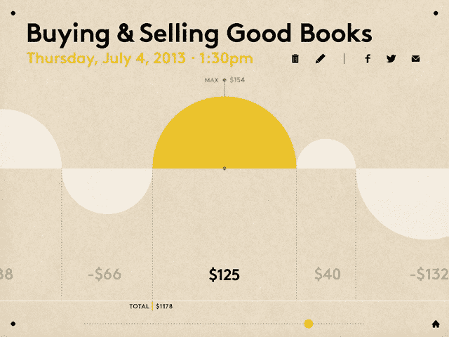
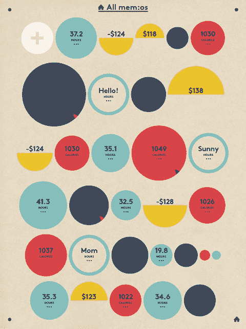
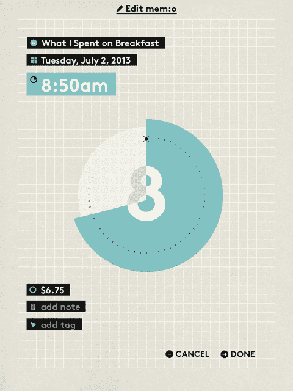

# iPad 应用 mem:o 是设计爱好者的简单数据可视化工具 TechCrunch

> 原文：<https://web.archive.org/web/http://techcrunch.com/2013/09/12/ipad-app-memo-is-a-simple-data-visualization-tool-for-design-lovers/>

技术让我们很容易将日常生活中的细节转化为有用的数据集，但有时看到每一次经历或记忆被分解成饼状图和条形图，会感觉很凄凉。 [mem:o](https://web.archive.org/web/20230129083421/https://itunes.apple.com/us/app/mem-o/id662546859?ls=1&mt=8) 是一款独特的可视化工具，通过将数据转换成受荷兰图形设计影响的醒目图像，将生活日志超越电子表格。 [iPad 应用程序可以免费下载](https://web.archive.org/web/20230129083421/https://itunes.apple.com/us/app/mem-o/id662546859?mt=8)，包括两块主板，可以选择通过应用内购买来添加更多主板。

开发人员 Caroline Oh 和 Young Sang Cho 是工作室 [c+y](https://web.archive.org/web/20230129083421/http://www.carolineandyoung.com/) 的幕后二人组，他们表示，该应用程序的外观灵感来自图形设计的大胆形状和俏皮颜色，它们受到了荷兰阿特兹艺术学院举办的硕士项目 [Werkplaats Typografie](https://web.archive.org/web/20230129083421/http://www.werkplaatstypografie.org/) (印刷术研讨会)的影响。mem:o 使用了一种叫做 [Brown](https://web.archive.org/web/20230129083421/http://www.swissdesignawards.ch/federaldesign/2010/aurele-sack/index.html?lang=en) 的字体，这种字体是由瑞士设计师 [Aurèle Sack](https://web.archive.org/web/20230129083421/http://www.a--s.ch/) 创造的，特别易读。但是 mem:o 并不仅仅针对设计书呆子。该应用程序因其精简的功能和易于理解的图表而独树一帜。

“就个人数据而言，你通常希望了解习惯和趋势，而不是执行复杂的计算。我们对 mem:o 的目标是让用户容易地看到这些类型的关系，而不会迷失在无关的复杂性中，”Oh 和 Cho 在一封电子邮件中告诉我。

要创建一个图表，你需要做的就是从七个选项中选择一个调色板，然后开始输入数据。每个图表都为您提供了添加单位(美元、小时、分钟、英里、码或英尺)、每个条目的日期和时间以及标签和简短文本注释的选项。您可以在白板或日历视图中查看数据集。我发现后一个选项特别有助于跟踪我的每日卡路里、运动量和体重，并一眼看出这三件事是如何相关的，但 mem:o 的开发者希望其用户能够喜欢发现他们个人数据之间意想不到的相关性。该应用的主屏幕被设计成“有些混乱”，不相关的面板并列在一起。

“在我们有 mem:o 之前，这是我们在笔记本上记笔记时经常遇到的笔记和数字，”二人组说。“这种‘意外’也应该出现在数字世界中。”

在创建 mem:o 之前，Oh 和 Cho 合作了几个大型互动博物馆展品的设计和软件开发。总部位于纽约市的多学科设计师兼教育家 Oh 是 TKOH 工作室的联合创始人，该工作室目前正在开发一个记录口述历史的网络和平板电脑平台。Young 是一名软件开发人员、设计师和动画师，同时也是首尔工作室 Byul Associates 的总监。

在合作完成显示静态内容的项目后，Oh 和 Cho 表示，他们希望创建一个可用于不同方式的开放式工具，并拥有不同于 iOS 默认设置的界面设计。两人考虑开发一个笔记或列表应用程序，但意识到玩量化值会给他们更多的设计可能性。mem:o 的创建是为了脱离可视化数据的标准格式，比如前面提到的饼状图和条形图，以及它们与办公室隔间和 PowerPoint 演示的关联。

Oh 和 Cho 正在计划为这款自费应用增加几项功能，包括扩展的调色板和 PDF 文件等导出选项，但他们表示，他们将确保这些新功能不会影响 mem:o 的简洁性。即将推出的 iPhone 应用程序将提供补充功能，而不是缩小版的 iPad 应用程序。