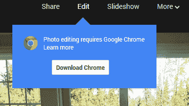

# 谷歌对原生客户端的押注拉近了 Chrome 和 Google+ Photos 的距离 TechCrunch

> 原文：<https://web.archive.org/web/http://techcrunch.com/2013/09/15/googles-bet-on-native-client-brings-chrome-and-google-photos-closer-together/?ncid=tcdaily>

谷歌在 Google+上的照片上下了大赌注。事实上，到目前为止，该公司社交网络上的大多数创新都围绕着照片，包括在 I/O 推出的 [#AutoAwesome。上周，谷歌加大了努力，](https://web.archive.org/web/20230209132203/https://techcrunch.com/2013/05/15/google-photos-can-now-automatically-create-animated-gifs-panoramas-hdr-images-and-better-group-shots/)[推出了一套新的照片编辑工具](https://web.archive.org/web/20230209132203/https://plus.google.com/107982474099703846460/posts/8CDR3mLfMmE)，包括微调 Google+的自动增强功能，应用新的滤镜和选择性地调整图像的部分。就像 Google+照片工具的其他部分一样，这些新功能比竞争对手领先一步，但也有一个问题:它们只适用于 Chrome(以及原生的 iOS 和 Android Google+应用)。

原因很简单:新工具使用了谷歌自己的[原生客户端](https://web.archive.org/web/20230209132203/https://developers.google.com/native-client/)技术，其他浏览器厂商都没有采用。这些工具本身基于该公司从 Nik Software 收购的技术，Nik Software 是流行的照片处理应用 Snapseed 的制造商。Snapseed 从未出现在网络上，所以谷歌的工程师们肯定认为，将这些功能移植到网络上最简单的方法是走原生客户端路线。

 你可能已经听过一千遍了，要开发出能与 HTML5 中的 Photoshop 相媲美的优秀照片应用几乎是不可能的。这就是本地客户的由来。这项技术允许开发人员在浏览器的沙箱中执行本机代码。它可以以本机速度执行 C 和 C++代码，并且能够渲染 2D 和 3D 图形，在多线程上运行并直接访问计算机内存。所有这些都使它比更传统的 HTML5 应用程序速度快得多(毕竟，原生客户端应用程序的运行速度基本上与桌面应用程序相同)，并使新的 Google+照片编辑功能等工具变得更快。

Native Client 可以在 Windows、Linux、Mac 和 Chrome OS 上的 Chrome 中工作，但其他浏览器供应商不支持它。例如，Mozilla 正试图让 JavaScript 运行得几乎和本地应用一样快(多亏了 [asm.js](https://web.archive.org/web/20230209132203/http://asmjs.org/spec/latest/) 项目，他们已经非常接近了)。另一方面，微软正押注于 IE11 中的硬件加速(和 [WebGL](https://web.archive.org/web/20230209132203/https://techcrunch.com/2013/06/26/microsoft-confirms-webgl-support-for-internet-explorer-11/) )来使网络应用在其浏览器中运行得更快。

https://www.youtube.com/watch?feature = player _ embedded & v = lm 4 akz 0 npfm

正如谷歌自己的 Native Client 文档[提到的](https://web.archive.org/web/20230209132203/https://developers.google.com/native-client/overview)，这项技术提供了一个简单的迁移路径，将现有的桌面应用程序带到网络上。到目前为止，这主要是游戏开发者的领域——他们已经用 C 或 C++编写了大部分代码——但现在看起来谷歌自己也在赶这股潮流。例如，我们知道该公司正在努力将 QuickOffice 移植到浏览器上，它的一些文档预览网络应用也已经在 Chrome 中使用了 Native Client。

当然，所有这些都让 Firefox、Opera 和 IE 用户只有一个选择:不要使用 Google+照片(或者接受你不能编辑它们的事实)，或者改用 Chrome(或者，正如有人肯定会在评论中指出的那样:不要使用 Google+，因为它已经死了或什么的)。然而，照片正迅速成为 Google+的焦点，因此将大量网络用户拒之门外感觉不太对。

我们都想要更快的网络和更好的网络应用。谷歌开发 Chrome 背后的理念一直是推动网络进步。可悲的是，使用 Native Client 只能为 Chrome 用户改善网络。