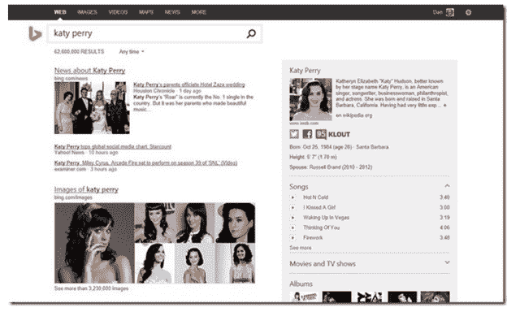

# 必应展示其重新设计和最新改进

> 原文：<https://web.archive.org/web/http://techcrunch.com/2013/09/17/bing-reveals-its-redesign-and-latest-improvements/?utm_source=dlvr.it&utm_medium=twitter>

# Bing 展示了它的重新设计和最新改进

微软重新设计了必应的标志和用户界面，试图将搜索引擎定位为开发者平台。

必应的新标识和搜索页面是为了配合微软为整个公司逐步推出的视觉改造。必应标志的改头换面，意在看起来“简单、真实和直接”，使用了微软公司字体 Segoe 的一个版本。整个徽标现在与上一版本中的圆点处于相同的橙色，这也是微软公司旗帜徽标右下象限的颜色。

新外观[与必应升级后的搜索体验](https://web.archive.org/web/20230326060630/http://www.bing.com/blogs/site_blogs/b/search/archive/2013/09/16/next-phase.aspx)一同亮相，它以一种比典型的链接列表更具互动性的形式为用户提供问题的答案。

预览窗口将把用户连接到与他们的搜索最相关的网站部分，或者通过查看潜在的结果来帮助他们改进他们的查询(就像更直观的自动建议工具)。Bing 的新位置回答了关于当地天气的问题，而 Snapshot，[于一年前首次发布](https://web.archive.org/web/20230326060630/https://techcrunch.com/2013/03/21/bing-just-got-a-lot-smarter-now-knows-more-about-people-and-places/)，提供了关于某些主题以及相关链接的信息摘要。必应的社交搜索，包括从脸书和其他社交网络中精选的内容，将被整合到一个侧边栏中。

Bing 的新功能使微软更容易将 Bing 集成到客户使用的产品中，如 Xbox 游戏机和 Windows Phones，以及预测他们未来的搜索查询。这也与 Redmond 将 Bing 从一个搜索引擎转变为一个平台的努力紧密相连。今年 6 月，微软宣布将 Bing 作为一个平台向开发者开放，允许其平台内的应用程序，包括 Windows 8、8.1 和 Xbox One，使用 Bing 实体，如自然用户界面、光学字符识别及其映射和可视化功能。正如 [Frederic Lardinois 指出的](https://web.archive.org/web/20230326060630/https://techcrunch.com/2013/07/05/bing-as-a-platform-will-allow-microsoft-to-compete-with-google-for-developer-cred/)，如果微软决定向所有平台的开发者提供必应服务，这将有助于微软更好地与谷歌竞争。