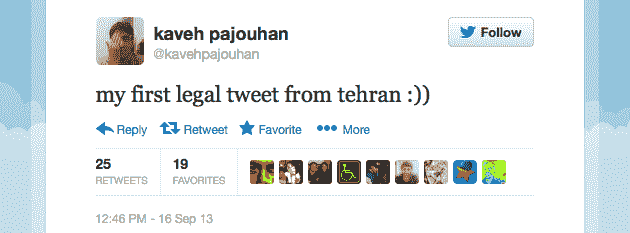

# 令人惊讶的自由是短暂的:伊朗对社交媒体的访问是一个“小故障”

> 原文：<https://web.archive.org/web/http://techcrunch.com/2013/09/17/surprise-freedom-is-short-lived-iranian-access-to-social-media-was-a-glitch/>

# 令人惊讶的自由是短暂的:伊朗对社交媒体的访问是一个“小故障”

伊朗网民昨天欣喜若狂，因为他们发现自己可以不受限制地访问婴儿照片和贾斯汀比伯更新(又名脸书和推特)。然而，自由的曙光是短暂的:在不到一天的时间里，政府防火墙再次阻止了社交媒体网站的访问。伊朗当局指责系统中的一个“小故障”。

但是，在短暂的 24 小时内，社交媒体的庆祝活动令人振奋。[伊朗记者阿里·哈什姆在](https://web.archive.org/web/20230129225149/https://twitter.com/alihashem_tv/status/379679127164686336)的推特上写道:“我很高兴我通过移动网络从伊朗发的第一条推特解除了#推特和#脸书的封锁。”。

《纽约时报》的标题是“伊朗人获得了访问脸书和推特的权利”。

BuzzFeed [暗示](https://web.archive.org/web/20230129225149/http://www.buzzfeed.com/sheerafrenkel/twitter-and-facebook-return-to-iran)这一举动可能是外交新趋势的一部分，并提到了外交部长贾瓦德·扎里夫此前发布的一条“犹太新年快乐”的推文。

[推特 https://twitter.com/JZarif/status/375434442031910912]

不幸的是，所有乐观的猜测都落空了。也许有一天伊朗会给予完全的互联网自由，但这不太可能是意料之中的事；这将是一场来之不易的战斗。