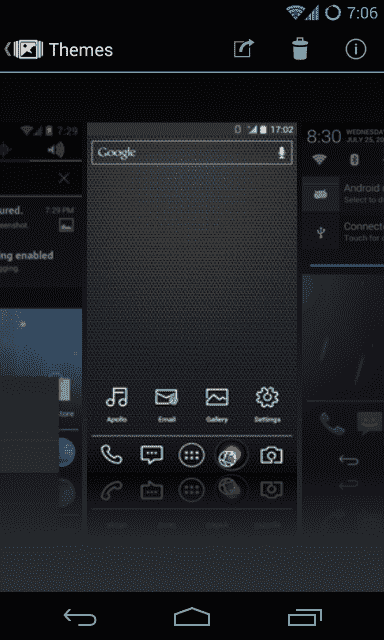

# Cyanogen Mod 筹集 700 万美元为 Android 固件寻找一条直接面向消费者的路线 TechCrunch

> 原文：<https://web.archive.org/web/https://techcrunch.com/2013/09/18/cyanogen-mod-7m-benchmark/>

虽然在过去几年中，Android 和 iOS 已经在智能手机操作系统的世界中形成了两匹马的竞争，但第三匹马有可能出现吗？

微软已经尝试了，尤其是最近收购诺基亚移动硬件业务的交易。

但也许第三匹马将会是安卓变种。

运行[Cyanogen](https://web.archive.org/web/20230124210357/http://www.cyanogenmod.org/)Inc .的团队一直在开发世界上最受欢迎的 Android ROMs 之一— [Cyanogen Mod](https://web.archive.org/web/20230124210357/http://www.cyanogenmod.org/blog/a_new_chapter) 。他们刚刚从 Benchmark Capital 获得了 700 万美元的资金，将一个业余爱好项目变成了一项真正的业务，开辟了一条直接面向消费者的移动操作系统交付路线。

对 Android 的标准风格感到失望的消费者可以刷新他们的设备，并用 Cyanogen Mod 取代他们的软件体验，Cyanogen Mod 拥有额外的安全和个性化功能以及更快的速度。现在他们有大约 800 万用户安装了 Cyanogen Mod，而没有任何昂贵的营销努力。除了这 800 万直接用户之外，其他 Android 版本如小米的 MiUI 利用 Cyanogen Mod，因此该项目的实际覆盖范围要大几倍。

“这是我在第一代 Android 设备问世时开始觉得有趣的东西，”联合创始人史蒂夫·孔迪克说，他在三星担任软件工程师时曾参与 Cyanogen Mod 的工作。“但它就像雪球一样越滚越大。很快人们开始给我一些他们想要的功能的建议。我们只是解决了很多令人痛苦的技术问题来做到这一点。”

但是现在，Cyanogen Mod 的安装过程非常痛苦。可能需要一个小时或更长时间。“我们在和谷物做斗争，”孔迪克开玩笑说。

有了这笔资金，这家初创公司正在构建一个安装程序，它将使这个过程变得非常简单。

“这应该像从 Google Play 商店抓取一个应用程序一样简单，”他说。"你将能够安装 Cyanogen Mod，基本上只需点击一下."

Kondik 认为 Cyanogen Mod 可以成为一款“由用户使用、为用户服务的移动操作系统”。该公司的构建过程及其与用户的关系类似于中国的小米如何处理其狂热的粉丝群，每周都发布新版本，提供社区建议的功能。

Kondik 说他有时会一天上传多个版本的 Cyanogen Mod 来修复 bug。他也从他的粉丝那里找到工作。用户会 mod 他的 mod，然后甚至做他 mod 的 mod 的 mod。

“这很有趣，”他在今天给用户的信中写道。“我们都有相同的想法——有一个我们想要的产品，没有人会制造它，所以我们不惜任何代价自己做。这个想法成了我们社区的风气。”

直到今天，Cyanogen Mod 还在为多种用户管理版本。他们有一个“出血边缘”版本，每天都为更具冒险性和实验性的用户更新，然后是更稳定的每月版本。

新一轮融资实际上在几个月前就结束了，随着融资的进行，Kondik 辞去了他在三星的工作。Boost 的联合创始人科特·麦克马斯特(Kirt McMaster)出任首席执行官，负责运营公司和管理筹资过程。他们现在有一个 17 人的团队在从事这个项目。

【T2