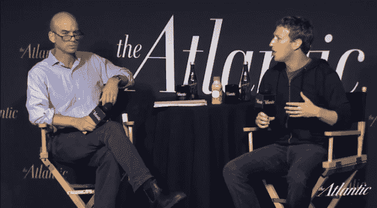

# 脸书不想变得酷，它想成为电技术危机

> 原文：<https://web.archive.org/web/http://techcrunch.com/2013/09/18/facebook-doesnt-want-to-be-cool/?utm_source=dlvr.it&utm_medium=twitter>

批评家说脸书注定要失败，因为它对青少年来说不再酷了。但是马克·扎克伯格说他不在乎脸书是否酷，因为现在它的目标是成为一个无处不在的公用事业。

“也许电刚出现的时候很酷，但是很快人们就不再谈论它了，因为这不是什么新鲜事，在这种情况下，你真正需要关注的问题是，因为不太酷，所以打开电灯的人会更少吗？”

不，因为这对现代生活来说是必不可少的，扎克伯格在他与《大西洋》编辑詹姆斯·贝内特在华盛顿特区的谈话中暗示道

大多数批评者谴责脸书失去了“T2 ”,他们引用了随机抽取的青少年的轶事“T3 ”,或者“T4”调查“T5 ”,这些调查可能是有偏见的，因为青少年“T6”想假装不喜欢或使用脸书，看起来很酷。然而，这些都不能真正证明脸书在参与上有任何有意义的损失。

与此同时，脸书一直否认青少年在收入电话上抛弃社交网络的说法，扎克伯格最近说“基于我们的数据，这不是真的”，随后又说今年青少年与脸书保持稳定的关系。

扎克伯格认为，脸书实际上是“后冷静”的——不受趋势的影响，在某种程度上也不受竞争对手的影响。扎克伯格开玩笑说:“人们认为我们是在装酷。这从来都不是我的目标。我是那里最不酷的人。我们都快 10 岁了，所以我们肯定不再是小众了，所以这种冷静的角度对我们来说已经足够了。”

相反，他说他想创造一些基本必需品。作为对贝内特的回应，扎克伯格表示，每一个经济 epoc 都建立了一个新的基础服务，如电力。“我们的社会需要一个新的数字社会结构，”扎克伯格解释道。“我们可以帮助建造它。”

当贝内特就透明度和隐私之间的潜在权衡向扎克伯格施压时，他辩称，“我倾向于认为这是积极的”。被迫在隐藏信息和“选择与他们关心的人联系”之间做出选择，用户将倾向于更多地分享。

从很多方面来看，脸书成功地增加了用户数量，并让他们更频繁地分享。它拥有 11.5 亿用户，每天有 6.99 亿人使用它。他今天还说，50%的社交应用使用脸书登录。

目前，脸书最大的威胁不是被一些时髦的新社交网络篡夺，而是停滞不前。它必须毫不留情地雇佣有远见的产品建造者、设计师、工程师和商人。必要时，它必须收购这些人才所在的公司。它必须尽一切努力不让自己过得太舒服。因为最终一个巨大的转变将会到来，它可能会冲走今天的大部分网络。脸书要么看到它的到来，然后建设或购买以适应，要么固执地坚持旧的方式，像 Myspace 一样变得无关紧要。