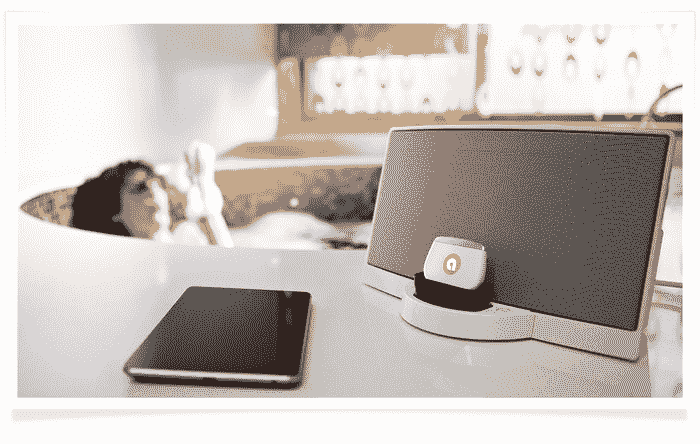

# 使用 Auris Skye Kickstarter 项目 TechCrunch 将 AirPlay 添加到您的旧 30 针 iPhone 基座

> 原文：<https://web.archive.org/web/https://techcrunch.com/2013/09/20/add-airplay-to-30-pin-iphone-dock/>

在这个闪电电缆和连接器的世界里，旧 iPhone 坞站是一个令人沮丧的景象，它们的 30 针连接器暴露在外，孤独无助。有许多蓝牙配件可供你在这些设备上使用，包括配件制造商 Auris 公司生产的名为 freeDa 的配件。但是他们的[最新项目](https://web.archive.org/web/20221005160312/http://www.kickstarter.com/projects/auris/auris-skye-wifi-for-your-dock?ref=category)是一个类似的附件，将 AirPlay 和 DLNA 流媒体带到那些码头。

Auris Skye 目前正在 Kickstarter 上寻求资金，并通过 Wi-Fi 而不是蓝牙连接。它可以让你在本地 Wi-Fi 网络上，使用苹果专有的 AirPlay 流媒体协议或 Android 和 Windows 上的 DLNA，从 iPhone、iPad touch、Android 或 Windows Phone 以及 Mac 或 PC 上播放音乐。它还支持 Wi-Fi 直连，因此您甚至不需要 Wi-Fi 路由器或网络就可以使用它。

 通过蓝牙使用 AirPlay 有几个好处。首先，如果你家里有其他 AirPlay 扬声器和立体声设备，你可以从 Mac 或 PC 上同时传输到 Skye 和其他设备。苹果还尽最大努力优化 AirPlay 流媒体协议，以获得最高质量，所以只要 Skye 像广告宣传的那样工作，你使用它就会获得比蓝牙好得多的声音。另外，不需要配对；一旦在您的网络上设置好，Skye 应该会显示在您的可用流媒体设备列表中。最后，Wi-Fi 范围远大于蓝牙。

Skye 也不需要单独的电源，因为它使用 dock 本身的电源，通常用于为底座上的 iOS 设备充电。Auris 团队表示，他们已经用一系列扬声器测试了它，到目前为止还没有发现一个不起作用的，他们提供了一个控制应用程序来帮助你设置。

总部位于圣克拉拉的 Auris 已经生产并销售了两种音频配件，因此它知道如何生产产品。该公司此前启动了蓝牙接收器，并筹集了 131，911 美元(超过其 4 万美元)的目标。值得注意的是，一些支持者在该项目的评论中抱怨该设备的质量，但 Auris 重新设计了原始产品，并已经超过了 Skye 的 56，000 美元目标，筹集了 72，197 美元。

AirPlay 可能很难做好，尽管该技术最近在消费产品中的体现都表现可靠，所以 Auris 有很多东西要通过这个项目和 2013 年 12 月的发货时间表来交付。不过，希望该公司从第一次复盘中吸取了一些教训，因为这是一个非常有用的配件。