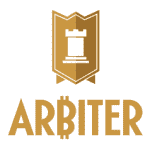

# 注入比特币的加速器 Boost.vc 随着 Stellar Second Batch TechCrunch 的推出而获得动力

> 原文：<https://web.archive.org/web/https://techcrunch.com/2013/09/24/bitcoin-infused-accelerator-boost-vc-gains-momentum-with-the-launch-of-stellar-second-batch/>

去年夏天，亚当·德雷珀(Adam Draper)和布雷顿·威廉姆斯(Brayton Williams)推出了 [Boost.vc](https://web.archive.org/web/20230131164924/http://boost.vc/) ，这是一个针对早期创业公司的为期 12 周的加速器项目。总部位于圣马特奥的加速器和投资基金(accelerator and investment fund)采取了一种熟悉的企业孵化方法，为其选择的公司提供少量现场服务，包括住房、办公场所、指导和种子资金。

为了让他的加速器在过去几年变得越来越拥挤的领域中脱颖而出，德雷珀希望通过 Boost.vc 采取一种亲身实践的方法。他还处于一种有点独特的地位，能够利用他作为第四代风险投资家和企业家的经验，让团队获得成功企业家和高管的积极支持网络，并邀请知名演讲者就如何度过业务发展的关键早期阶段提供建议。

[自推出以来，Draper 一直希望通过进入特定的垂直市场来试验](https://web.archive.org/web/20230131164924/https://techcrunch.com/2013/05/14/to-test-the-bitcoin-waters-adam-drapers-boost-vc-accelerator-adds-backing-from-lightspeed-beluga-founder-more/)加速器公式，以便为专注于该市场的初创公司提供更有针对性的支持和加速。德雷珀是比特币的早期支持者和拥护者——上个月初他被传唤——决定从数字货币开始，将其第二批(总共七家创业公司)的一半投入到围绕新兴的比特币生态系统开发产品和技术的公司。

为了帮助比特币成为创业公司的下一个数字前沿， [Boost.vc 为每一家从加速器毕业的比特币公司筹集了一笔后续或“启动基金”](https://web.archive.org/web/20230131164924/https://techcrunch.com/2013/05/14/to-test-the-bitcoin-waters-adam-drapers-boost-vc-accelerator-adds-backing-from-lightspeed-beluga-founder-more/)。因此，除了 17 家公司各自获得的 1.5 万美元种子资金(换取 5%的股权)，Boost.vc 的比特币初创公司将在计划结束时获得额外的 5 万美元投资。该基金本身由 Lightspeed、Rothenberg Ventures、比特币机会基金和 Beluga 创始人本·达文波特(Ben Davenport)主持。

上周五，这些比特币初创公司能够利用他们的“启动基金”资本，因为加速器上周五举行了第二次演示日，17 家初创公司上台在数百名投资者面前推介他们的业务。

德雷珀告诉我们，从 Boost.vc 毕业的第一批创业公司增长缓慢，迄今为止，七家创业公司已经筹集了数百万美元的后续融资。他说，虽然他们没有把融资部门的屋顶炸掉，但所有人都活得好好的，其中最值得一提的是，他们和朋友们相处得很好。臭名昭著的“休闲性爱脸书”的创始人最初加入加速器是为了开发一个不那么挑逗的约会应用程序，并在从事另一个项目时创建了 Bang With Friends 网站来自娱自乐，却只能看着它几乎在一夜之间起飞。

拥有超过 130 万用户，创始人自然决定追求这个想法，看看它会把他们带到哪里，德雷珀向我们保证，虽然公司一直很安静，但它仍然在踢。据传闻，该团队还筹集了一轮种子资金，并准备进行一次大规模的品牌重塑。他们还没有准备好分享细节，但请继续关注。

Boost.vc 创始人还表示，[青睐](https://web.archive.org/web/20230131164924/http://www.askfavor.com/)，这是一家总部位于奥斯汀的初创公司，它的第一批产品已经为其按需送餐服务找到了一些有前途的早期动力。在成功的 GrubHub 和无缝模式的基础上，Favor 是一个按需定制的个性化送货助理，最初专注于奥斯汀地区，但计划在未来几个月内扩展。

至于 Boost.vc 的第二批创业公司，其 17 家创业公司都在筹集后续种子资金，其中 5 家正在对其融资活动进行收尾工作。加速器的第二类创业公司之一， [AuditFile](https://web.archive.org/web/20230131164924/https://auditfile.com/) ，在演示日之前完成了一轮 30 万美元的种子资金，并且已经签约了五家企业客户。

该公司很早就引起了投资者和客户的兴趣，这要归功于它对一个明显不性感但服务不足的市场——会计师——的应对。这家初创公司正在为会计师事务所构建一个安全的基于云的解决方案，使他们能够运行更高效的审计，管理审计风险，实时跟踪进展，符合同行审查，并针对 BYOD 的使用进行了优化。

另一家早期投资者感兴趣的公司是 [Gliph](https://web.archive.org/web/20230131164924/https://gli.ph/) ，这是一家初创公司，也是一款同名的移动应用，它为用户提供了一种简单易行的发送比特币的方式。该应用程序提供了一个安全的短信和比特币支付网络，可以用来在匿名的情况下与陌生人在 craigslist 上进行交易，而无需透露电子邮件地址或电话号码。Gliph 目前在其安全消息平台中支持超过 2000 个比特币钱包。

另外两家似乎吸引了投资者大量关注的初创公司是 [Dreambox](https://web.archive.org/web/20230131164924/http://www.3dreambox.com/) ，这是一款旨在将 3d 打印带给大众的 3d 打印自动售货机，以及 [CourseOff](https://web.archive.org/web/20230131164924/https://courseoff.com/) ，这是一款面向学生的快速日程规划和日程共享解决方案。

但是，事不宜迟(排名不分先后)，下面你会看到在 Boost.vc 的第二个演示日首次亮相的 17 家创业公司的综述。一定要附和你的想法。

 ** [ Bitwall:使用比特币的出版商小额支付](https://web.archive.org/web/20230131164924/http://www.bitwall.io/)**

每年有 360 亿美元花在数字内容付费上，但他们使用付费墙来赚钱。Bitwall 正在创建一种新的付费墙，允许你以 10c 的价格购买一篇文章，而不是每月 20 美元的整期订阅。该公司有 10 家出版商注册了他们的支付方式，他们的目标是一起消灭付费墙。

 ** [盛宴:民主化餐饮](https://web.archive.org/web/20230131164924/http://eatfeastly.com/intro/)**

首席执行官兼创始人诺亚·卡雷什(Noah Karesh)讲述了一个非常引人注目的故事，他在危地马拉找不到危地马拉食物，直到他偶然遇到一位鳄梨销售员，这位销售员欢迎他去他母亲家吃饭。AirBnB 为住房所做的，Lyft 为驾驶所做的，Feastly 正在为食物所做的。

 **循环:网页的用户界面**

15 年前的网景浏览器和今天的谷歌 chrome 浏览器在视觉上没有什么区别。Cycle 旨在通过为移动设备提供最好的用户界面来改变人们与网络浏览器的交互方式。

 ** [ Bitbox:比特币交易所](https://web.archive.org/web/20230131164924/https://bitbox.mx/)**

Bitbox 通过其平台完成了近 40 万美元的交易。使其成为全国排名第五的比特币交易所。如今，在互联网上购买大量比特币没有什么好办法，Bitbox 正在改变这一点。

**[commit change:非营利组织智能筹款](https://web.archive.org/web/20230131164924/https://www.commitchange.com/)**

现在，公司用来管理捐赠的非盈利软件非常复杂。提交更改会更改所有这些内容。它们已经被 19 家非盈利机构使用，而且只使用了 30 天。首席执行官兼创始人罗德里克·坎贝尔(Roderick Campbell)在非盈利领域有着广泛的背景，他明白技术是不好的，他解释说，技术之所以有效，是因为有一个非常简单的附加值:“更少的时间淹没在技术中，更多的时间帮助他人。”这是指 219B 美元的在线捐赠空间。

 ** [马德尔:优质网络食品品牌](https://web.archive.org/web/20230131164924/http://battr.com/)**

如今，在食谱网站上没有品牌忠诚度。人们只是搜索谷歌，希望弹出的内容质量高到足以烹饪。Battr 计划通过将他们的食谱网站集中在厨师周围来改变这一切。厨师列出高质量的图片和描述，并填写食谱简历。厨师需要一个展示自己技能的地方，而巴特就是这样做的。

 ** Gneo:生产力优先**

Gneo 下周将发布他们的新应用。他们的最后一个应用程序已经有 25 万次下载，并在过去 12 个月中为他们带来了 12.5 万美元的收入。生产力是一个问题，Gneo 正在通过关注待办事项的优先级来解决这个问题。

 ** [ Bitpagos:阿根廷酒店支付处理器](https://web.archive.org/web/20230131164924/https://www.bitpagos.net/)**

在 Bitpagos 的首席执行官 Sebastian Serrano 的一生中，阿根廷的货币已经被抹去了三次。最重要的是，如果你现在从美国购买一个房间在阿根廷的酒店住一晚，30-50%的钱会因为汇率和税收而损失。比帕戈斯正在改变这一点。通过使用比特币，他们允许阿根廷的酒店保留 30-50%的电子购物。

 **仲裁者:和你的朋友在游戏上打赌**

仲裁者的诞生是因为安迪·津瑟和他的兄弟奥古斯特创建了一个在线博彩游戏，并意识到当金钱进入画面时，创建一个游戏是非常困难的。Arbiter 是一个 API，负责处理开发人员在构建赌博游戏时必须处理的所有困难的技术和监管挑战。刚刚宣布集成到一个拥有 15 万用户的游戏中。

 ** [审计文件:注册会计师云解决方案](https://web.archive.org/web/20230131164924/https://auditfile.com/)**

审计背后的技术已经 15 年没有改变了。史蒂夫·邦(Steve Bong)和他的哥哥凯文(Kevin)都有工程和会计背景，他们决定为此做点什么。空间非常引人注目。Steven Bong 展示了一张幻灯片，展示了税务和簿记软件领域的所有竞争以及该领域的拥挤程度，然后展示了审计领域的竞争，该领域只有 3 家竞争对手。审计即将变得性感。

 ** [验证 BTC:实时身份验证软件](https://web.archive.org/web/20230131164924/https://verifybtc.com/)**

在比特币世界，最近的热门话题之一是所谓的 KYC 或了解你的客户。这是一个验证拥有银行账户或比特币交易所账户的人的身份的过程。目前，在线验证的过程非常手工，比较文件和护照。BTC 已经开发出可以实时验证某人身份的技术。节省时间和金钱。

 ** [ Courseoff:未来学院调度](https://web.archive.org/web/20230131164924/https://courseoff.com/)**

你知道当你在大学时，你必须注册 5 门课，为了使用该软件，你必须在大一时接受培训，需要 2-3 个小时来制定完美的时间表，然后你错过了一些东西，你必须重新开始这个过程。Courseoff 已经帮助 30，000 名学生在 5 分钟内用他们简单易用的界面创建了时间表。但是排课只是一个开始。

 ** [ Appfuel:以更便宜的价格获得用户](https://web.archive.org/web/20230131164924/http://appfuel.me/)**

Appfuel 搭建了一个网络游戏应用网络。他们已经消除了在网络中分享游戏的摩擦。这降低了在 iOS 上开发视频游戏的成本。它消除了所有的中间商。

**[Vaurum:Nasdaq 为加密货币](https://web.archive.org/web/20230131164924/http://signup.vaurum.com/)**

Avish Bhama 创立了 Vaurum，帮助在线经纪公司获得交易比特币的能力。消费者已经信任在线经纪品牌，因此这将是比特币走向主流的一大步。

Email box:Twillio for Email

电子邮箱的创始人尼克·里德(Nick Reed)发现，电子邮件领域不存在创新的原因是，“电子邮件对开发者来说很糟糕。”没有简单的方法来构建电子邮件应用程序来增强您的电子邮件。因此，Nick 构建了一个 API 来处理电子邮件客户端的复杂部分，以便更容易地在其上构建可定制的应用程序。使用 API 开发了 7 个应用程序，包括一个当有人向你发送愤怒的电子邮件时提醒你的应用程序。

 ** [ Gliph:使用比特币最简单的方法](https://web.archive.org/web/20230131164924/https://gli.ph/)**

Rob Banagale 从一个安全的消息平台开始，并发现这是集成比特币的最佳场所。现在，Gliph 已经整合到最大的钱包提供商，包括比特币基地、Bips 和 Blockchain.info。他们拥有 20，000 名用户和 2，000 个附属钱包，每天都在增长。60%的新用户是以前没有使用过比特币的人。

 ** [梦想盒子:照片的未来](https://web.archive.org/web/20230131164924/http://www.3dreambox.com/)**

Dreambox 致力于让每个人都可以使用 3D 打印。最初，这是从伯克利团队在学校时建造的 3D 打印自动售货机开始的。但是一个实验改变了这一切。他们造了一台 3d 扫描仪，第一天就赚了 1000 美元。他们正在构建照片的未来，试图用 3D 捕捉瞬间。