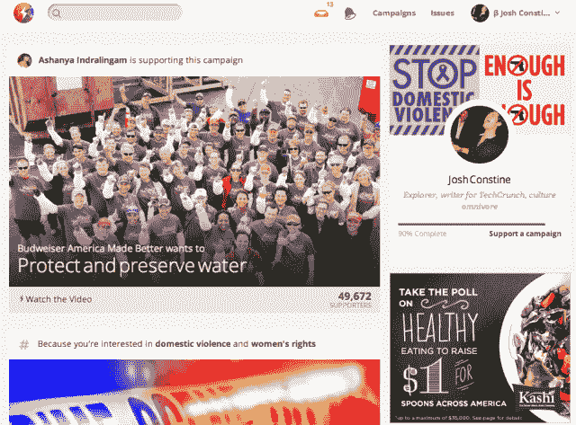
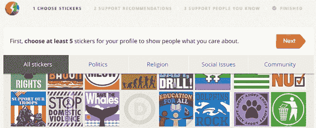

# 作为一个社会公益行动的社交网络，而不是肤浅的点击活动主义

> 原文：<https://web.archive.org/web/https://techcrunch.com/2013/09/24/causes-social-network/>

点击一个链接，点击一个请愿书，感觉更好，没有什么不同。那是旧的原因。今天，[新事业推出](https://web.archive.org/web/20230406110430/http://causes.com/)重新激活其 1.86 亿注册用户。这是一个独立的公民社交网络，推动教育、捐赠和承诺的行为改变，而不是与脸书捆绑在一起的拼凑的运动。它有一个严肃的本土广告策略。

Causes 首席执行官马特·马汉(Matt Mahan)告诉我:“我们相信，围绕你身份的特定部分，将会有特殊的目的和深厚的社交网络。“我们认为，你的目标或公民身份是目前没有得到充分服务的核心部分。”

该计划将继续作为一项营利性事业。它想让世界变得更好，但通过[以赚钱的承诺筹集 1640 万美元](https://web.archive.org/web/20230406110430/http://www.crunchbase.com/company/causes)，它可以雇佣更好的人才，更快地扩大对世界的贡献。

### 树皮多，咬的不够

将人们联系起来支持共同事业的使命[始于 2007 年](https://web.archive.org/web/20230406110430/https://techcrunch.com/2007/05/24/project-agape-launches-via-facebook/)，当时这家初创公司是脸书平台的启动合作伙伴之一。由两名前雇员[乔·格林](https://web.archive.org/web/20230406110430/http://www.crunchbase.com/person/joe-green)(现任 FWD.us 总裁)和[肖恩·帕克](https://web.archive.org/web/20230406110430/http://www.crunchbase.com/person/sean-parker)(投资人和连续创业者)创建，并获得创始人基金的 A 轮投资。Causes 的领先优势和脸书当时提供的利润丰厚的病毒式渠道让它迅速注册了大批用户。

问题是他们没有尽可能多地完成工作。在六年的时间里，1.86 亿用户确实为非营利组织筹集了 4800 万美元，并为草根运动的请愿书增加了 3400 万个签名，但他们的大部分潜力都没有实现。

大多数人(包括我在内)都是通过脸书的请求或朋友发给他们的墙贴被送去参加慈善活动，签了名或捐了一点钱，然后就再也没有回来。很少有人花时间去真正理解他们在支持什么。拯救鲸鱼？当然可以。点击。停止人口贩卖？这是 10 美元。也许 17 个月后我会再见到你，因为。

到今年，由于展示广告和赞助活动，Causes 拥有 60 名员工和数百万的收入，但未能实现正现金流，仍依赖于风险投资。它的创始人不再参与日常事务。它的参与度已经下降到每月只有 600 万用户——仅占其注册用户的 3%。

Causes 需要新鲜血液，并通过收购另一家肖恩·帕克支持的公司 Votizen 找到了它。Votizen 将人们的[政治活力转化为影响力](https://web.archive.org/web/20230406110430/https://techcrunch.com/2012/02/23/votizen-raises-750k-from-sean-parker-others-to-turn-elections-from-fundraising-to-friendraising/)，让他们鼓励志同道合的朋友在选举中投票。其联合创始人杰森·普托蒂以其经典、迷人的设计而闻名。这笔交易是由 Causes 新任首席执行官马特·马汉在 1 月份完成的。他和普托蒂开始重新定义原因。

### 将激情转化为行动

今天他们的视觉[投入生产](https://web.archive.org/web/20230406110430/https://www.causes.com/)。旧的 Causes 脸书应用程序目前将继续存在，因此资深用户不必担心他们的活动会消失，但这是新的 Causes.com，事情正在发生。

世界野生动物基金会、美国伊拉克和阿富汗退伍军人协会、旧金山自行车联盟等组织以及丰田和 Kashi 等品牌已经加入进来。Causes 还挖掘了长期支持社会公益的名人，包括支持退伍军人运动的阿甘正传的丹·加里·西尼斯中尉，以及为枪支安全而战的受伤的美国国会女议员加贝·吉福兹。

从 Causes.com 开始，你不再需要登录脸书。这是一个“独立”的社交网络，可以围绕商品创建一个独特的社交图，只需一个电子邮件地址就可以注册。然后你挑选一些数字“保险杠贴纸”，在你的事业简介上代表你的理想。不过，说真的，这是一种让你说出你感兴趣的原因的轻量级方法，这样它就可以建议你关注的组织和人。这是一个精明的入职流程，确保你的 feed 充满了相关的项目。

这就把我们带到了主页 feed，在这里你会看到根据你所关注的内容对参与活动的明智建议。这包括捐款、承诺参加线下抵制活动，或者观看品牌赞助活动的视频，从而获得该品牌 1 美元的捐款。

尽管 Causes 希望它的 feed 成为你日常生活的一部分，但马汉向我承认，“大多数人加入竞选活动的方式是通过脸书、LinkedIn、Twitter 和电子邮件看到一条整合的内容”，或者来自他们在其他地方有联系的品牌。我们的目标是让事业横向扩散，而不仅仅是组织者自上而下。

这就是为什么 Causes 活动页面关注支持者和管理员贡献的内容一样多的原因。顶部显示了官方图片、描述和行动号召，解释了您可以如何提供帮助，但底部是用户生成的内容，旨在激励和教育人们了解该项目。为了向人们展示他们的影响力和鼓励贡献，每个帖子都显示了它所带动的观点和行动的数量。

要成为可以邀请朋友并在活动订阅源上发帖的正式支持者，人们实际上必须为某项事业采取行动。马汉告诉我，“我们希望支持的概念比喜欢或关注脸书和推特更重要、更有意义。这是与那些你支持其信仰并想采取行动的人站在一起。这应该是一种集体行动关系的开始。”

改版后的 Causes 中最大的新功能是可以为任何活动创建自己的个人子页面。在这里，你可以保证召集一定数量的行动，比如 1000 美元的捐款或者 50 个人确认他们将抵制一个不好的生意。你可以讲述你自己的故事，为什么一个计划对你很重要，并邀请朋友。这些个人主页把任何人都变成了草根组织者。

总的来说，新的事业看起来很好，并且在社会公益运动方面比旧的版本做得更多。然而，导航感觉有点笨重和反直觉，它可以有点混乱知道你是否应该添加内容到一个活动或朋友的个人页面。Causes 面临的核心挑战将是，要么通过不断分享到其他社交网络，使其新网站具有足够的病毒传播力，保持在人们的脑海中，要么改变人们的行为，使他们自然而然地停止关注 Causes。

### “好”广告

如果 Causes 可以重新激活其被关闭的用户，并说服他们在网站上花费大量时间，它就有一个认真的赚钱计划。马汉解释说，“人们对广告持怀疑态度”，但公益事业可以为企业提供一种不同的联系方式。“我们给他们一种新的、深刻的、丰富的方式来与数百万人建立关系，”马汉说。

Causes 不是通过点击进入产品页面的广告，而是以赞助活动的形式建立原生广告单元。百威啤酒可以向人们展示它资助了清洁水项目，而不是试图积极地销售它的啤酒。当人们通过观看视频告诉他们为什么清洁水是重要的，百威啤酒代表他们给了一美元。它可能已经计划捐出这一美元，但通过将捐款与某人的行动联系起来，他们会觉得啤酒公司帮助他们做出了改变，他们对该品牌的亲和力增加了。

Causes 将在主页、主题页面和搜索中推荐这些赞助活动。在某些情况下，它们会看起来像脸书的赞助故事，广告突出了一个与品牌活动有关的朋友。目前，Causes 的桌面网站还将展示更多传统的公益组织和活动的展示广告，但马汉告诉我，原生广告是其未来的重点。这是因为随着用户转向移动设备，这些原生设备将非常适合，因为那里没有老派横幅广告的空间。

这种商业模式也让它有别于那些以不那么谨慎的方式赚钱的竞争对手。“如果你观察一下这个领域——请愿网站、Change.org、集会——他们要么接受一部分捐款，要么出售人脉，或者两者兼而有之。马汉说:“我们决定采用本土广告单元。这意味着当你签署请愿书时，你的电子邮件地址永远不会被出售给捐赠律师，并导致使用[网络来处理信用卡付款的成本，以便尽可能多的钱去你支持的东西。尽管如此，这仍然是一个拥挤的空间，有像](https://web.archive.org/web/20230406110430/http://www1.networkforgood.org/) [Jumo](https://web.archive.org/web/20230406110430/http://www.globalgiving.org/jumo/) 、 [HopeMob](https://web.archive.org/web/20230406110430/http://hopemob.org/) 、 [Google 的 OneToda](https://web.archive.org/web/20230406110430/https://techcrunch.com/2013/08/09/googles-charitable-donations-android-app-one-today-exits-pilot/) y 这样的网站，以及争夺人们的承诺和捐款的特定主题网站。

最后， [起因](https://web.archive.org/web/20230406110430/http://causes.com/)‘理想主义是它最大的力量，也是它最大的威胁。为加入某项事业设置行动障碍可以确保人们真正关心他们所说的，但这也为分享和成长设置了障碍。如果它能始终如一地提供相关的活动让我们关注，并将其设计得更加直观，我们就会有动力让社会公益成为我们日常生活的一部分。