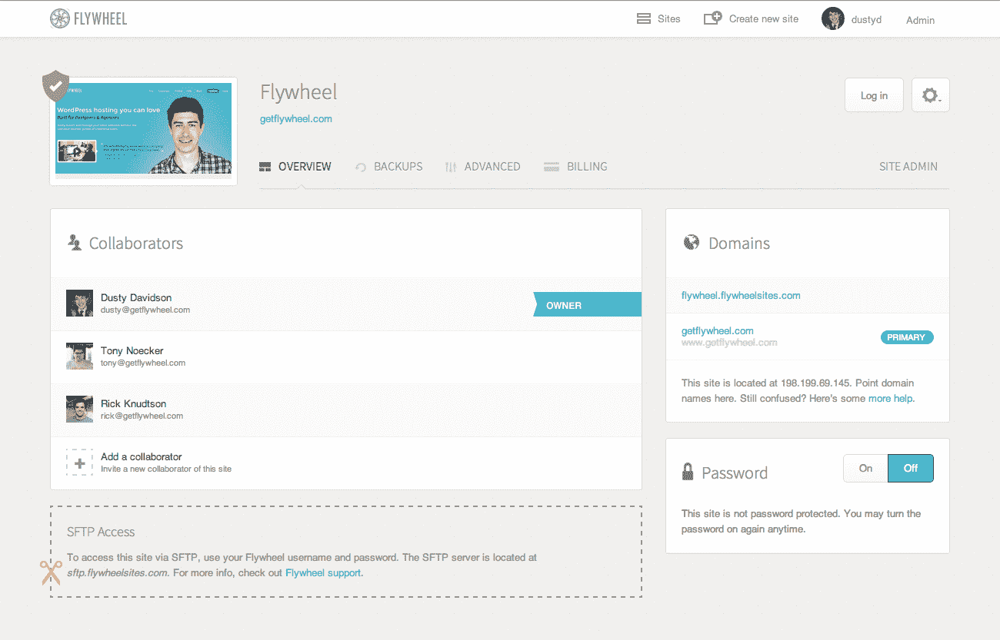
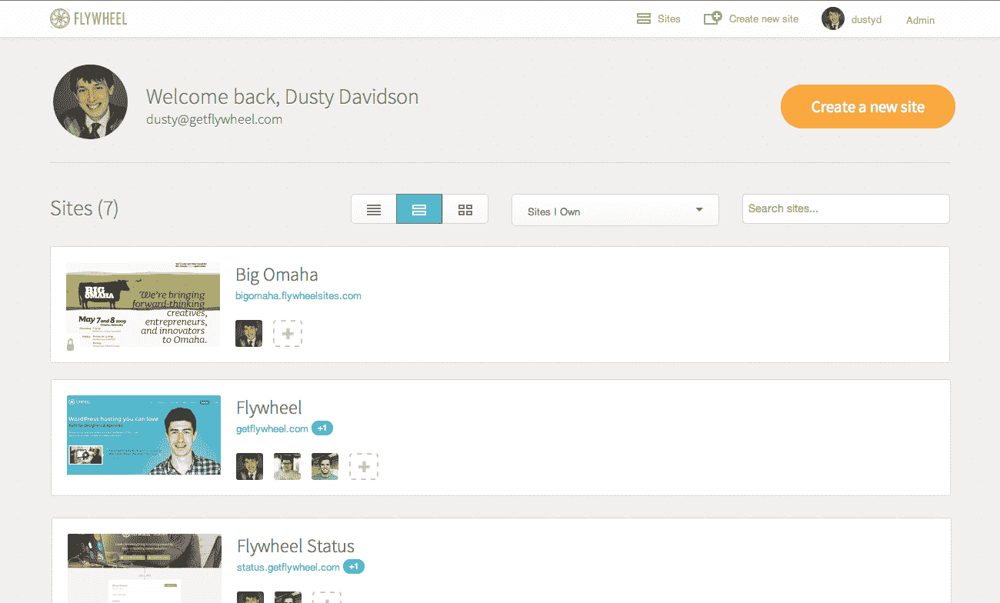

# Flywheel 推出面向设计师的优质 WordPress 托管和管理服务 TechCrunch

> 原文：<https://web.archive.org/web/https://techcrunch.com/2013/09/24/flywheel-launches-a-premium-wordpress-hosting-and-management-service-for-designers/?via=indexdotco>

# 飞轮为设计师推出了一个高级 WordPress 托管和管理服务

总部位于内布拉斯加州奥马哈的初创公司飞轮公司今天发布了一项新的 WordPress 托管和管理服务，这是专门为网页设计师、自由职业者和代理公司打造的。

[WordPress](https://web.archive.org/web/20221006021509/http://wordpress.org/) 已经走过了漫长的道路，从“仅仅”是一个博客工具，到成为想要为他们的客户建立网站的设计师和网站开发者的首选内容管理框架。但对他们中的许多人来说，管理他们的服务器并对其进行微调以使 WordPress 运行得更快，这既不是他们想花时间做的事情，也不是他们擅长的事情。此外，一旦他们做好了一切并运行，他们仍然需要让他们的客户获得一个托管账户，并把他们的 WordPress 安装、内容、插件和主题转移到一个新的服务器上。

Flywheel 的目标是消除这一过程中的所有复杂性。它为用户处理所有的服务器管理，然后允许他们在网站建立并运行后轻松地将账单转给他们的客户。该服务还允许其用户与其他人合作，通过它可以轻松地授予和撤销对托管账户和 SFTP 服务器的访问权限来上传文件。这项服务运行在数字海洋的服务器上，可以在大约 20 秒内建立一个新网站。这项服务为所有用户提供免费的模拟账户，在网站上线之前不收费。然而，免费网站是有密码保护的。

正如 Flywheel 首席执行官 Dusty Davidson 告诉我的那样，该团队认为 WordPress 已经发展到了这样一个地步，大多数用它创建网站的人都不是技术人员，他们自己对管理托管环境也不感兴趣。该团队为其用户处理所有的缓存、安全强化和其他托管方面。值得注意的是，实际的 WordPress 用户体验在飞轮上保持不变，用户可以安装自己的插件和主题，并根据需要进行其他修改。

付费飞轮[托管计划](https://web.archive.org/web/20221006021509/http://getflywheel.com/pricing/)对于访客少于 5000 人的小网站，起价为每月 15 美元，以后还会上涨。该公司表示，其最受欢迎的计划是每月 30 美元的账户，用于拥有多达 25，000 名访客、10GB 存储空间和 500GB 带宽的网站。所有这些都包括恶意软件监控，但除非你选择每月 75 美元的企业计划，否则你必须为 CDN 和 SSL 支持支付额外费用。该公司还为同时在 10 或 25 个网站上工作的机构提供批量定价。

