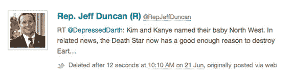

# 加州离奇的青少年互联网擦除法

> 原文：<https://web.archive.org/web/https://techcrunch.com/2013/09/24/on-californias-bizarre-internet-eraser-law-for-teenagers/>

加州通过了 T2 一项善意的法律，允许青少年从网上抹去他们年轻时的不检点行为。从 2015 年开始，任何未成年人都可以要求数字服务提供商删除他们在贾斯汀比伯演唱会上喝醉的照片。这项法律没有太多意义，因为几乎所有能想到的服务都提供删除按钮。

也许更重要的是，它忽略了几乎不可能从网上删除信息的现实:令人尴尬的照片像病毒一样传播，互联网档案馆自动创建网络上几乎每条信息的副本。

然而，正如所写的，它似乎在隐私法和第一修正案之间制造了正面冲突。没有明确的规则规定，当朋友评论或互动某个令人遗憾的内容时，哪些内容会保留下来，这些内容最终将不可避免地被删除。

网络是混乱的，病毒式的，相互关联的。要么法律完全没有效力，要么它引发了一个非常可怕的反信息雪球。

**成文法律**

California SB 568 要求“互联网网站、在线服务、在线应用程序或移动应用程序的运营商允许作为该运营商的互联网网站、在线服务、在线应用程序或移动应用程序的注册用户的未成年人删除或请求并获得删除发布的内容或信息”。

该法律将于 1 月 1 日生效，正好让宿醉的未成年人删除他们的除夕恶作剧。它还禁止网站向未成年人提供大量有趣但令人遗憾的产品，如电子烟和纹身。

**不现实**

如果一个怀恨在心的前男友与脸书宇宙分享他前情人的顽皮照片，SB 568 不会给未成年人删除它的权利。用户只能删除他们上传的数据。此外，如果一位十几岁的母亲[发布了一张她蹒跚学步的孩子用烟枪吸大麻的照片](https://web.archive.org/web/20230208212041/http://www.huffingtonpost.com/2010/08/16/arrested-over-facebook-po_n_683160.html#s127052title=Mother_Arrested_Over)，那也是免责的:执法部门可以传唤该信息。

也许最重要的是，越来越多的社交媒体世界被自动存档。例如，阳光基金会自动存档推特，以防政客删除。一些被删除的推文非常搞笑。

最重要的是，几乎所有能想到的网站都允许用户删除帖子。所以，在现实中，法律是完全不现实/不必要的。尽管如此，常识媒体儿童权益组织的首席执行官詹姆斯·斯泰尔称这部法律是“一个非常重要的里程碑”

**第四修正案对第一修正案**

正如所写的，该法律是关于给一个特定的群体，倾向于愚蠢的决定，删除他们不喜欢的信息的能力。在这一点上，In 危险地接近了欧盟提议的“[被遗忘权](https://web.archive.org/web/20230208212041/http://www.stanfordlawreview.org/online/privacy-paradox/right-to-be-forgotten)”。

乔治·华盛顿大学的法学教授 Jeffrey Rosen 解释说:“如果脸书和谷歌没有删除人们发布的关于他们自己的照片，即使这些照片已经被广泛传播，被遗忘的权利也可能会使他们承担高达全球收入 2%的责任。”。

虽然 SB 568 试图将法院命令限制在没有被其他用户转发的信息上，但不清楚这在实践中如何运作。例如，如果我“喜欢”我朋友在脱衣舞俱乐部的一张照片，但他后来想删除它，应该怎么办？脸书的“喜欢”现在作为第一修正案言论受到保护。

要想拥有任何种类的牙齿，法律最终将不得不允许删除已经转发、存档或交互的数据。因此，我们必须创建一个全新的案例法体系，致力于选择何时被遗忘的权利优先于我们分享和讨论信息的权利。

法国人已经对这件事做出了决定。Rosen 解释说:“le droitàl ' oubli——或“遗忘权”——一种允许已服满刑期并获得平反的被定罪罪犯反对公布其定罪和监禁事实的权利。”。如果欧盟的提议通过，这种审查将延伸到互联网。

实际上，SB 568 做的唯一一件事就是打开了一个右边的蠕虫罐，从互联网上抹去信息。从现在开始，事情只会变得更加离奇。