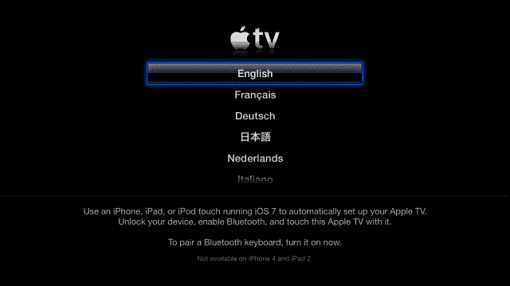

# 苹果使用蓝牙 le 通过 iOS 7 设备支持苹果电视“触摸设置”

> 原文：<https://web.archive.org/web/https://techcrunch.com/2013/09/25/apple-turns-apple-tv-into-an-ibeacon-to-enable-touch-to-set-up-with-ios-7-devices/>

苹果正在利用蓝牙 le 技术，该技术自 iPhone 4S 以来一直内置于每部 iPhone 中，以实现 Apple TV 3G 的自动设置。只需将运行 iOS 7 的设备与较新的苹果机顶盒接触，就可以让它自动设置 Wi-Fi 网络、区域设置和苹果商店帐户。

这实质上意味着——据我们所知——苹果正在使用类似于它[描述为“iBeacon](https://web.archive.org/web/20230122065215/http://tidbits.com/article/14116) ”的技术，这是一种蓝牙 le 设备，可以向该地区的任何兼容 BT 设备广播数据有效载荷。这可以实现复杂的交互，而不必在同一个 Wi-Fi 网络上，甚至不必与目标设备配对。但是它也可以使用 iPod 附件协议，BLE 也支持该协议。

“一触式”设置是由 TUAW 读者 Aaron G[发现的，并在今天早些时候的一篇文章中提到。苹果](https://web.archive.org/web/20230122065215/http://www.tuaw.com/2013/09/25/3rd-generation-apple-tv-setup-now-as-easy-as-touching-an-ios-7-d/)[关于新设置功能](https://web.archive.org/web/20230122065215/http://support.apple.com/kb/HT5900)的帮助文件给了我们一些线索，指出蓝牙 le 是驱动交互的技术。Apple 在其 iBeacon 协议中使用的一项技术。

据我们了解，这是*而不是*将苹果电视变成苹果消费者意义上的iBeacon，但它使用了类似的技术。

为了让它工作，你可以在你的 iPhone 4S、iPad 3G、iPad mini 或 iPod touch 5G 和更新版本上启用蓝牙。然后，你将它点击到位于设置屏幕上的 Apple TV 3G。您的设备将进入带外配对，系统会提示您在 iOS 设备上输入 Apple ID。然后，如果您愿意，您可以选择让它记住您在 Apple TV 上购买的数据。

然后，Apple TV 会自动配置自己，绕过使用苹果的 gum remote 棒输入 Apple ID 和 Wi-Fi 信息的超级尴尬的过程。Apple TV 必须是 6.0 或更高版本，iOS 设备必须是 7.0 或更高版本。

帮助文档告诉你必须打开蓝牙的事实是一个致命的泄露，这是基于苹果公司在其设备中内置的技术，比它需要的时间更长。苹果在一段时间内将对蓝牙 le 的支持内置于其设备中，并将 iBeacon 支持内置于最新的 iOS 和 Apple TV 软件中。

我们试用了新的安装方法，效果和宣传的一样。然而，我们确实发现不需要物理接触，因为 Apple TV 与我们的设备配对的距离高达 8 英寸。我们能够轻敲它并让它工作，但简单地在一英尺左右的范围内移动它似乎也能工作。这与 iBeacon 过程中称为测距的部分是一致的。将设备“轻敲”到 Apple TV 的指令可能只是为了确保接近度。

因此，虽然这还不是“iBeacon ”,但一旦这些动物开始在野外出现，这肯定是一个熟悉的过程。

有关 iBeacons 的更多信息，您可以[查看我们对 Estimote](https://web.archive.org/web/20230122065215/https://techcrunch.com/2013/09/11/estimote-details-ios-7-ibeacon-support-for-its-contextual-proximity-shopping-devices/) 的报道，这是一种硬件设备，使用蓝牙 LE 来帮助零售商根据店内位置等信息与消费者沟通。

*本文已经澄清，指出这不是一个 iBeacon，但使用类似的技术。*