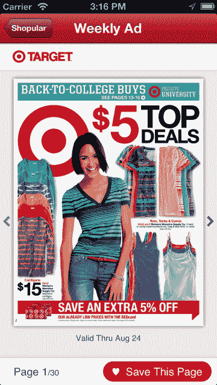
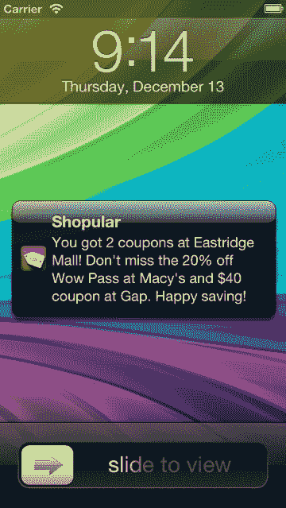

# 移动交易寻找应用 Shopular 从红杉 TechCrunch 获得 640 万美元的 A 轮融资

> 原文：<https://web.archive.org/web/http://techcrunch.com/2013/09/26/mobile-deal-finding-app-shopular-raises-6-4-million-series-a-from-sequoia/?utm_source=dlvr.it&utm_medium=twitter>

虽然今天大多数移动应用程序都非常关注让用户记得定期打开它们，但移动交易发现应用程序 [Shopular](https://web.archive.org/web/20230209131019/http://www.shopular.com/) 已经满足于在后台运行，当消费者在商店或商场时提醒他们打折和打折。现在，它对实用性而不是垃圾行为的关注得到了回报，由红杉资本(Sequoia Capital)领投的 640 万美元 A 轮融资。红杉资本的李佑晨也将加入 Shopular 的董事会。

这家初创公司此前已经获得了 Y Combinator 和其他天使投资人的种子轮投资，其中包括亚当·德安杰洛(Adam D'Angelo)。

 Shopular [第一次出现](https://web.archive.org/web/20230209131019/https://techcrunch.com/2012/12/14/shopulars-new-app-alerts-you-to-nearby-deals-no-coupon-clipping-required/)是在 2012 年假日季之前，在参与 Y Combinator 的 2012 年冬季批次之后。由前 Shopkick 工程师 Navneet Loiwal 和 Tommy Tsai 创建的 Shopular 提供了一种不同于他们之前公司解决方案的移动交易发现方式。

Loiwal 说:“我们非常尊重 Shopkick 向世界展示了移动设备可以以新的方式用于实体零售。然而，该团队希望为消费者打造更直观、更符合逻辑的产品。Shopkick 奖励用户走进商店并进行购买，Shopular 则让你知道为什么你应该走进商店。

该公司使用自己的专有技术来获取交易，抓取网上发布的一切，电子邮件报价，甚至是零售商脸书页面上发布的商品。它将这些信息整合到一个交易数据库中，该数据库目前包括美国大多数零售商的交易信息，从沃尔玛、塔吉特(Target)、家得宝(Home Depot)等大牌零售商，到专业女装零售商、美容品牌、珠宝店、儿童商店等。

与此同时，消费者可以通过选择他们最喜欢的商店或选择收听即将到来的销售来进一步配置应用程序，但正如卢瓦尔[之前解释的那样](https://web.archive.org/web/20230209131019/https://techcrunch.com/2012/12/14/shopulars-new-app-alerts-you-to-nearby-deals-no-coupon-clipping-required/)，“你最起码需要做的是把应用程序放在你的手机上。忘记这个应用程序，你每次出去购物都会开始省钱。”

今天，Shopular 在美国 50 个州的 40，000 家商店开展工作，几乎覆盖了所有的购物中心、购物街或独立的大卖场。然而，Loiwal 拒绝提供用户数量或参与度指标，只是指出该应用在 iTunes 和 Google Play 上的评级为 1 万多，分别为 5 星和 4.8 星。他还指出，Shopular 的人口统计数据中 80%是女性，有两个不同的群体——花很多时间在购物中心的青少年，以及年龄在 25 至 35 岁之间的年轻、预算意识强的妈妈们。

到目前为止，Shopular 的重点一直是增加客户群和商店覆盖面，而不是收入，但有了新的资金，该公司计划采取下一步措施，包括直接与零售商合作。Loiwal 表示，他们已经开始与选定的零售商就一项功能进行测试，该功能将允许品牌通过应用程序与购物者沟通。

“零售商有两个主要问题:一是让客流量到达他们的商店，二是当消费者走进商店而不是结账时与他们沟通，”Loiwal 解释道。Shopular 将充当这些消息的中间人。该公司现在试图回答的问题是，当它有能力接触到你周围的人时，它可以为一个企业带来多少转换。Loiwal 在谈到这些早期实验时补充说:“我们看到一些大型网络的指标相当于在同一时间进行相同的推广活动。

Shopular 关注的其他事情包括零售商对苹果 iBeacon 技术的采用，以及用户对 Shopular 应用程序 iPad 优化版本的需求。但更大的焦点将是通过利用它在一年中建立的关于消费者行为的所有数据，增加应用程序的个性化方面。

“我们试图通过你对应用的使用来更好地了解你，同时也了解你和其他用户有多相似，”Loiwal 解释道。“我们正在研究一些能为你提供超出优惠券价值的东西，”他调侃道，但拒绝提供细节。

这家初创公司一直在相当精简地运营，只有一个四人团队，但随着红杉资本的注入，它计划在未来几个月内雇佣至少九人，包括工程师和产品设计、营销和销售人员。

从广义上讲，该应用不仅与 Shopkick 竞争，还与其他移动交易发现程序竞争，包括 RetailMeNot、Jifiti(在某种程度上)、SnipSnap 等优惠券应用、daily deals 应用等。

一个更新的、对 iOS 7 更友好的应用版本也即将发布，但与此同时，你可以在这里查看 iOS 或 Android 应用。