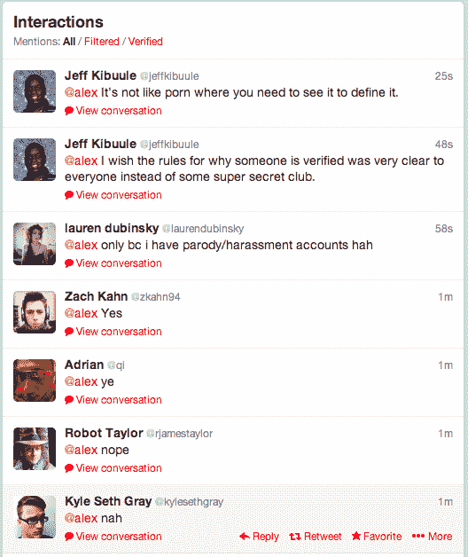
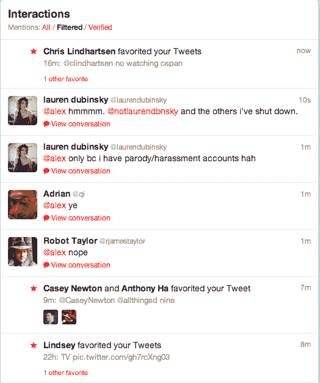
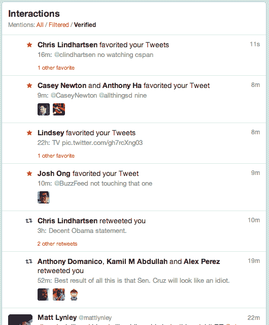

# 未验证？这是我坐的地方的 Twitter 视图 TechCrunch

> 原文：<https://web.archive.org/web/https://techcrunch.com/2013/09/30/not-verified-heres-the-twitter-view-from-where-im-sitting/>

# 未验证？这是我坐的地方的推特视图

所以你在 Twitter 上没有被验证。别担心。现在还有时间——不像国会为政府提供资金。但是我跑题了。

无论如何，你可能不知道的是，如果你*通过了*的验证，你就可以在 Twitter 网络界面的交互标签中使用一个简洁的过滤选项。它允许您只看到来自其他已验证用户的与您的帐户的交互。这基本上是一种只在酷孩子俱乐部里闲逛的方式。而且很棒。

这是我的 Twitter 互动反馈的三张截图，是背靠背拍摄的。首先，标记为“全部”的正常、嘈杂的交互提要:

【T2

我刚刚问了一个问题，所以涌入的人群中有我认识的人也有我不认识的人。现在，让我们看看“过滤”选项是什么样子的:

好了，许多@消息已经被剔除，足以让我们看到最早八分钟前的收藏夹。

现在，到最后一层——“已验证”过滤器选项卡:

一个全新的世界！这就是:从验证的角度看 Twitter。

*顶级形象荣誉:[肖恩·坎贝尔](https://web.archive.org/web/20221007131421/http://www.flickr.com/photos/thecampbells/)*