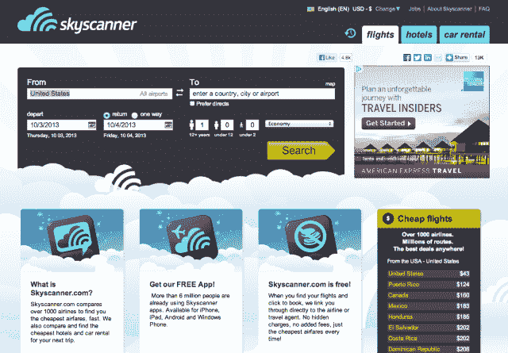

# 老牌旅游搜索引擎 Skyscanner 以 8 亿美元的估值获得红杉迄今为止“最大的投资之一”TechCrunch

> 原文：<https://web.archive.org/web/https://techcrunch.com/2013/10/02/veteran-travel-search-engine-skyscanner-lands-one-of-largest-sequoia-investments-to-date-at-800m-valuation/>

在旅游搜索中，大多数年轻人的记忆不会延伸到比 Kayak 更远的地方，Kayak 大约在 2004 年开始出现。虽然 Skyscanner 的名字在美国旅行者中可能不太熟悉，但它现在是网络上最大的航班搜索引擎之一，超过了 Kayak，其起源可以追溯到公元前 2001 年

在接下来的 10 年里，这家苏格兰公司在其快速、可靠的航班对比引擎上建立了自己的品牌，并且像其北美 bretheren 一样，后来扩展到酒店预订等领域——据我的同事史蒂夫·奥黑尔(Steve O'Hear)称，去年其“营业额”据报道达到了 3000 万美元(利润为 1000 万美元)。

由于与中国搜索引擎百度的合作，以及看到该搜索引擎现在支持 30 种语言的国际用户群，该公司宣布，它钓到了一条更大的鱼——事实上是一条骑士。今天，Skyscanner 宣布，它已经完成了红杉资本(Sequoia Capital)的一笔未披露的投资，由合伙人迈克尔·莫里茨爵士领导，他也将加入该公司的董事会。

尽管 Skyscanner 拒绝透露投资的规模，但该公司确实选择透露这项投资的估值高达 8 亿美元。这是一个惊人的数字，特别是考虑到根据 CrunchBase 的数据，Skyscanner 迄今为止已经筹集了 520 万美元，正如我们上面提到的，一年前的营业额为 3000 万美元。

在过去的 12 个月里，Skyscanner 一定是真的踩了货币化加速器的脚。不过，从大背景来看，这是风险投资者中一个已经发展了一段时间的趋势，因为老基金正在寻找十年历史、久经考验的初创公司，这些公司基本上都是白手起家的。Accel 和红杉[为 Qualtrics](https://web.archive.org/web/20221205173229/https://beta.techcrunch.com/2012/05/15/qualtrics-raises-70m-accel-sequoia/) 做了同样的事情——向我的同事 Anthony Ha 致敬，因为他指出了这一点——Accel 也为 Lynda.com 做了同样的事情，后者[在 15 年多的时间里没有从外部投资中获得一分钱，筹集了 1.03 亿美元。](https://web.archive.org/web/20221205173229/https://beta.techcrunch.com/2013/01/15/after-17-years-education-platform-lynda-com-raises-its-first-round-of-funding-103m-from-accel-spectrum/)

投资或建设，硬币的两面都没有确定的赌注，但这是最接近的赌注了。我相信有些人可能称之为“风险管理”，而其他人可能会说“胆怯”，但无论如何，这是对 Skyscanner 在过去 10 年中所做努力的证明。莫里茨爵士是谷歌、LinkedIn、YouTube 和 PayPal 等公司的早期投资者，他比大多数人更接近英国女王。

同样，虽然双方都没有透露投资金额，但他们确实设法放弃了这是“红杉迄今为止对任何公司进行的最大投资之一。”然而，该公司随后补充道，尽管红杉进行了其公司 40 年历史上最大的投资之一，苏格兰股权合作伙伴仍将是该公司最大的投资者，这似乎有悖常理。

这笔投资紧随欧洲航班搜索公司的持续增长而来，因为它在过去 12 个月中将其员工人数增加了一倍多，并将在明年再增加一倍，达到 500 人。它也一直在大力推进移动业务，其应用程序(跨平台)现已被下载超过 2500 万次，其网站每月吸引超过 2500 万个唯一用户。

根据其今天的声明，Skyscanner 在过去四年中的年增长率超过了 100 %,最近在迈阿密开设了一个新办事处，随着其业务扩展到美国、加拿大和拉丁美洲，以及 Kayak 的地形，它计划将该办事处作为其北美总部。

今天的新闻也紧随 Skyscanner 最近收购巴塞罗那的 Fogg 之后，Fogg 是一家专注于优化酒店搜索和预订的初创公司，这是 Skyscanner 的战略与其美国翻版 Priceline 拥有的 Kayak 的战略之间的又一个相似之处。

在全球 150 个市场成功推出租车引擎后，此次收购可能使该公司增加其粘性，并将其旅行预订引擎扩展到另一个(更有利可图的)垂直领域。同样值得注意的是，虽然 SkyScanner 的市场策略与 Kayak.com 的市场策略之间的一些相似之处可能纯粹是表面的，是类似定位的成熟市场领导者的自然演变的结果，但其新领导层可能有助于加深这种关系。(感谢马歇尔·柯克帕特里克指出这一点。)

SkyScanner 的最新投资者和董事会成员迈克尔·莫里茨爵士是 Kayak.com 的投资者和董事会成员，直到今年 3 月 Priceline 以超过 10 亿[美元的价格完成收购。](https://web.archive.org/web/20221205173229/http://biz.yahoo.com/e/130521/kyak8-k.html)

正因为如此，莫里茨拥有一个非常独特的视角，可以在公司经历首次公开募股以及后来的退出过程中，观察并帮助指导公司。Kayak 在上市过程中跌跌撞撞，因为它努力开发更可观的收入来源，回想起来可能会说，它申请 IPO 有点过早。此外，Moritz 还担任 ITA Software 的[董事会成员，ITA Software 是一家航空公司和 IT 服务提供商，被谷歌以一笔有争议的大约 7 亿美元的重磅交易](https://web.archive.org/web/20221205173229/http://www.crunchbase.com/person/michael-moritz)[收购，该交易最终在 2011 年](https://web.archive.org/web/20221205173229/http://www.techmeme.com/110413/p48#a110413p48)结束。

红杉资本对 Skyscanner 的投资让莫里茨进入了另一家大型旅游公司的董事会，该公司正(在某个时候)走向某种流动性事件。如果过去可以借鉴的话，莫里茨有足够的经验来帮助公司定位下一步行动——不管是什么。同样令人惊讶的是，如果该公司顺利通过 IPO 或高价退出，莫里茨本人已经给旅游业一些最大的参与者——或至少是最大的初创公司——的形象和影响力留下了不那么微不足道的印记。

要了解更多信息，[请点击此处查找 Skyscanner home。](https://web.archive.org/web/20221205173229/http://www.skyscanner.com/)

