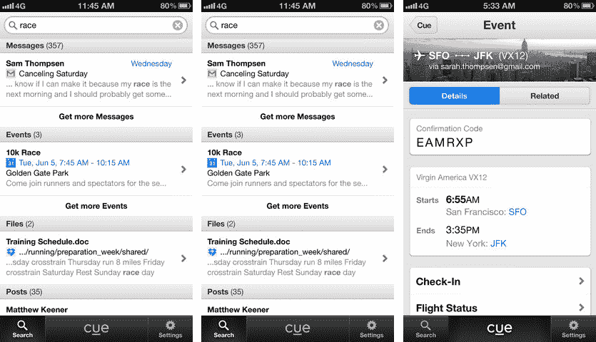

# 苹果以超过 4000 万美元收购 Cue，与 Google Now TechCrunch 竞争

> 原文：<https://web.archive.org/web/https://techcrunch.com/2013/10/03/cue-acquired-for-over-40m-likely-by-apple-to-compete-with-google-now/>

# 苹果以超过 4000 万美元收购 Cue，与 Google Now 竞争

个人助理应用程序 [Cue](https://web.archive.org/web/20221210065708/http://cueup.com/) 已被收购，我们已向知情人士确认。这款应用的售价在 4000 万美元到 6000 万美元之间，我们从两个来源获悉，包括 TechCrunch tips，他们认为苹果已经以超过 3500 万美元的价格收购了该公司。

虽然我们听说价格范围更像是 5000 万美元到 6000 万美元，但苹果内部人士[早些时候发布了](https://web.archive.org/web/20221210065708/http://appleinsider.com/articles/13/10/03/rumor-apple-may-have-acquired-personal-assistant-app-cue-for-at-least-35m)一条匿名消息，称苹果以[至少 3500 万美元收购了该公司。](https://web.archive.org/web/20221210065708/http://appleinsider.com/articles/13/10/03/rumor-apple-may-have-acquired-personal-assistant-app-cue-for-at-least-35m)根据我们的消息来源，Dropbox 在某个时候已经在 Cue 的收购队列中。；)

除了一些著名的天使投资人之外，Cue 还得到了 SV Angel、红杉资本、Lerer Ventures 和 Index Ventures 的支持，并以 Greplin 的名字诞生，这是一家社交搜索初创公司。该公司不会在收购后被关闭，尽管它最近关闭了其应用程序。

Greplin 去年变成了 Cue，并严重依赖用户电子邮件来创建个人议程。Cue 之前在 2012 年 11 月从 Index Ventures 获得了 1000 万美元的融资，这家初创公司选择不对外公布。

个人助理风靡一时，从苹果的 Siri 到谷歌的 Google Now 都占据了头条。也有另一层独立公司对产品表现出类似的意图，如 Nuance 的 Project Wintermute、Incredible Labs 的 Donna 和 Sunrise calendar。苹果很可能会在 iOS 7 中首次推出该产品，Cue 的电子邮件和社交网络魔法用来更准确地表示你正在进行的事情，并出现在通知中心的[的“今天”部分](https://web.archive.org/web/20221210065708/http://cl.ly/RmFX)。

苹果最近的其他收购包括瑞典移动数据初创公司 AlgoTrim、Matcha.tv 和 Embark。

苹果公司给我们自己的 Ingrid Lunden 回复了一份声明，这显然是“你将从这家老牌公司得到的最接近苹果公司的确认”:

> 你好，英格丽德，感谢你对苹果公司的关注。以下是我们对此的声明:苹果不时收购较小的科技公司，我们一般不会讨论我们的目的或计划。

*由 [Ingrid Lunden](https://web.archive.org/web/20221210065708/https://beta.techcrunch.com/author/ingrid-lunden/) 和 [Matthew Panzarino](https://web.archive.org/web/20221210065708/https://beta.techcrunch.com/author/matthew-panzarino/) 补充报道。*