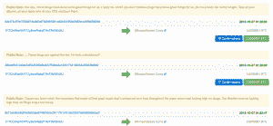

# 随着联邦政府摸索比特币，互联网盯上了联邦调查局的“私人”钱包 TechCrunch

> 原文：<https://web.archive.org/web/http://techcrunch.com/2013/10/07/as-feds-fumble-with-bitcoin-the-internet-trolls-the-fbis-private-wallet/?utm_source=dlvr.it&utm_medium=feed>

# 当联邦调查局摸索比特币时，互联网偷走了联邦调查局的“私人”钱包

比特币既匿名又完全公开。你可以通过系统实时跟踪交易，了解大宗交易发生在哪里，或者在这种情况下，大宗交易发生在哪里。请看，[丝绸之路](https://web.archive.org/web/20230129055533/https://techcrunch.com/tag/Silk-road)陷落后，联邦政府将 26000 BTC 转移到一个私人钱包里，此时，[已经成为恶作剧者](https://web.archive.org/web/20230129055533/http://blockchain.info/address/1F1tAaz5x1HUXrCNLbtMDqcw6o5GNn4xqX?offset=0&filter=0)的目标，他们将它变成了一种反政府涂鸦墙。

这些发送到联邦调查局钱包的迷你交易可能是“开放”互联网上对丝绸之路扣押的最公开的反应。

根据比特币聊天记录，美国联邦调查局取走了属于丝绸之路用户的 2.6 万 BTC——可能是从他们在交易前存放 BTC 的钱包中取走的。他们将 BTC 放入钱包地址“1 f1 taaz 5 x 1 huxrcnlbtmdqcw 6 o 5 gnn 4 xqx”罗斯·乌布里希特的一个装有 60 万 BTC 的钱包——估计是流通中的 BTC 总量的 5%——仍然无法访问，因为它完全被加密了。

发给联邦调查局的信息都在每笔小额比特币交易的“公共通知”部分。他们中的许多人提到禁毒的荒谬，但有些人有点跑题:

另一条评论引用了霍华德·津恩的话:“他们会说我们扰乱了和平，但没有和平。真正困扰他们的是我们在扰乱战争。”

丝绸之路被查封后，人民币汇率基本保持不变，但人民币汇率已从 260 美元的高点跌至今天上午的 130 美元左右。

[通过 ZDNet](https://web.archive.org/web/20230129055533/http://www.zdnet.com/after-silk-road-seizure-fbi-bitcoin-wallet-identified-and-pranked-7000021603/)