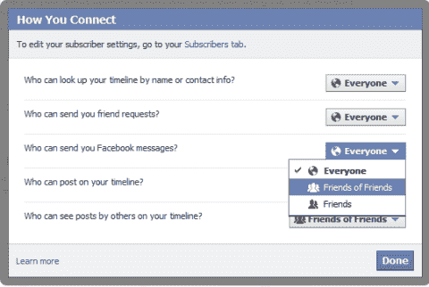
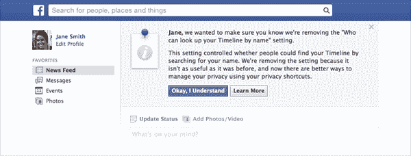
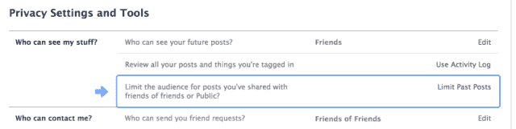

# 脸书删除了无法通过名称搜索的选项，凸显出缺乏通用隐私控制技术

> 原文：<https://web.archive.org/web/https://techcrunch.com/2013/10/10/facebook-search-privacy/>

"谁能通过名字找到你的时间线？"您未阻止的任何人。脸书正在取消这个隐私设置，通知那些隐藏自己的人，他们将会被搜索到。去年 12 月，谷歌在[删除了那些没有使用该选项的用户，并开始推动每个人对他们分享的每种内容进行隐私控制。但是没有一键退出脸书搜索。](https://web.archive.org/web/20230207163548/http://newsroom.fb.com/News/547/Better-Controls-for-Managing-Your-Content)

公平地说，“谁能通过名字找到你的时间线？”这个特性可能被很多人误解了。乍一看，你可能会认为这意味着陌生人无法找到你的个人资料。但这是不正确的。有很多方法可以导航到你的个人资料，比如在你被标记的照片上点击你的名字，在朋友的朋友列表中找到你的名字，或者在共同朋友的新闻订阅帖子上搜索喜欢的内容。

随着图形搜索的推出，嗅出某人个人资料的途径呈指数级增长。基本上每一条个人信息(很快你发布的关于的[内容)都能让你进入搜索。如果你公开列出你住在旧金山，搜索“住在旧金山的人”可以找到你的个人资料。](https://web.archive.org/web/20230207163548/https://techcrunch.com/2013/09/30/graph-search-posts/)

这也让人们认为搜索在某些情况下被破坏了。如果我通过脸书群认识了某人，并想与他们成为朋友，我可能会搜索他们，但如果他们使用了此隐私设置，我就找不到他们了。但更重要的是安全问题。

保留这种隐私选项给了人们一种虚假的安全感。出于这个原因，脸书移除它是明智的。但它应该为选择退出搜索提供一个更强大的通用隐私控制，而不是一系列较弱的控制。

在接下来的几个月里，使用隐私设置来避免名字被搜索的用户将会在他们的脸书主页顶部看到一个大公告，解释正在发生的事情。他们必须确认他们理解这一变化，然后才能重新进入姓名搜索，隐私设置将从他们的选项中消失。

之后，人们可以保持隐藏的方式是手动限制他们个人资料的每个部分的可见性。这有点麻烦。你必须浏览“关于”栏中的每一条个人信息，并将它的可见性设置为“朋友”或“只有我”。至少脸书提供了一个快捷的方法来限制你所有旧新闻的可见性。

严肃的隐私爱好者应该记住，你目前的个人资料照片和封面图片总是公开的，所以如果你不想让任何人知道你的名字以外的任何人，你就必须将这些留为空白。

然而，对于有跟踪者的人来说，脸书可能变得更加危险了。脸书告诉我，防止特定的人发现你的个人资料或查看你的任何内容的方法是阻止他们。但是如果你的跟踪者只是用新名字注册了一个假的个人资料呢？然后他们会搜寻并找到你。

一个解决办法是使用假名。尽管这违反了脸书的服务条款，但对于求职者和隐私爱好者来说，这是一个避开老板和前任情人的流行解决方案。

这就是有摩擦的地方，因为脸书连接世界的使命，为投资者创造回报的责任，以及保护人们隐私安全的职责发生了冲突。脸书不只是想赚更多的钱，设计简单的隐私控制也不是一件简单的事情。在过去的两年里，它为所有的东西都添加了内嵌控件，还在导航栏中添加了隐私快捷方式，但我觉得脸书可以做得更多。

社交网络当然可以提供一个选项来锁定你所有的个人信息，就像它锁定你的旧帖子一样，但它没有。它可以提供一种方法来选择不出现在任何类型的搜索结果中，而不仅仅是搜索你的名字，但它没有。它希望你的朋友能够找到你。它希望图形搜索成为一个全面的工具。它想培养你的友谊和新闻帖子产生的联系，这也让它继续做生意。但是它通过牺牲你选择你的身份被索引多少的权利来保护它对这些东西的访问。

*[形象](https://web.archive.org/web/20230207163548/http://www.unc.edu/courses/2010fall/law/357c/001/socialmedia/facebook.html)*