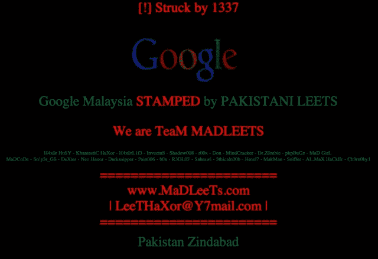

# 谷歌马来西亚网站 DNS 被黑,“马德里队”黑客 1337 TechCrunch 声称对此负责

> 原文：<https://web.archive.org/web/http://techcrunch.com/2013/10/10/google-malaysia-site-hacked-credit-claimed-by-team-madleets/?utm_source=dlvr.it&utm_medium=linkedin>

# 谷歌马来西亚网站域名系统被黑,“马德里队”黑客 1337 声称对此负责

谷歌[马来西亚网站](https://web.archive.org/web/20230130230241/http://www.google.com.my/)被黑客攻击，取而代之的是一个闪屏，显示一个名为“Madleets”的团体。截至周四下午晚些时候，正常网站已经离线几个小时，该页面列出了一系列表面上属于负责团队的句柄。**更新了**，下面是黑客的简短声明。

[攻击似乎是 DNS 中毒的](https://web.archive.org/web/20230130230241/http://thehackerspost.com/2013/10/google-malaysia-gets-hacked-1337-hacker-madleets.html)，黑客进入了马来西亚网络信息中心，将谷歌网站的 DNS 记录更改为由马来西亚控制的服务器。因此，目前谷歌服务器上似乎没有任何信息被更改，因为这是一种重定向攻击。

顶部的邮票上写着“!]strike by 1337 '，这显然是指一个名为 1337 的组织内的[个人黑客，他最近(据称)对几个国家的](https://web.archive.org/web/20230130230241/https://www.facebook.com/MaDLeeTs.phtm)[域名注册商](https://web.archive.org/web/20230130230241/http://thehackerspost.com/2013/10/suriname-antigua-and-barbuda-and-saint-lucia-high-profile-sites-hacked-by-1337.html)进行了黑客攻击。1337 的脸书页面上有一条信息称“谷歌马来西亚由 1337 盖章”，并提到了 google.my 和 google.my 域名。关于这个组织可能是谁的唯一另一个指标是提到他们是巴基斯坦人。

[Madleets 地址](https://web.archive.org/web/20230130230241/http://www.madleets.com/)指向团队的[脸书页面](https://web.archive.org/web/20230130230241/https://www.facebook.com/Madleets)，该页面发布了以下消息:

> 我们觉得我们需要提醒任何人，我们不会因为任何形式的仇恨而黑掉任何国家的顶级域名，例如 google.com.my，我们不恨任何人，我们热爱全人类，没有明显的理由要给顶级域名加盖印章。至少原因不是任何种类的仇恨。不管原因是什么，我们无法解释，除了我们爱你们所有人。
> 顾氏
> H4x0rL1f3

页面信息显示“MadLeets 是一个道德和 1337 白帽黑客社区。我们是反黑客，我们教授如何保护自己免受黑客攻击。”

如果团队的脸书页面上的推理是准确的，那么这只是一个简单的问题，因为他们可以而不是做一个政治声明。放置在页面[源代码中的链接指向艺术家器乐核心的音乐视频](https://web.archive.org/web/20230130230241/http://www.youtube.com/watch?feature=player_embedded&v=B8EWfoaeZOI#t=19)。当访问者在网站上时，音乐会自动播放。

七月，谷歌马来西亚和其他几个马来西亚网站被一个抗议孟加拉国工人待遇的团体黑了。该组织现在采取行动的一个可能动机是吉隆坡的全球创业峰会(Global Entrepreneurship Summit)，美国国务卿约翰·克里(John Kerry)将代替美国总统巴拉克·奥巴马(Barack Obama)出席该峰会。

我们联系了网站上给这个团队的电子邮件地址和谷歌。如果我们收到任何一方的回应，我们将更新这个故事。

**更新**:黑客们向 TechCrunch 发布了一份简短声明:

> 背后没有太多道理，只能证明安全感只是一种假象。它不存在。
> 
> 正如你已经说过的，我们没有任何政治意图。
> 
> 问候你，李特

凯瑟琳·舒对本文亦有贡献。

**更新 2** :和[以下是 Integricity 公司对情况的解释](https://web.archive.org/web/20230130230241/http://www.integricity.com/blog/google-com-my-outage)，这家公司为谷歌在马来西亚运营域名服务器，他们恢复了网站的运行。