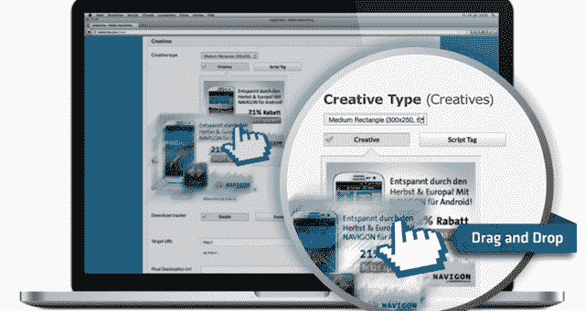

# 刚刚推出的移动广告管理平台 LiquidM 筹集了 500 万美元

> 原文：<https://web.archive.org/web/http://techcrunch.com/2013/10/10/liquidm-launch-series-a/>

初创公司 LiquidM 今天推出了一个新平台，供广告网络、交易平台和运营商管理他们的移动广告活动。该公司还宣布，它已经从 Blumberg Capital、Earlybird Venture Capital 和 Asset Management Ventures 获得了 500 万美元的首轮融资。

首席执行官 Christof Wittig 来自[一个软件背景](https://web.archive.org/web/20230319210253/http://www.linkedin.com/in/christof)(而不是媒体背景)，他说随着他越来越多地参与移动行业，他说他惊讶地发现移动广告比他预期的“少得多的软件支持”。换句话说，他发现移动营销活动通常是通过耗时的内部技术、“单点解决方案”和 AppNexus 等并非专为移动领域打造的产品的组合来管理的。

LiquidM 正在提供它所说的“全栈”平台，管理从优质广告到效果广告的一切。该公司强调的功能包括拖放式活动设置、与第三方富媒体提供商的集成、对实时竞价的支持以及基于地理、人口统计、设备等的目标定位。维蒂希强调，LiquidM 是一家不可知的技术提供商，本身并不是一家媒体公司。

他认为拥有一个“为移动而从头开始构建的”平台是至关重要的。例如，他说，当传统的广告管理平台转向移动时，他们往往专注于移动网站，同时将应用程序视为“黑匣子”。首席产品官 Roi Chobadi 补充说，专注于移动设备还可以让广告商利用独特的定位功能——例如，使用 LiquidM，他们可以将他们的位置数据与美国人口普查数据相结合，以针对特定的人口统计群体投放广告。

当被问及多屏广告的作用时，维蒂希表示，他原则上同意广告商对接触受众感兴趣，不管他们使用什么设备——但这并不意味着单一的广告管理平台可以处理一切。

“捆绑销售发生在食物链的上游，但是技术，在引擎盖下发生的事情，在移动设备上完全不同，”他说。

维蒂希说，这项技术最初是由欧洲移动广告网络 Madvertise 为满足自己的需求而开发的，后来 LiquidM 决定解决这个问题，它收购了产品和团队，而 Madvertise 专注于网络业务。(LiquidM 的总部位于旧金山，但产品和技术开发仍在柏林进行。)事实上，Madvertise Media 现在是 LiquidM 的客户之一，还有 M & C Saatchi、Orange、Fetch 和 Mobilike。