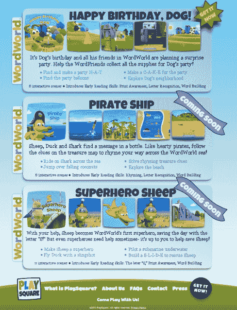

# 继好奇影业投资之后，PlaySquare 首次推出面向儿童的“可触摸电视”iPad 应用 TechCrunch

> 原文：<https://web.archive.org/web/http://techcrunch.com/2013/10/11/following-investment-from-curious-pictures-playsquare-debuts-touchable-tv-ipad-apps-for-kids/>

对于儿童电视的制片人来说，iPad 是最终让他们突破第四堵墙的设备，以便直接与观众互动，观众现在不仅可以观看和回应屏幕上的活动，还可以参与推动故事的发展。一家试图建立新型“iPad 电视”业务的公司是 [PlaySquare](https://web.archive.org/web/20230129092016/http://www.playsquare.tv/) ，其首款应用[于去年夏天推出](https://web.archive.org/web/20230129092016/https://techcrunch.com/2012/08/08/dream-team-of-childrens-tv-producers-create-playsquare-touchable-tv-for-the-ipad/)，现已退出测试。PlaySquare 正在全面投入生产，新的“可触摸电视”剧集正在商店中，还有更多正在开发中。

该公司由一个制片人团队和其他在儿童电视方面有经验的人创建，包括首席执行官[亚历克斯·凯](https://web.archive.org/web/20230129092016/http://www.linkedin.com/pub/alex-kay/21/619/735)，他之前创建了三次获得艾美奖奖的 PBS 节目 [WordWorld](https://web.archive.org/web/20230129092016/http://pbskids.org/wordworld/index_flash.html) ，以及执行制片人[蒂娜·皮尔](https://web.archive.org/web/20230129092016/http://www.imdb.com/name/nm1381241/)，她在电视领域有 30 多年的经验，包括在[芝麻工作室](https://web.archive.org/web/20230129092016/http://www.sesameworkshop.org/)工作了 15 年。

至于应用程序本身，PlaySquare 开始重新利用 Kay 从 WordWorld 获得的资产，将其用于 iPad，同时还引入了新的参与形式，孩子们必须完成任务和玩游戏，因为他们探索“世界”和其中的角色。现在，该公司正在将这款应用程序从测试期转移出来，并推出可供应用内购买的新剧集，试图将可触摸电视变成一项创收业务。

进展跟随纽约制作公司[好奇影业](https://web.archive.org/web/20230129092016/http://www.curiouspictures.com/)的合作伙伴和投资。《好奇》以受欢迎的电视节目而闻名，如迪士尼的《小爱因斯坦》(Little Einsteins)、小尼克(Nick Jr .)的《宇宙战队》(Team Umizoomi)和 HBO 的《有点好奇》(A Little quicky)等。今年早些时候[我们被告知](https://web.archive.org/web/20230129092016/https://techcrunch.com/2013/04/11/curious-pictures-producers-of-popular-disney-nick-pbs-childrens-television-invests-in-kids-app-maker-playsquare-a-startup-building-touchable-tv/)，他们已经承诺在未来两年内投资 150 万美元，并持有该公司的股份。

凯说，PlaySquare 在 2013 年一直忙于建立新内容的管道，现在正在向苹果提交升级的应用程序，等待他们的批准。新应用预计最早将于周一发布，但一般来说，它可能会在 10 月中旬甚至更早发布，这取决于苹果的审核过程。

最初的测试版应用是单集体验，但它正在进行改造，使其成为新的 PlaySquare 电视平台的一部分。Kay 解释说，这款应用将拥有不同的外观和导航元素。每个应用程序仍将是自己的应用程序，但将通过可点击的链接连接到所有其他应用程序，这些链接将直接启动父母购买的其他内容。随着原应用程序的改头换面，名为“海盗船”的第二集也将于本月推出。11 月，《超级英雄羊》也将开播，12 月的假日剧集也将紧随其后。所有这些将继续在“WordWorld”中进行，每个 2.99 美元。

“是同一个型号。凯解释说:“我们挑选了 WordWorld 电视节目]中最精彩的几集，并在其中穿插一些活动，这样孩子就可以帮助推动它向前发展。”。“我们本质上是在开放这些剧集——在某种程度上，这就像是从 2D 和 3D 开始。”

凯告诉我们，最初的应用程序被下载了很多次——在低六位数，但确切的数量没有在记录中披露，因为该公司尚未专注于用户获取或直接向消费者营销。

也就是说，PlaySquare 现在已经有 340 万次会话，相当于 2200 万分钟的使用时间。这些数字表明，虽然它的用户群仍然有点小，但他们正在参与。(有趣的是，我们在家里也看到了同样的事情。尽管这款应用已经有一年多的历史了，但它仍会定期启动，并反复播放多次。)

“数字一直很稳定，”凯补充道。从 5 月份到今年夏天，下载量翻了一番。“我们还没有看到开始时的高峰和下降，我们希望随着我们有更多的剧集，并告诉父母应用程序中可以提供什么，这将成为我们营销计划的关键部分。”

与此同时，随着基于 WordWorld 的剧集进入制作阶段，以每月一部的速度推出新的版本，该公司也在与其他儿童电视资产所有者进行讨论——其中一些是由于与好奇的合作，好奇也向 PlaySquare 提供艺术和动画服务(100 人团队)，作为他们投资的一部分。

本月晚些时候，PlaySquare 将宣布一项为电视开发的新地产交易已经完成。该节目将在电视上播出，随后 PlaySquare 将推出可触摸电视体验，涉及向所有者返还版税——该公司计划在未来为其他公司复制这一模式。“他们的专长是电视，”凯谈到新协议，以及为什么电视制片人不想自己承担应用程序的创作。“开发这些东西需要资金和时间。对他们来说，使用第三方并免费开发是有意义的，”他解释道。

### “你不可能有一家只做一款应用的企业。”

最重要的是，Kay 认为多集/多应用模式是成功的儿童应用程序制造商必须采用的模式。这个领域的其他品牌，包括 Toca Boca、Duck Duck Moose 和其他更大的品牌都是这么做的。

“你不可能有一个只做一个应用程序的企业，甚至不可能有一个做很多不同应用程序的企业，”凯说。“我们正在制作一系列内容，如果有人喜欢 WordWorld，希望他们会购买所有 10 到 15 集。然后，当我们发布另一个属性时，希望他们也会尝试一下。”

目前的 PlaySquare 应用程序在测试期间是免费的，在发布前就从应用商店中消失了。然而，[感兴趣的家长可以在这里注册，以收到一封电子邮件](https://web.archive.org/web/20230129092016/http://www.playsquare.tv/mailinglist.php)，提醒他们预计在 10 月中旬重新发布。