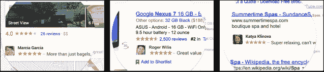
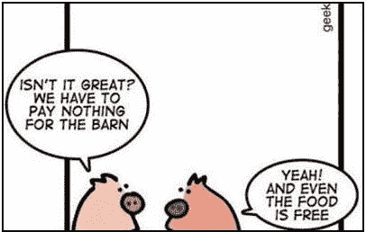

# 你不仅仅是产品，你还是广告(你的朋友应该感谢你)

> 原文：<https://web.archive.org/web/https://techcrunch.com/2013/10/11/you-make-ads-better/>

口碑，赞助。可信推荐，提升。朋友的评论，赞同。这是新的广告词汇。随着世界学会忽略传统的在线广告，科技巨头们找到了一种抓住人们注意力的方法:使用你的名字、面孔和话语。我们同意吗？也许我们应该。

今天，谷歌宣布了[“共享背书”](https://web.archive.org/web/20221219071723/https://techcrunch.com/2013/10/11/google-to-start-employing-user-ratings-and-photos-in-shared-endoresments-ads/)，这是其在广告中使用你的 Google+ '+1s '计划的扩展。[现在谷歌可以](https://web.archive.org/web/20221219071723/http://www.google.com/policies/terms/changes/)显示你的活动，比如关注一个品牌，评论一篇帖子，或者在广告中评论一家企业，广告上有你的名字和面孔，你允许人们看到你采取的行动。谷歌允许企业支付费用，与你更多的朋友分享这些认可，而不是像通常那样出现在搜索结果、地图、Google+和其他地方。谷歌并不孤单。

2011 年，脸书凭借其[“赞助商故事”](https://web.archive.org/web/20221219071723/http://www.insidefacebook.com/2011/01/24/sponsored-stories-feed-ads/)广告单元开创了这种社交广告模式。脸书的过滤新闻源只显示你朋友的最重要的帖子。但是如果你喜欢一个品牌的页面或帖子，在一家企业登记，下载或使用一个应用程序，或者分享一个链接，广告商可以付费提高该行为在提要中的可见性，或者让它出现在侧边栏广告中。

Twitter 也有社交广告。它的“推广推文”显示你不关注的商家的帖子。为了显示这些企业是有信誉的和相关的，广告会显示你所关注的人的名字。在我的信息流中，惠普的一条推广推文提到了我关注的三个账户。不过，Twitter 不会在广告中使用你的脸、文字或内容，社交环境也没有谷歌和脸书那么突出。

将社交信号与广告结合起来会让营销看起来不那么普通，考虑到我们每天会看到多少广告，这一点很重要。仅仅因为你不点击那些广告，并不意味着它们没有效果。

正如脸书的测量主管肖恩·布鲁奇告诉 Slate 的法尔哈德·曼朱的那样，“平均来说，如果你看看那些在脸书上看到一个广告，然后购买了一个产品的人，只有不到 1%的人点击了这个广告。”如果你朋友的名字和面孔让你看了，广告已经完成了他们的工作。

### 你不是顾客

在互联网行业，有一句话叫。"如果你不是顾客，你就是产品."本质上，如果你不付费使用服务，你可以期待你的数据会以某种方式被用来赚钱。很长一段时间以来，这种商业模式专注于利用你的数据来*锁定*广告。搜索某个关键词，你会看到相关产品的广告。列出你是一个喜欢电子游戏的 25 岁男性，你会看到你这个年龄段的人经常购买的东西的广告。

这仍然是很多互联网广告的运作方式。Pinterest 和 Instagram 开始展示广告，这些广告会考虑到你关注的内容。LinkedIn 分析你的个人资料，提供与你的收入阶层相关的广告，Spotify 查看你听的内容，让乡村粉丝听到皮卡的广告。

重新定位是广告中的另一个[近期](https://web.archive.org/web/20221219071723/https://techcrunch.com/2012/06/13/facebook-exchange/) [趋势](https://web.archive.org/web/20221219071723/https://techcrunch.com/2013/07/03/twitter-will-soon-start-showing-more-targeted-ads-based-on-user-account-information/)。网站可以跟踪你在网上访问过的其他网站留下的 cookies，而不仅仅是根据你在某项服务上做了什么来定位广告。这意味着，如果你几乎在某个旅游网站上购买了飞往夏威夷的航班，夏威夷航空可能会向谷歌、脸书、Twitter 或 LinkedIn 支付费用，向你展示同一航班的折扣广告，希望你会扣动扳机。

但现在，不仅仅是你的数据被无形地用于定向广告。你的*内容和身份*是被*用作*广告。

谷歌正在以最尊重和负责任的方式做这件事。你可以[完全拒绝](https://web.archive.org/web/20221219071723/https://plus.google.com/settings/endorsements?hl=en)将你的内容用作广告。脸书允许你[选择不在“社交广告”](https://web.archive.org/web/20221219071723/https://www.facebook.com/settings?tab=ads&section=social&view)中使用，这种广告会在广告旁边显示你的名字，但你不能选择不使用你的内容作为广告的赞助故事。Twitter 没有提供任何方法来选择不在广告中使用你的名字(尽管你可以选择不显示个性化的推荐和重定向广告)。

公司必须在业务健康和用户自由之间做出选择。如果他们让人们很容易地选择退出，他们的广告就不会那么有效，他们花在制造产品上的钱就少了。

### 广告不可避免…

对于一些人来说，对社交广告的本能反应是厌恶、偏执和愤怒的结合。被用来推销产品会让人觉得…被利用了。他们要求隐私和控制。与此同时，一些人支持广告拦截软件，并希望他们再也不会在网上看到广告。

但是让我提供另一种观点。广告是消费者互联网的生命线。广告是支付设计师、工程师和服务器的费用，让我们最喜欢的服务持续运行。

如果没有广告，谷歌、脸书和 Twitter 等服务可能不得不收费。这对一些人来说很烦人，对另一些人来说又太贵了。如果你三分之一的朋友因为不想付费而不在社交网络上，那么社交网络就没有那么多乐趣了。传递知识和生产力的服务将留给有钱的人，而不是真正需要信息和权力的人。广告可以带来一些好处。

### …它们不应该相关吗？

如果我们接受大型科技公司不会放弃广告，我们就可以专注于让我们与他们的体验尽可能地无痛。这可能意味着让他们容易被忽视。我们的本能会自然而然地将我们的目光吸引到人脸上，尤其是我们认识的人。朋友的名字从文本中突出。如果你的目标是在浏览世界顶级网站和应用程序时保持一种禅宗般的状态，社交广告没有帮助。

但是，如果你希望你在网上看到的一切都是相关和有用的，社交广告可以把你引向你真正喜欢的东西。现在有很多应用程序。在脸书上看到一个广告，指出你的朋友使用哪些应用程序，或者在谷歌上看到你的朋友给了一个五星评价的应用程序，这些都可以帮助你寻找值得下载的东西。同样的道理也适用于选择当地的餐馆、电影或家用清洁产品。

广告商会说任何让你购买的话(他们甚至会用婴儿的照片)。当他们说他们是“最好的日历应用程序”、“最好吃的披萨”、“最有趣的电影”或“最柔软的卫生纸”时，很难知道你是否能相信他们。但是你信任你的朋友。我们总是直接向他们征求意见。社交广告只是扩大口碑，给你推荐，而不需要他们重复。

所以在某些方面，不选择不被用作社交广告，你是慷慨的。你把你的朋友从无关的广告中拯救出来，因为他们并不关心这些东西。

也许每个人都应该效仿谷歌，给你选择不把你的名字、面孔和活动变成广告的自由——即使这会伤害提供免费服务的公司和使用这些服务的朋友。如果你想利用提供的选择退出，请继续。[更新:你有权说你不会利用你的身份，这些公司可以找到另一种赚钱的方式。也许他们应该。]

但是在你选择退出之前，请记住，你可以选择为其他人做更好的广告。