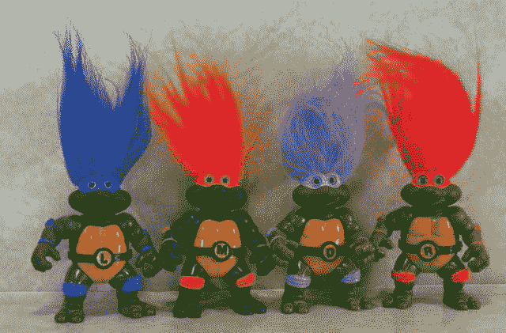

# 研究:脸书的评论比报纸网站的评论更文明

> 原文：<https://web.archive.org/web/http://techcrunch.com/2013/10/13/study-facebook-comments-are-more-civil-than-newspaper-website-comments/?utm_source=dlvr.it&utm_medium=feed>

# 研究:脸书的评论比报纸网站的评论更文明

**假设**:当一个人的朋友可以看到一个完全陌生的人是一个彻头彻尾的混蛋时，他就不太可能指责一个完全陌生的人是一个社会主义恶魔，一心想杀死享有免费医疗保险的婴儿。

**测试**:真

一项新的研究发现，脸书用户的文明程度是在华盛顿邮报评论区梳理荒地的匿名钓鱼网民的两倍。伦敦肯特大学的伊恩·罗教授解释说:“与脸书版本相比，读者评论中不文明的交流行为在《华盛顿邮报》的网站版本中明显更常见，用户可以保持匿名。”我希望这是一种令人愉快的英国口音。

将网站上对同一篇文章的评论与脸书网站上的评论进行比较，罗发现，用户在网站上不文明的可能性超过一半，评论中有刻板印象、讽刺、辱骂以及我们以前都见过的许多其他特征。现在，对脸书来说并不全是玫瑰和阳光:用户更可能骂人和粗俗，尽管粗俗似乎在统计上无关紧要。

罗的发现与我在其他新闻机构的朋友们的发现大体一致。当《洛杉矶时报》转到脸书评论时，讨论的水平显著提高了。《洛杉矶时报》在线总编辑吉米·奥尔说:“巨魔不希望他们的朋友知道他们是巨魔。”。

然而，脸书的出现并没有完全阻止一些网站删除评论。PopScience 最近[抛弃了](https://web.archive.org/web/20230128104202/http://www.popsci.com/science/article/2013-09/why-were-shutting-our-comments?src=SOC&dom=tw)的评论，引用了[的证据](https://web.archive.org/web/20230128104202/http://www.nytimes.com/2013/03/03/opinion/sunday/this-story-stinks.html?_r=1&)说，巨魔扭曲了读者解读证据的方式，因此粉碎了开诚布公的讨论。TechCrunch 在转向 Livefyre 之前，曾短暂地与脸书的评论有过接触。人们认为脸书的确会杀死巨魔，但[它也会伤害](https://web.archive.org/web/20230128104202/https://techcrunch.com/2011/03/06/techcrunch-facebook-comments/)社区和有见地的匿名评论者。谷歌正在将 YouTube 评论这一智力下水道切换到 Google+,这可能会有所帮助。

不管怎样，让我们一起重复一遍:我们不知道这些实验的规模。正如我以前写过的，韩国的实名制法律没能提高评论的质量。我们不知道滋生巨魔的确切条件，所以我们真的不知道如何阻止他们。

也就是说，你可以随意登录脸书，深思熟虑地告诉我，为什么我是奥巴马的助手，带领美国进入一个小狗溺死的独裁政权，由混血同性恋夫妇的铁腕统治，他们用没收的枪支射杀儿童。