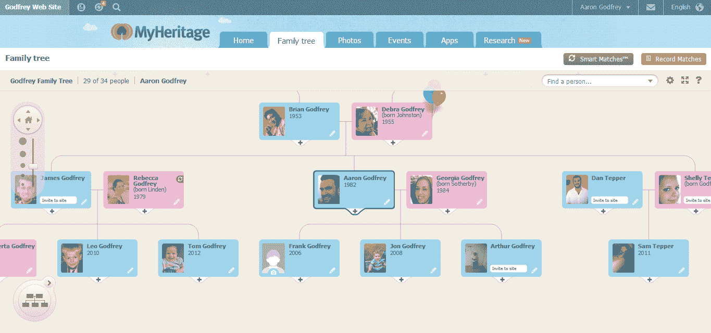
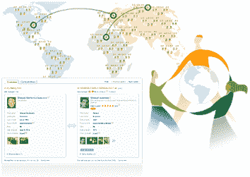

# MyHeritage 与 FamilySearch 合作，将数十亿条历史记录添加到其家谱数据库| TechCrunch

> 原文：<https://web.archive.org/web/https://techcrunch.com/2013/10/15/myheritage-partners-with-familysearch-to-add-billions-of-historical-records-to-its-genealogy-database/>

# MyHeritage 与 FamilySearch 合作，将数十亿条历史记录添加到其家谱数据库中

说到在线家谱，两个主要的盈利玩家是[Ancestry.com](https://web.archive.org/web/20230306014008/http://www.ancestry.com/)和 [MyHeritage](https://web.archive.org/web/20230306014008/http://www.myheritage.com/) 。Ancestry.com 在“我的遗产”上领先一步，但它主要集中在收集历史记录上，而“我的遗产”则强调构建和匹配家谱。但现在它也开始积累更广泛的历史记录。今天，MyHeritage 宣布与该领域最大的非盈利机构摩门教会资助的家庭调查公司(T7)建立多年合作关系。

由于这种合作关系，MyHeritage 的用户现在可以从 FamilySearch 获得 20 亿条历史记录和家谱资料。作为回报，FamilySearch 的用户将能够使用 MyHeritage 的技术(通过该公司的 API)将家谱与历史记录进行匹配。MyHeritage 已经将 150 名员工中的 40 名投入到这个项目中。虽然合作有时间限制，但 MyHeritage 创始人兼首席执行官吉拉德·贾菲特没有透露协议的期限。

Japhet 表示，这项服务目前有大约 7500 万注册用户，他们增加了 16 亿个个人资料。它有 40 种语言版本，虽然 Ancestry.com 在美国可能更大，但 MyHeritage 认为它在大多数欧洲和南美国家都是最大的玩家。

 因为很难在服务之间迁移家谱，所以它看到了非常高的保留率，但这也意味着如果不直接收购这些服务，很难从较小的竞争服务中获得新用户。例如，大约一年前， [MyHeritage 收购了 Geni.com](https://web.archive.org/web/20230306014008/https://techcrunch.com/2012/11/28/all-in-the-family-myheritage-buys-former-yammer-stablemate-geni-com-raises-25m/)，以获得其工程师、用户和数据。

MyHeritage 的一个独特之处是它能够匹配用户的家谱，这有助于他们发现以前未知的家族分支。该服务的模糊匹配算法可以找到这些匹配，即使有小错误或替代拼写。

今天与 FamilySearch.org 的合作为 MyHeritage 带来了广泛的新文件，该公司现在正在消化这些文件，并计划在未来几个月内开始曝光。鉴于摩门教出于宗教原因对家谱的关注(这有时会使其陷入困境)，FamilySearch 已经积累了一个最大的(如果不是最大的话)家庭历史记录数据库。总的来说，FamilySearch 将向 MyHeritage 提供大约 10 亿条记录。

正如 Japhet 所指出的，FamilySearch 坐拥大量数据，但却不具备轻松分析这些数据的技术。另一方面，我的遗产公司有技术，但需要更多的数据。在他看来，这是一个“三赢”的局面，因为两家公司以及它们的用户将几乎立即从这种伙伴关系中受益。