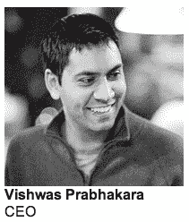
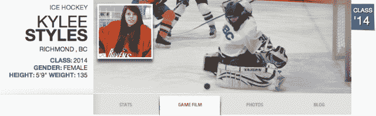

# 去年 Raine Group 以 1700 万至 2200 万美元秘密收购了高中运动员网站 beRecruited TechCrunch

> 原文：<https://web.archive.org/web/http://techcrunch.com/2013/10/18/berecruited-acquired-by-raine/?utm_source=dlvr.it&utm_medium=twitter>

据消息人士告诉我和 beRecruited now 核实，希望被大学球队招募的“高中运动员 LinkedIn”被私募股权公司[Raine Group](https://web.archive.org/web/20230129223326/http://www.raine.com/)秘密收购。了解该交易的消息人士证实，Raine 为 beRecruited 支付了 1700 万至 2200 万美元，因为它的增长势头和利润丰厚的溢价功能。

前几天得到了一个关于收购和价格的提示，又找了一个来源确认。当记者追问时，beRecruited 首席执行官 Vishwas Prabhakara 告诉我们“我可以确认 Raine 集团拥有 beRecruited。”

当被问及这笔交易为何保密时，他表示“我们在一个广阔的市场中成长，公布这笔交易没有任何好处。这是旅程的开始，而不是结束。”从战术上来说，将这笔交易保密的目的可能是为了防止其他企业家意识到并投资于体育招聘领域。好吧，现在秘密已经泄露了。

具体来说，beRecruited 允许运动员创建个人资料，突出他们经过验证的学术和运动成绩，研究他们可能想参加的大学，并与大学招聘人员联系。beRecruited 为学生提供了高级功能，例如可以看到哪些招聘人员正在查看他们的个人资料，出现在教练的主页上，并通过感兴趣的信件联系他们。

beRecruited 拥有来自美国 20，000 多所高中的 200 多万名注册学生运动员。在过去的一年中，有 25000 名大学招聘人员登录，这是全国估计的 40000 至 45000 名大学招聘人员的一半以上。

该公司于 2000 年由高中生 Ryan Spoon 创立，他于 2007 年从 T2 麦迪逊·帕克资本公司获得了 120 万美元的种子资金，以换取我们所知的多数股权。2011 年 6 月，[公司收购了 Y Combinator 年夏季初创公司 Fanvibe](https://web.archive.org/web/20230129223326/https://techcrunch.com/2011/06/27/fanvibe-berecruited/) ，并任命其创始人 Prabhakara 为首席执行官。

最近，beRecruited 发布了一款 iOS 应用程序，进行了重新设计，并成为了 IMG 学院的官方招聘方[，这是一所为毕业于玛利亚·莎拉波娃和埃利·曼宁的高中生开设的体育培训学校。](https://web.archive.org/web/20230129223326/https://techcrunch.com/2013/07/30/berecruited-a-networking-site-for-high-school-athletes-is-the-top-pick-for-elite-training-camp/)

当它被 Raine Group 收购时，它有六名员工，标价为 1700 万至 2200 万美元，消息人士证实，这对其团队和投资者来说是一个大胜利。现在 beRecruited 有 14 名员工，还在继续招人。

beRecruited 表示，Raine Group 决定收购它是基于其基本面，包括收入增长、盈利能力、团队和市场。在一个基于网络效应的行业中，拥有如此庞大的用户群，beRecruited 可能很难被颠覆，而且有足够的发展空间。

从更宏观的趋势来看，你可以说科技让人们更密切地关注体育运动，因此体育运动将不断赚钱，从事体育运动将变得更加有利可图。这意味着奖学金和招聘对高中生来说将更具竞争力，他们将更愿意向 beRecruited 这样的网站付费以获得优势。