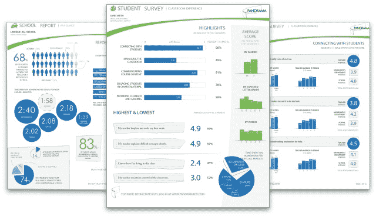

# Panorama Education 希望通过调查和分析帮助修复学校，从扎克伯格的初创公司:Education、Google Ventures 等获得 400 万美元 TechCrunch

> 原文：<https://web.archive.org/web/https://techcrunch.com/2013/10/21/panorama-education-wants-to-help-fix-schools-with-surveys-and-analytics-gets-4m-from-zuckerbergs-startupeducation-google-ventures-and-more/>

[Panorama Education](https://web.archive.org/web/20221006141709/http://panoramaed.com/) 是一家快速发展的初创公司，为学校制作和管理调查，以帮助教师和管理人员更好地了解他们在学习和社会包容等领域的表现，该公司今天宣布获得 400 万美元的种子资金，将用于将其大数据教育方法深入美国市场和全球。

Panorama 及其融资故事在多个方面引人注目。[在今年早些时候孵化了 Y-Combinator 项目中的](https://web.archive.org/web/20221006141709/https://beta.techcrunch.com/2013/08/15/panorama-education-wants-to-make-polling-parents-students-and-teachers-easier-for-educators/)(也是我们在 2013 年 8 月[演示日](https://web.archive.org/web/20221006141709/https://beta.techcrunch.com/2013/08/20/y-combinator-demo-day-summer-2013/)的最佳选择之一)，Panorama 的投资者现在包括[初创公司:教育](https://web.archive.org/web/20221006141709/http://www.startupeducation.org/aboutus.html)——由脸书首席执行官马克·扎克伯格和他的妻子陈慧娴领导的基金会——soft tech VC、谷歌风投、阿什顿·库彻的 A-Grade Investments 和联合创始人曾就读的耶鲁大学。

这是来自初创企业:教育的第一笔全国性股权投资，三年前，它进行了第一次也是唯一一次努力——向纽瓦克市的学校系统捐赠 1 亿美元。

“Priscilla 和我很高兴能够支持全景教育及其使命。马克·扎克伯格在一份声明中说:“他们的公司是一个令人兴奋的例子，证明了技术可以帮助教师、家长和学生表达他们的意见。”。

据我们所知，这将是更多来自 Startup:Education 的股权投资的第一笔，重点将继续放在基于使命的努力上，而不一定是那些在规模或财务实力上可能成为“下一个脸书”的努力。创业公司:教育的确切规模尚未确定，但扎克伯格夫妇最终会将一半的财产捐赠给公益事业，而且已经有了其他教育和公共政策方面的努力，包括参与推动计算机科学教育的[Code.org](https://web.archive.org/web/20221006141709/http://code.org/)倡议、[Internet.org](https://web.archive.org/web/20221006141709/http://internet.org/)跨公司推动，以鼓励全球更多采用联网服务来帮助发展，以及扎克伯格的 [FWD.us](https://web.archive.org/web/20221006141709/http://fwd.us/) 游说移民改革的努力。

具体回到 Panorama，联合创始人 Aaron Feuer 告诉我，这笔种子投资将用于一些不同的目的。

首先是继续扩大其在美国市场的业务:该公司目前为大约 4，000 所学校提供服务，覆盖超过 100 万名学生，客户包括康涅狄格州和科罗拉多州的教育部，最近还包括洛杉矶联合学区(Feuer 的家乡)及其 55 万名学生。到目前为止，它还没有解决私人机构或任何超出 K-12 范围的问题，所以那里仍然有很多机会。

他说，第二步将是进行首次国际努力。本月，该公司与 [Teach for All](https://web.archive.org/web/20221006141709/http://www.teachforall.org/) 合作，将其服务扩展到 17 个国家，首先从英国开始。“这些计划仍在变化中，”他在一次采访中告诉我。

Feuer 在 2010 年创办了 Panorama，当时他和联合创始人 Xan Tanner 还是耶鲁大学的本科生，但获得关于学校如何运作的更好反馈的想法可以追溯到 Feuer 在洛杉矶读高中的时候。

作为一名学生会主席，他与其他学校的学生会领导合作，领导了一场全州范围的运动，将更好的反馈带入课堂。“我们甚至为此通过了一项法律，”他说。"每个人都喜欢这个想法，但问题是实际操作起来太难了。"进入全景。

### 问题第一，技术第二

我对 Panorama 感兴趣的是，虽然今天许多初创公司都是由技术创新引领的，然后寻找有趣的应用程序——也许是工程师和开发人员也充当企业家的结果——但这家初创公司却走了另一条路，这条路也受到优步和 Airbnb 等公司的支持。也就是说，它使用技术作为解决通常不被认为是“技术”目的的手段。或者，正如弗伊尔所说，“我们不想创业，但这是解决问题的最佳方式。”

许多人，比如 Yammer 的 David Sacks 认为，利用技术来解决非基本技术问题，恰恰是当今创业公司的重大机遇之一。

到目前为止，Panorama 的公式似乎是有效的。弗伊尔解释说，该公司与学区合作，以确定问题，构思需要问什么问题，以及如何问这些问题。然后，它为其调查提供了一种混合格式——涵盖数字/在线问卷，但也包括纸质调查和电话采访——以获取数据。

“我们做了大量的纸质调查，现在有 50 万份，”他告诉我。然后，它使用自己的人员和系统来分析和解析数据。当学校选择加入时，来自其他调查的匿名数据也会与现有信息相结合，以形成更完整的比较分析。

“在这个过程的最后，我们帮助他们理解它的含义，”他告诉我。有时候，这些信息可能永远不会被发现，但对于试图回答某些问题是至关重要的，这些问题是为什么一些看起来有前途的学生后来可能会掉下梯子。"你知道欺凌弱小是九年级男生特有的问题吗？"他问我。“如果你问老师，他们看到了，但他们不做任何事情来阻止它。这不是你能从任何产品中得到的。我们正在帮助那些(决策者)获得最多的信息。”

服务的定价取决于许多因素，Feuer 拒绝透露该公司目前的收入。(今年 5 月，Panorama 拥有约 1100 名客户，全年运营费用约为 50 万美元。)更重要的是，“我们还没有遇到一个学区说负担不起我们的费用，”弗伊尔告诉我，这是对它所做的事情的重要性及其定价的认可。

Feuer 说，他看到今天的竞争对手是典型的管理咨询公司，而不是世界上的调查猴子，他们通常以很高的成本来彻底改造学校系统的反馈和响应系统，以及更广泛的 IT 基础设施升级。

这也指出了 Panorama 本身在未来的发展方向。“调查不是我们的长期愿景，”Feuer 说。“学校让我们去那里解决问题，比如制止欺凌或其他事情。但是如果你沉迷于调查，你会错过更大的问题。看反馈很重要，但有些公司是调查公司；我们没有。我们把它作为第一个高峰来关注。”

事实上，你可以看到这也适用于许多其他行业，尽管正如 Feuer 向我指出的那样，教育目前已经是一个足够大的挑战。

图片: [Flickr](https://web.archive.org/web/20221006141709/http://www.flickr.com/photos/thoseguys119/9840943264/sizes/l/in/photolist-fZBpzA-7Lbfig-cVdJ3d-7WRCtV-7GbrVU-8pdR8Z-9hFQzM-7CJRNM-7WkDuF-9hFQht-9hZuwX-auK2uT-9djFa2-fKt4WL-gFAx3z-9DHvNH-fZBuTd-gtQ6y2-gLrfb4-gFBbf8-fTUPbC-gKBxuu-fUXnpd-f24K2m-fQbcP5-f1PqBR-f24KiN-gnZVmL-gLqjSc-fNECGv-go13Kv-gvqBnh-gKC5es-gtSqHu-8coAeP-cotGoL-axS16M-9DHvfH-g7yX1W-g4g96Y-f2zZFu-f2zZpj-diYnjb-g7ytRr-8pTgLj-fMVSUX-fMVU1r-fZBCJJ-g4gaQ7-fQaVDy-fZC2dZ/)