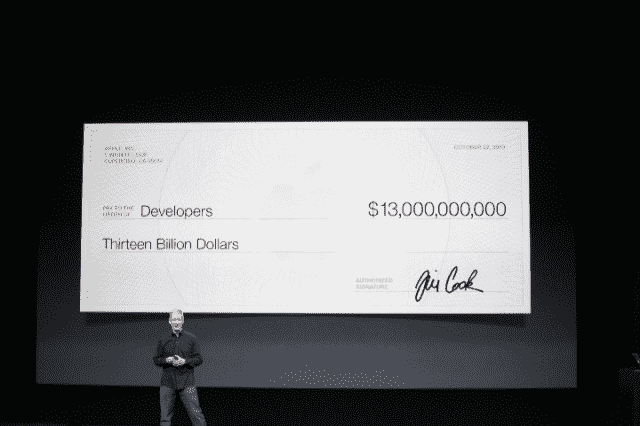

# 100 多万个应用之后，苹果称开发者已经在其平台 TechCrunch 上赚了 130 亿美元

> 原文：<https://web.archive.org/web/https://techcrunch.com/2013/10/22/1-million-apps-later-apple-says-developers-have-made-13-billion-on-its-platform/>

# 100 多万个应用之后，苹果称开发者已经在其平台上赚了 130 亿美元

iOS 应用商店现在有超过 100 万个应用，已经被下载了 600 亿次。这个消息是今天早上在旧金山芳草地艺术中心举行的苹果活动上宣布的，当时首席执行官蒂姆·库克走上舞台，回顾了苹果公司在新 iPhones 和 iOS 7 的采用上所看到的牵引力，作为当天公告的开场白。和往常一样，他向开发者社区大声疾呼，告知苹果支付了多少费用。那个数字？库克说，今天是 130 亿美元。

我们怀疑，100 万应用里程碑就在眼前。在今年 6 月的 WWDC 上，苹果[宣布](https://web.archive.org/web/20221209172047/https://beta.techcrunch.com/2013/06/10/apples-app-store-hits-50-billion-downloads-paid-out-10-billion-to-developers/)其平台上有 90 万个应用程序，已经被下载了 500 亿次。当时，该公司还指出，它已经向开发商支付了 100 亿美元。

在这 100 多万个 iOS 应用程序中，苹果后来宣布，475，000 个应用程序是为 iPad 设计的——该公司表示，iPad 拥有 81%的平板电脑使用份额(请注意，不是市场份额)。

相比之下，2012 年 6 月，苹果称当时有 65 万个 iOS 应用，其中 22.5 万个是为 iPad 开发的。2011 年有 42.5 万个 iOS 应用，当时只有 9 万个支持 iPad。该公司在 2012 年向开发者支付了 50 亿美元，2011 年支付了 25 亿美元，2010 年支付了 15 亿美元。

当然，这些开发者的支出令人印象深刻，但最近几个月 App Store 的受欢迎程度和巨大规模已经变成了一把双刃剑。研究发现，如今要登上 App Store 的排行榜要困难得多，在美国顶级 iPhone 发行商中，只有 2%是新进者。苹果一直在改进其[算法](https://web.archive.org/web/20221209172047/https://beta.techcrunch.com/2013/08/23/apples-app-store-rankings-algorithm-changed-to-favor-ratings-and-possibly-engagement/)，以在一定程度上公平竞争，并防止商店的图表被篡改，但这些变化的结果尚未惠及中小型开发者。

