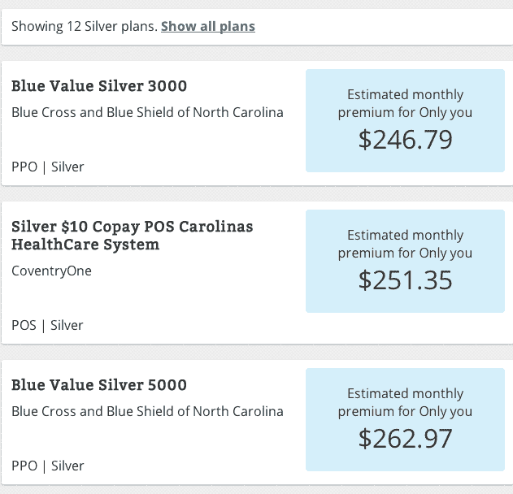
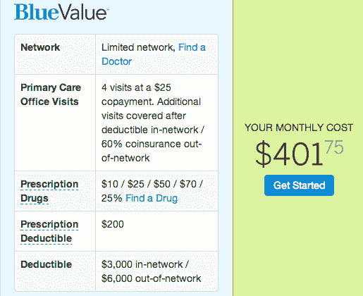
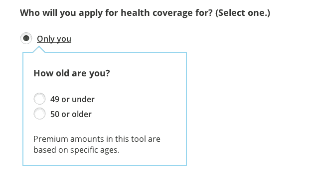
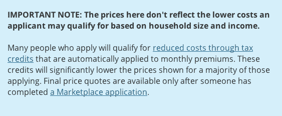

# Healthcare.gov 忽略生日，大幅低估价格 TechCrunch

> 原文：<https://web.archive.org/web/https://techcrunch.com/2013/10/23/healthcare-gov-ignores-birthdates-dramatically-underestimates-prices/>

# Healthcare.gov 忽略出生日期，大幅低估价格

Healthcare.gov 的最新功能是向消费者展示令人不安的误导性医疗保险价格。哥伦比亚广播公司[揭露了](https://web.archive.org/web/20221204121706/http://www.cbsnews.com/8301-505269_162-57608843/healthcare.gov-pricing-feature-can-be-off-the-mark/)陷入困境的联邦保险市场网站如何低估了实际保险成本 50%或更多，因为——这不是我编造的——它忘记询问用户的出生日期。

哥伦比亚广播公司(CBS)发现(TechCrunch 也证实了这一点)，Healthcare.gov 估计，一名没有资格获得政府补贴的 48 岁北卡罗莱纳州居民每月将为“白银”计划支付 231 美元。但是，真正的保险提供商蓝十字蓝盾的网站显示价格为 360 美元(下图是一些成本估算)。healthcare.gov 最便宜的价格显示在上面的图片中。蓝十字最便宜的价格是下图)。

看，在 Healthcare.gov 的新“购物和浏览”功能上，用户只被问及他们是否在 49 岁以下。问题是，计算器似乎在计算 20 多岁消费者的平均成本，其中一些人有资格获得更大的折扣。

令人震惊的疏忽变得更加糟糕。虽然 Healthcare.gov 非常谨慎地指出价格只是估计，但它只是说计划可能会更便宜。

Healthcare.gov 和国营网站一直在为持续的崩溃和登录问题制造头条新闻。奥巴马总统指责媒体缺乏耐心，称[甚至苹果公司也有推出故障](https://web.archive.org/web/20221204121706/https://beta.techcrunch.com/2013/10/01/obama-iphones-have-glitches-just-like-healthcare-gov-has-glitches-deal/)。没错，公司在发布上遇到了麻烦，但我很确定苹果从未误导用户认为他们可以用 200 美元买到 iPhone，而实际上它是 400 美元。

我们在之前已经[注意到，政府的计算器可能会严重误导，最好由提供复杂计算器的科技初创公司来完成，这些计算器会考虑个人的独特需求。然而，患者保护与平价医疗法案允许各州选择性地与科技创业公司合作；加州和纽约选择将合作推迟大约两年。](https://web.archive.org/web/20221204121706/https://beta.techcrunch.com/2013/10/20/how-healthcare-gov-doomed-itself-by-screwing-startups/)

又是一天，又是一次政府的失误。