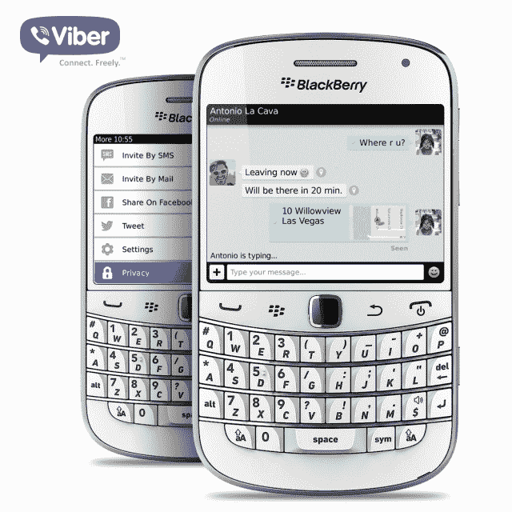

# Viber 发布黑莓应用更新以赶上 iOS 和 Android | TechCrunch

> 原文：<https://web.archive.org/web/http://techcrunch.com/2013/10/23/viber-releases-update-to-blackberry-app-to-catch-up-with-ios-and-android/>

# Viber 发布黑莓应用程序更新，以赶上 iOS 和 Android

如果你是黑莓粉丝，可能会觉得有点喘不过气来。但今天，Viber 希望改变这一切，为黑莓平台提供免费通话和信息应用的更新版本。

这一更新标志着黑莓味的 Viber 自 4 月份将语音通话引入平台以来的首次重大升级。自去年五月在[开始，黑莓就得到 Viber 的支持。](https://web.archive.org/web/20230326093128/https://techcrunch.com/2012/05/08/with-70-million-registered-users-viber-brings-beta-apps-to-blackberry-windows-phone/)

新的更新包括一些细节，Viber 已经在 iOS 和 Android 等其他平台上实现了这些细节。例如，用户图像和阅读回执显示在对话中，用户现在可以使用自定义位置共享。总的来说，用户界面得到了急需的翻新。

需要澄清的是，这款应用支持 BB 5、6 和 7，但不支持与新款黑莓设备兼容的新 BB10 操作系统。

Viber 首席执行官兼创始人 Marco Talmon 在新闻稿中提醒我们，黑莓是 Viber 的第三大平台，该公司拥有超过 2 亿注册用户。iOS 和 Android 占据了第一和第二的位置。

官方引用:

> 我们对平台上的 Viber 用户社区的持续支持与我们在世界范围内尽可能广泛地接触用户的努力是齐头并进的。

Viber 还在黑莓版本中加入了印度尼西亚语作为可用语言。

除了这些新功能，新的黑莓版本还被翻译成了印度尼西亚语，让说这种语言的 Viber 用户可以轻松访问该应用程序。

Viber 最近推出了贴纸市场，打开了货币化的开关。然而，贴纸市场在最新的黑莓版本中不可用。

更新将在未来 24 小时内推出。

