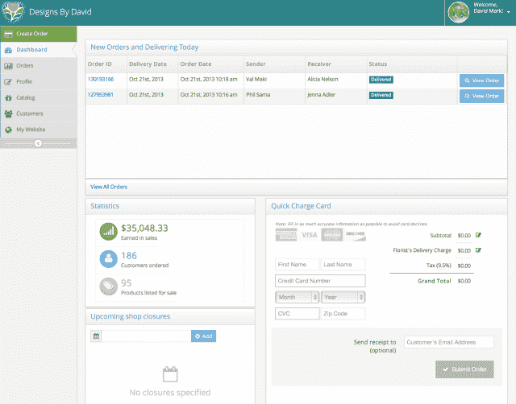

# 本地花店平台 BloomNation 从 Andre essen Horowitz & Others | TechCrunch 融资 165 万美元

> 原文：<https://web.archive.org/web/https://techcrunch.com/2013/10/24/bloomnation-raises-1-65m-from-andreessen-horowitz-others-for-a-florist-marketplace-online-software/>

BloomNation 是一家为花店和花艺设计师建立市场的初创公司，该公司今天宣布获得了 165 万美元的种子资金。这轮融资由 Andreessen Horowitz 的 Chris Dixon 牵头，参与方包括 Spark Capital、Chicago Ventures 和 CrunchFund。*这是 BloomNation 的第一笔外部投资，之前它是用创始人的钱……哦，还有扑克奖金启动的。

**披露:CrunchFund 创始人迈克尔·阿灵顿创立了 TechCrunch。*

首席执行官兼联合创始人 Farbod Shoraka 在 2011 年辞去了 M&A 银行家的工作，创办了 BloomNation，此前他处理了一笔交易，让他深入了解了当今花卉行业的运作方式。他请来了联合创始人大卫·达内什加(David Daneshgar)和格雷格·魏斯斯坦(Gregg Weisstein)担任企业发展主管，达内什加也是伯克利的毕业生，后者现在是首席运营官的 BloomNation。

这家初创公司的故事中有趣的部分是，在最初的日子里，由于一场纸牌游戏，团队筹集了 25，000 多美元来启动项目。Daneshgar 恰好是一名职业扑克玩家，也是世界扑克锦标赛的冠军。因此，当 BloomNation 需要一点启动资金时，他报名参加了洛杉矶的一个当地锦标赛，并赢了。

Shoraka 说，他和 Weisstein 在赌场的咖啡馆里，在 Daneshgar 玩的时候继续工作。在进入最后一名选手并击败了站在自己旁边的最后一名选手后，Daneshgar 宣布:“该开花了。”

谁知道他是否说过这些话，但 Shoraka 发誓这是真的。我要说，即使不是，这也是一个好故事。

[bloom nation](https://web.archive.org/web/20230404193221/http://www.bloomnation.com/)几个月以来建立的是一个平台，旨在通过提供工具，使当地花店能够接触到客户，而不是规模，来淘汰像 1800Flowers、FTD 和 Teleflora 这样的主要花店。本质上，这是一个社区市场模型——就像鲜花的 Etsy。

当地花店能够在 BloomNation 平台上建立个人资料，然后上传他们花卉设计的真实照片(不是库存照片)。作为回报，与大多数花店不喜欢的所谓的“[花线服务](https://web.archive.org/web/20230404193221/http://en.wikipedia.org/wiki/Floral_wire_service)”相比，他们可以保留更大比例的销售额。

“花商讨厌与这些服务合作。他们感觉自己就像这些大型营销公司的订单填充员和员工，”Shoraka 解释道。“我们已经把创造力带回了这个行业，并把一切都去商品化了。”

他说，对于更大的服务，消费者从库存照片目录中挑选，那里的价格已经确定，但不一定反映附近商家的当地成本结构，他们必须履行这些订单。消费者为他们的安排支付的钱有一半在到达花店之前就花在了费用上。此外，因为花店没有真正与顾客直接互动，他们没有动力尽最大努力。

“他们没有得到任何品牌的认可，所以他们最终把他们的老花或偷工减料，只是为了得到那里的交付，”Shoraka 说。

当地花店的替代方案是走 DIY 路线，或者使用他们自己找到的第三方营销解决方案。一年前推出的 BloomNation marketplace 是让花店直接接触顾客的第一步，而不是依赖更大的服务。

但现在 BloomNation 正在推出其平台的下一阶段，即花店商业中心。这是一个免费的在线工具套件，为花店提供他们自己的(白标)网站、电子邮件营销和社交媒体管理工具，以及专为花卉行业设计的销售点系统。花店可以选择使用他们喜欢的系统中的任何部分，全部使用，或者不使用，这样做没有月费或合同。相反，BloomNation 从花店网站上的市场订单中收取一小笔“成功费”。(花店留 90%)。

Shoraka 说:“由于这些地方企业没有这些资源，有线服务得以蓬勃发展。”。“他们没有时间或知识来让事情运转起来。BloomNation 改变了这一点。”

BloomNation 允许的更有趣的事情之一是它所谓的“bloom snap”——花店在送花前通过分享自己花束的照片直接与客户沟通的一种方式。在未来，BloomNation 希望通过 BloomNation 移动应用程序和提醒客户送货进度和完成情况的通知，将花店和客户进一步联系在一起。

这项业务已经发展到遍布美国大大小小 3000 个城市的 2000 家花店，尽管它的大本营仍在 BloomNation 的发源地洛杉矶。有了额外的资金，该公司继续进行产品开发，并在工程、营销、设计、产品等领域招聘新员工，使其现有的五人团队增加一倍。