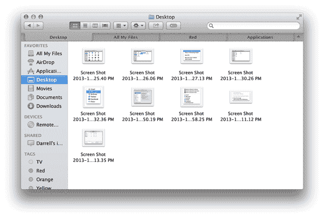
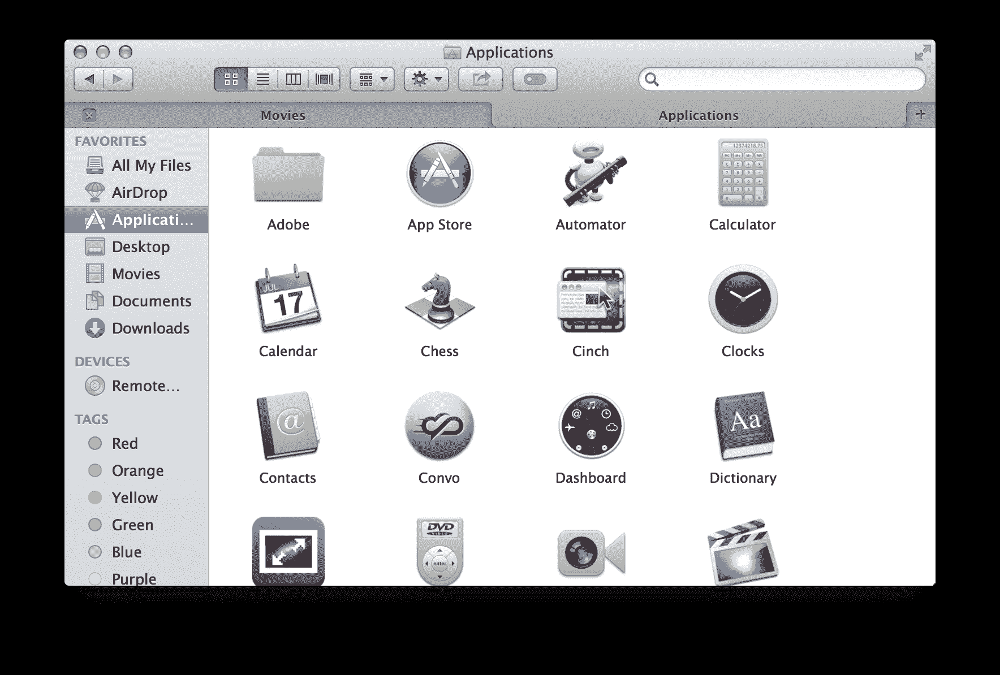
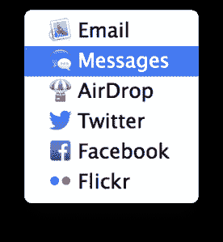
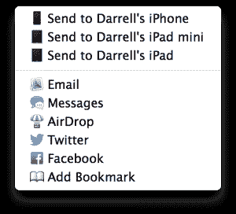
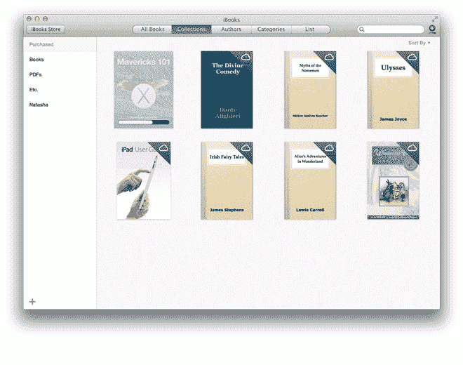
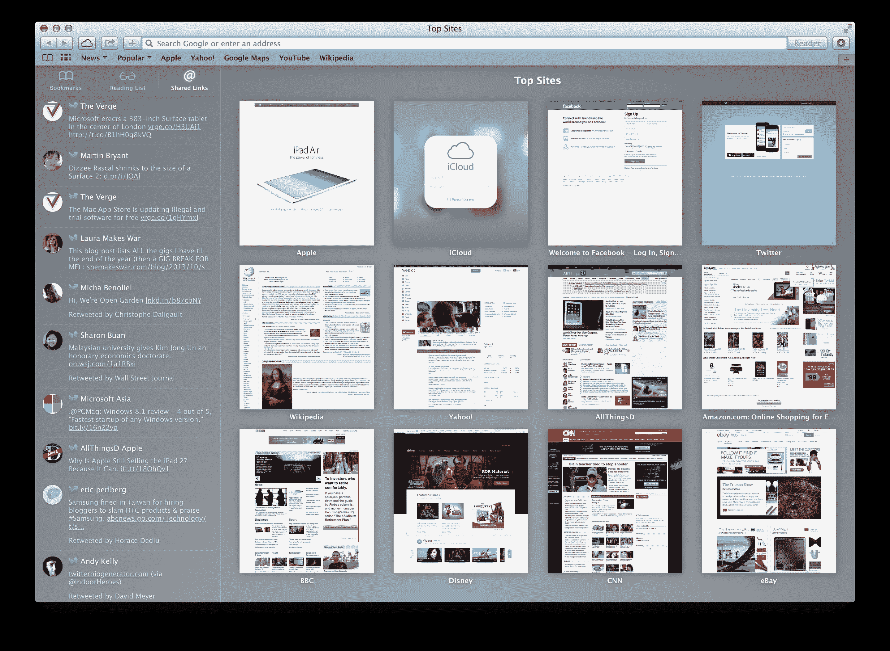
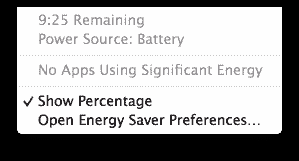

# OS X Mavericks 点评:苹果的 Mac 操作系统对速度有需求| TechCrunch

> 原文：<https://web.archive.org/web/http://techcrunch.com/2013/10/24/os-x-mavericks-review/?ncid=tcdaily>

苹果继大猫操作系统之后的第一次更新，OS X Mavericks ，以地球上最美丽的地方之一命名。Mavericks 是加利福尼亚州的一个冲浪海滩，以其名字命名的操作系统无疑代表了 Mac 软件的新浪潮，尽管它与 OS X 10.8 相比并没有太大的变化。不过，苹果所做的改变是朝着更好的方向发展，而且既然它是免费的，没有理由不利用所有这些伟大的新东西。

## 探测器

Mavericks 中更新的 Finder 比旧版本提供了很多优势，包括标签式浏览和新标签，以便更好地组织文件和媒体。对于桌面操作系统来说，这两个特性都不是绝对必要的，事实上，它们可能更吸引高级用户而不是其他人。但它们恰恰代表了苹果在 Mavericks 的更新策略中所包含的各种改进:也就是说，修复那些被一小部分需要它们的人严重遗漏的小东西。

标签提供了一种将文件分组到计算机以外的地方的方法，并在文件夹结构(桌面操作系统的传统组织方法)的基础上提供了一个巨大的改进。默认情况下，OS X Mavericks 提供了许多不同颜色的标签供您使用，但是如果您想要自定，您也可以创建自己的标签。这意味着您可以为任何您希望能够快速调用的内容组制作一个，而不管它们驻留在您的驱动器上的什么位置。我仍然认为，苹果最终会像它在 iOS 上所做的那样，完全超越 OS X 上的传统文件结构，而标签可能是帮助实现这一转变的第一步。对于带标签的文档和媒体，它们驻留在哪里是无关紧要的，这完全抛弃了虚拟空间中“位置”的概念。也许最好的标签功能是，您可以简单地将文件拖到 Finder 窗口边栏中的标签上，为它们分配标签，这非常方便。下一步可能是自动标记，但就目前而言，我认为这是为一小群真正专注的组织者播下的种子，他们将最大限度地利用它。

至于选项卡式浏览，这又是一个可能会被大量用户忽略的特性。尽管如此，那些习惯于网络浏览器的人也会发现它在浏览文件时也很方便。您只需右键单击即可在新标签页中打开任何文件夹，只需按 Command+T 即可在“我的所有文件”视图中打开新标签页。在标签页之间拖放文件和文件夹，并通过打开多个 Finder 窗口在不同文件夹之间移动文件，使查找不同文件夹中的内容变得更容易，从而减少通常积累的混乱。
 结合起来，标签和标记组成一个强大的团队。例如，您可以为您的任何标签打开一个标签，然后将内容从您的一个其他标签拖到该标签，以分配给它们不同的标签。然后，您还可以快速切换到该选项卡，在一个位置查看您刚刚创建的所有收藏。

Finder 的另一个新功能是共享菜单，允许你将文件直接发送到 iMessage、隔空投送、电子邮件、Twitter、脸书和 Flickr。这是从移动计算范例中继承的另一个东西，但也是另一个非常有用的小补充。

## 多显示器支持

回到 OS X Mountain Lion，苹果为应用程序引入了全屏功能，允许它们完全接管桌面，这再次类似于移动操作系统的功能。最大的问题是，虽然能够设置一个应用程序来完全接管很好，但你失去了桌面计算的其他好处，如同时访问多个显示器。

Mavericks 使你可以让一个应用程序接管一个屏幕，但不影响其他屏幕，这是一个巨大的进步。但苹果并没有就此止步；他们还使你最终可以在其他每个屏幕上拥有菜单栏和 docks，而不是像 OS X 的早期版本那样只有一个。如果你像我一样定期运行多显示器设置，这将改变一切-它具有独立使用多台电脑的所有好处，以及共享公共媒体文件和系统资源的所有好处。

另一个多显示器功能是能够使用 AirPlay 连接的屏幕来无线扩展您的桌面，例如，通过连接到 Apple TV 的屏幕。这又是一个巨大的好处，因为它可以让那些无法访问多个屏幕的人通过他们的电视获得临时的第二显示。无线显示器从未真正作为专用配件起飞，但这可能是一个巨大的帮助，使其成为一种更容易使用的技术，特别是在教育和商业领域。

如果我必须为 OS X Mavericks 挑选一个最喜欢的新功能，改进的多显示器支持肯定是它。这是我一直希望我的多屏 Mac 设置能够工作的方式，并且不需要任何黑客或第三方软件工具。

## 新通知

桌面通知是从移动设备借鉴来的另一项改进。但是在他们第一次使用 OS X Mountain Lion 时，他们并没有发挥应有的作用。在 Mavericks 中，通知变得更好，这要感谢能够直接从它们那里采取行动。例如，你可以回复 iMessages 或电子邮件。除了应用程序，你还可以从其他来源获得通知——苹果也增加了网站通知。

一个可能吸引力有限的小改进，但我立即注意到并爱上了它，那就是当你移除闪存盘、USB 或 SD 卡而没有先弹出时的通知。通常，在以前的版本中，OS X 会在屏幕中间弹出一个持续的通知对话框，提醒你外部驱动器行为良好。现在，一个类似的消息出现了，但是它出现在所有其他通知出现的地方，在你桌面的右上角，你可以更容易地忽略它。这并不是说你应该这样做——首先删除是一种很好的做法，但是如果你是一个以狂热的速度工作并快速交换闪存卡的博主，在短期内能够更容易地忽略这些通知是很好的。

 另一个不错的小改进是，当你将显示器镜像到电视和投影仪时，增加了自动免打扰触发功能。这可以确保你在向董事会汇报时，或者在通过 AirPlay 和 Apple TV 观看电视播放的家庭电影时，不会弹出 iMessage。这是苹果关注一个小细节的又一个例子，这个小细节对特定的用户子集有很大的影响。

## 地图

苹果在 iOS 6 中的原生地图解决方案可能没有赢得那么多崇拜者，但这并没有阻止该公司在 OS X Mavericks 中为桌面构建自己的原生地图应用程序。在桌面上，它实际上比引入 iOS 6 时更有意义，也不那么烦人，因为它没有取代网络上的谷歌地图，还因为它提供了相当多的便利优势。

OS X 的地图意味着苹果现在可以在日历上为约会提供方向和估计的旅行时间，这很方便，即使这项服务有时仍不如谷歌更成熟的服务准确，至少可以大致了解所需的旅行时间。

[它还有实时交通信息，也许最棒的是，它有一个方便的共享菜单，可以让你通过 iCloud 直接向 iOS 设备发送路线。因此，你可以在计划时在桌面上查找旅行，然后迅速将其传输到你的 iPhone 上，供你在车上使用。这种无缝的跨平台体验应该会鼓励在移动和桌面上更多地使用苹果的原生应用解决方案，更多的使用意味着地图服务质量的提高。](https://web.archive.org/web/20230326074809/https://techcrunch.com/wp-content/uploads/2013/10/screen-shot-2013-10-23-at-3-58-25-pm.png)

## iBooks

我不用手就能数清自己使用亚马逊桌面电子书应用的次数，所以这不是我特别期待的功能。我认为即使是苹果公司也意识到在台式电脑上阅读像小说和短篇故事这样的文本书籍并不是一个理想的使用案例。这就是为什么他们在本周早些时候举行的发布会上强调 iBooks 的教科书方面，以宣布新的 iPads 和 MAC，以及 Mavericks 的可用性。

桌面上的 iBooks 为数字互动文本提供了很多机会，这些文本不仅仅提供阅读。这意味着学生可以轻松地将笔记和重点内容直接从他们的文本复制到笔记文档中，并且他们也为更好地集成 web 和视频内容提供了很多机会。这是苹果真正利用桌面所能提供的优势来增强最初仅用于移动设备的应用程序的体验的一个领域，而不仅仅是将许多相同的功能从小屏幕移植到大屏幕。

 当然，如果你喜欢的话，你也可以在桌面上使用 iBooks 阅读狄更斯的小说，内容和阅读进度会同步回你基于 iOS 的 iBooks 应用程序。然而，这还不是同步的全部，因为你还可以在 Mac 应用程序上访问你的 pdf 和其他来自 iOS iBooks 的存储内容，这实际上是一个非常方便的功能，对于经常使用 Adobe 的通用静态文档格式的人来说。

## 旅行队

这次对 Safari 的更新给苹果的桌面浏览器增加了一些社交味道，分享了你登录的社交网络的链接，包括脸书和 Twitter(通过系统偏好设置登录)。这个正在进行的链接列表是一个很好的方式来过滤你的内容目的地，新的阅读列表边栏也很方便。

 然而，我最喜欢小牛 Safari 的是它的节能能力。苹果公司做了大量的工程设计，以确保其浏览器具有令人难以置信的节能性，符合 Mavericks 整体的主要主题之一，这一点也表现出来了。我非常喜欢 Chrome 作为我的桌面浏览器，但苹果一直在让 Safari 成为越来越有吸引力的软件包，这次更新可能是迄今为止最好的。

## 电池寿命和性能

小牛提高你的电池。认为软件能产生如此大的影响是疯狂的，但苹果在最近的一次活动上表示，最近发布的 MacBook Air 可能会因为 Mavericks 的改进而多花一个小时左右，这对移动计算能力来说是一个很大的额外时间。在实践中，我发现自己的 15 英寸 Retina MacBook Pro 在充满电的情况下肯定比升级前更有动力，尽管很难量化到底有多少。尽管如此，一次简单的操作系统更新带来的任何改进都足以令人印象深刻。

然而，电池并不是唯一改进的地方。Mavericks 似乎在大多数方面都比它的前辈更快，苹果肯定在效率方面做了很多改进，以使其操作系统兼容长达六年的机器。结果是，操作系统升级会让许多 Mac 感觉像一台全新的机器。

## 小事情

Mavericks 中我最喜欢的一个新功能是如此之小，以至于许多已经升级的人可能会错过它，特别是如果他们使用的是台式机。这是活动监视器实用程序和显示笔记本电池电量的菜单栏中都有的功能。

如果您将鼠标悬停在电池指示器上，您会看到菜单中出现一个新项目，它会告诉您哪些打开并运行的应用程序正在使用特别高的能量。如果你处于电量不足的情况下，需要尽可能地发挥能量，这是一个非常有用的信息。

举例来说，我发现 Skype 在耗电方面是一个特别糟糕的违规者，所以如果我接近赤字，那将是第一个被淘汰的。如果你想了解更多关于哪些应用使用最多能源的信息，甚至是一段时间内使用模式的数据，Activity Monitor 中有一个新的“能源”标签，可以显示哪些应用具有最高的平均能源影响，以及哪些应用目前对你的电池影响最大。这些都是可以帮助聪明用户充分利用电池的东西，Mavericks 也通过新的后台进程提供了一般帮助。

一个更好的小功能是直接从通知中心发送消息的能力。除此之外，还有直接从通知中回复信息的能力，你很少需要打开专门的信息应用程序。

## 结果

这并不是小牛新增功能的全面列表，但它应该会让您对亮点有一个很好的了解，这些亮点加起来就是:小牛是免费的，小牛非常好。苹果的这次更新彻底颠覆了桌面软件的业务，没有理由不更新——事实上，有充分的理由让软件尽快改变。即使你没有被任何一个新的大功能特别吸引，每个人都会在苹果第 10 次也是最新一次 OS X 的所有小变化中找到喜欢的东西。