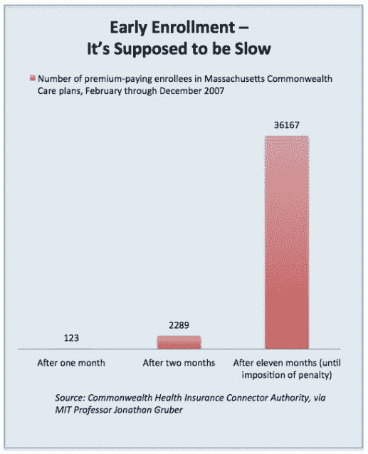

# Healthcare.gov 可能会在关键的感恩节截止日期前崩溃

> 原文：<https://web.archive.org/web/http://techcrunch.com/2013/10/25/healthcare-gov-likely-broken-until-crucial-end-of-november-deadline/>

# Healthcare.gov 可能会在关键的感恩节截止日期前崩溃

Healthcare.gov[将被打破](https://web.archive.org/web/20230129093510/http://washingtonexaminer.com/obamacare-website-undergoes-management-shakeup/article/2537865)直到 11 月底，杰夫·兹恩茨说，他是一名顾问，被请来修复陷入困境的联邦医疗保险电子商务网站。在一次新闻发布会上，Zients 最终承认了广泛存在的注册问题，估计只有十分之三的用户能够注册并完成申请(总共只有区区 70 万)。

[说](https://web.archive.org/web/20230129093510/http://www.politico.com/story/2013/10/jeff-zients-healthcaregov-working-by-end-of-november-98850.html#ixzz2ikxghaJy) Zients:“我们有信心在 11 月底，HealthCare.gov 将为绝大多数用户提供流畅的服务。”。这一估计应该会吓到奥巴马政府:11 月底已经危险地接近了感恩节的最后期限，一些专家表示，这对于吸引年轻、健康的消费者至关重要。

“如果感恩节前还不能运行，那就是二级戒备，”[警告说](https://web.archive.org/web/20230129093510/http://www.mydesert.com/article/20131023/NEWS11/310230028/Contractors-Confusion-vexed-health-law-rollout)麻省理工学院的经济学家 Jonathan Gruber，他曾为奥巴马总统和罗姆尼州长的医疗保健法工作。“这是一个现实问题，因为人们希望在 1 月份之前获得保险，但这不是一场危机。”

健康与人类服务部已经派遣了一支由推销员和名人组成的队伍去说服年轻的“无敌”们注册健康保险，这是为了补贴他们的长辈的开销。

在马萨诸塞州，也有类似的个人授权，截止日期快结束时，注册人数呈指数增长。

但是，马萨诸塞州有两倍长的时间，而且没有时髦的注册截止日期，用户必须在网站推出 3 个月后注册，才能在新计划开始时购买保险(对于患者保护与平价医疗法案，消费者必须在 12 月 15 日之前注册，才能在 1 月 1 日之前购买保险)。

Zients 表示，一家在故障后端工作的政府承包商 QSSI 将接管医疗保险和医疗补助中心，成为主要开发商。然而，延续白宫怪异和卑鄙保密的趋势，他不愿透露谁是修复网站的“[技术激增](https://web.archive.org/web/20230129093510/http://venturebeat.com/2013/10/22/why-a-tech-surge-isnt-going-to-save-healthcare-gov/#!)的一部分。

[ [形象信用](https://web.archive.org/web/20230129093510/http://www.cats-on-tshirts.com/images/cat_designs_280x280/design_thanksgiving_cat_bl.jpg)