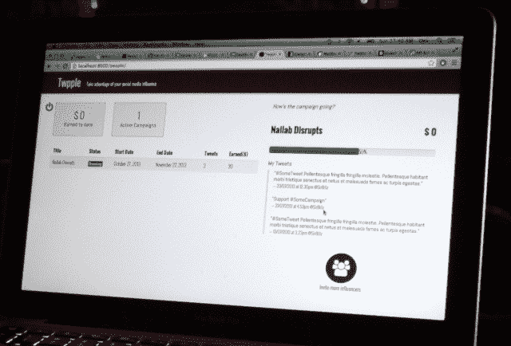

# Twpple Hack 由肯尼亚二人组创建，将小企业与社交媒体“大人物”联系起来

> 原文：<https://web.archive.org/web/https://techcrunch.com/2013/10/27/twpple-hack-built-by-kenyan-duo-connects-small-businesses-with-social-media-big-wigs/>

在 TechCrunch Disrupt Europe 黑客马拉松上，Sam Gichuru(左)和 Billy Odero 花了一整晚的时间研究一个简洁的黑客技术，帮助小企业通过利用社交网络影响者来宣传自己。这款名为 Twpple 的黑客软件旨在为烤肉店、市场摊位、发廊等较小的商店——基本上是任何没有建立自己的数字追随者的小企业——提供比他们在数字领域更强的声音，以推广他们出售的任何东西。

黑客使用 Klout 分数作为一种捷径来识别最具社会声望的个人，然后中小企业就可以利用这些个人。社交影响者通过在推特上发布一系列关于他们经营的企业或促销活动的信息(他们会自己说)来获得报酬——小额报酬可以激励他们帮助企业传播信息。

“如果你的 Klout 得分是 25，你可以通过发送三条推文获得 2.50 美元，”吉丘鲁在他的舞台上说。“我们称之为‘按影响力付费’"

这里更大的故事不是黑客，而是 Gichuru 和 Odero 从肯尼亚内罗毕远道而来参加黑客马拉松的事实。这两人在内罗毕一家名为 [nailab](https://web.archive.org/web/20221006163850/http://nailab.co.ke/) 的加速器工作，吉丘鲁是该加速器的首席执行官和联合创始人，通常可以帮助初创公司为孵化器举办的黑客马拉松磨练他们的技能。

他们告诉 TechCrunch，他们前往欧洲是为了参加在阿姆斯特丹举行的另一场科技会议，并会见一些投资者，他们决定在柏林逗留两天。他们从内罗毕出发，经过 8 个小时的飞行后，又乘坐了 13 个小时的火车，从阿姆斯特丹到柏林，其中包括在一座桥下发现了一枚 500 磅的未爆炸的二战炸弹后的漫长绕道。).除此之外，Odero 的笔记本电脑坏了，两人的肯尼亚银行卡被拒绝，所以他们无法购买替代机器——这意味着他们必须共用一台 MacBook 来构建 Twpple。然而，他们仍然黑客。

Gichuru 说 Twitter 在肯尼亚特别受欢迎，因此他们把重点放在 Twpple 的社交平台上。尽管社交媒体在肯尼亚对个人来说是一个“大游戏”，但许多小企业仍然被排除在外。

“他们总是问我们，‘嘿，你们是怎么上社交媒体的？我们如何让社交媒体有影响力的人在推特上谈论我们？谈论我们，写作，谈论我们的快乐时光，”因此，我们决定建立一个平台，让他们可以登录，甚至从他们的手机上登录，创建一个小的活动——只是基于他们的偏好——例如他们的位置，人口统计，他们想要到达的目标市场。

“然后，他们能够获得已经在我们的平台上注册的社交媒体影响者的列表。根据这些人的 Klout 数据，他们能够说出为一定数量的推文支付多少钱。"

Gichuru 在后台讨论黑客攻击时说，支付需要影响者发送一系列推文，以便小企业从微活动中获得足够的“牵引力”。“你需要(每个影响者)至少发布三条推文，才能获得足够的(为活动付费的企业)吸引力。但这必须是一次对话。我们必须在真正的对话和这些人的营销推特之间找到平衡，”他说。

“对于有很多 Klout 的人来说，很容易开始一个热门话题(在肯尼亚)，”Odero 补充道。“我们有一些最疯狂的标签。通常只有一个人。”

“社交媒体的大人物——我们称他们为‘大人物’——在我的国家成为名人，”吉丘鲁补充道。“他们是众所周知的，他们被关注，他们实际上——当政府做一些事情时，他们确实有质疑它的声音，或者要求政府解释它。你会注意到，即使在最近的内罗毕恐怖袭击期间，社交媒体的影响者也比政府、比主流媒体提供了更多的信息。”

吉丘鲁还指出，依靠社交权贵——他们毕竟会向自己的追随者传播营销信息——为广告过程增加了“自我监管”的元素。“如果是坏人，人们会报复你，”他说。"你不想成为社区攻击的目标."

与 nailab 运行的黑客相比，TC 如何扰乱黑客马拉松？“这是一次真正的全球体验。我们一直在开发本地解决方案。来到这里让我们有机会看到如何为更多的观众和更大的市场发展，”吉丘鲁说。"这让你知道如何在黑客攻击中赚钱."

“大多数人(在 nailab hackathons)试图专注于社会企业，”奥德罗补充道。“更容易获得捐赠资金，更容易获得赞助商，如果你真的在建造一些东西来解决我们现有的问题。”

这是 Gichuru 在舞台上展示 Twpple: