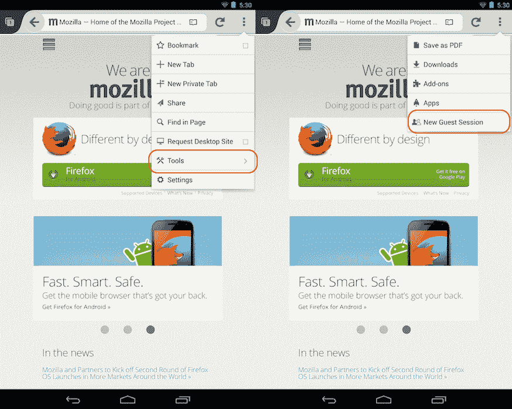

# Firefox 在 Android 上获得访客浏览模式，所有平台都支持网络音频 API

> 原文：<https://web.archive.org/web/https://techcrunch.com/2013/10/29/firefox-gets-guest-browsing-mode-on-android-web-audio-api-support-on-all-platforms/>

# Firefox 在 Android 上获得访客浏览模式，所有平台都支持网络音频 API

Mozilla 今天发布了适用于 Windows、OS X、Linux 和 Android 的 Firefox 浏览器的第 25 版。[新安卓版本](https://web.archive.org/web/20230320054728/http://www.mozilla.org/en-US/mobile/25.0/releasenotes/)的亮点是新的访客浏览模式，允许你与你的朋友和家人分享你的手机或平板电脑，而不必担心他们会查看你的浏览历史、书签、密码或其他数据。

一旦你点击“新建访客会话”按钮，Firefox 会以一个干净的档案重新启动，一旦你的访客再次关闭浏览器，他们所有的信息都会被清除。Mozilla 认为，这“意味着你可以让朋友和家人借你的手机或平板电脑上网，并确保你自己的信息是安全的。”

Android 上的新功能还包括支持 Firefox 的混合内容拦截，这是该组织用于阻止中间人攻击和窃听 HTTPS 页面的技术，以及在浏览器中拍摄任何图像并将其转换为设备壁纸或作为照片添加到联系人的能力。

像往常一样，这个版本也为开发者引入了许多新特性，包括对一些新的 CSS3 特性和 Contacts API 的支持。不过，用户可能首先注意到的一个特点是，开发者现在可以为 Android 版本编写插件，在地址栏中添加指示器，类似于 Firefox 的桌面用户已经习惯的做法。

在所有平台上，火狐现在都支持[网络音频 API](https://web.archive.org/web/20230320054728/https://developer.mozilla.org/en-US/docs/Web_Audio_API) 。起初这听起来可能不那么具有革命性——毕竟网络总是有某种音频支持——但是这个 API 允许开发者以以前不可能的方式在浏览器中操作音频。

在今天的公告中，Mozilla 特别指出，这项技术对于想要编写基于浏览器的游戏的开发人员来说非常有用。例如，它支持定位音频，以及混响等效果。

为了展示这些功能，该组织与 [Goo Technologies](https://web.archive.org/web/20230320054728/http://www.gootechnologies.com/) 合作，创建了一个[非常酷的技术演示](https://web.archive.org/web/20230320054728/http://labs.gooengine.com/mozlod/)，使用该公司的 HTML5 图形平台和 Web 音频 API 来展示开发人员可以在浏览器中创建的沉浸式体验。

Web Audio API 是 W3C 标准，但是像往常一样，不同的浏览器供应商以不同的方式实现这些标准。为了帮助开发者确保他们的应用可以在所有浏览器上运行，Mozilla 发布了一份指南，介绍其版本与竞争对手的版本有何不同。

