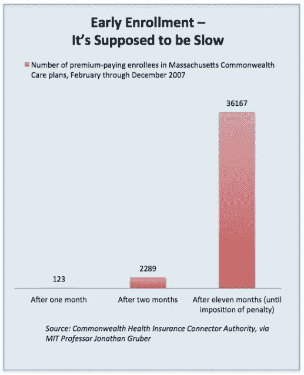

# 是的，在 Healthcare.gov 发布日只有 6 名用户注册，但不要惊慌 TechCrunch

> 原文：<https://web.archive.org/web/http://techcrunch.com/2013/11/01/yes-only-6-users-signed-up-on-healthcare-gov-launch-day-but-dont-panic/>

# 是的，在 Healthcare.gov 发布日只有 6 个用户注册，但是不要惊慌

新的文件显示，只有六个人在政府陷入困境的电子商务网站 Healthcare.gov 开业当天成功注册了医疗保险。

自然地，[媒体正在利用](https://web.archive.org/web/20230129215430/https://news.google.com/news/rtc?ncl=dJONuk9uHTc3cuM5vkSc1lcZf3IqM&topic=h)这一点击诱饵的统计数据，但实际上，这可能无关紧要。没有保险的年轻消费者是强迫性拖延者。早在 2006 年，当马萨诸塞州为一项类似的健康保险法推出自己的电子商务门户网站时，[很大一部分新注册者](https://web.archive.org/web/20230129215430/http://www.motherjones.com/mojo/2013/10/it-doesnt-matter-if-no-one-signs-obamacare-week)(12000 人)就在截止日期前两周到来。

随着最后一刻的消费者争相利用新产品，注册人数呈指数增长。现在，这并不是说 Healthcare.gov 的巨大失败不是坏事。正如我所写的，它充斥着宣传和独裁主义，这严重影响了科技产业。

网站持续存在的问题是一个严重的威胁，因为它可能不会在重要的感恩节假期前准备好[，届时年轻消费者有望注册。](https://web.archive.org/web/20230129215430/https://techcrunch.com/2013/10/25/healthcare-gov-likely-broken-until-crucial-end-of-november-deadline/)

也就是说，奥巴马医改并不是凭空推出的。我们从马萨诸塞州的经历中获得了大量的历史证据，可以将这些数字放在上下文中。