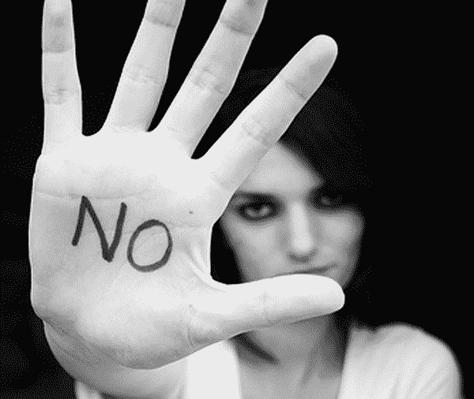

# 我从日交易百万美元中学到的 11 或 12 件事

> 原文：<https://web.archive.org/web/https://techcrunch.com/2013/11/02/12-or-13-things-i-learned-about-life-from-day-trading-millions-of-dollars/>

詹姆斯·阿尔图彻撰稿人

More posts by this contributor

**编者按:** *[James Altucher](https://web.archive.org/web/20230326051057/http://jamesaltucher.com/) 是一位投资人、程序员、作者，也是数次[创业者](https://web.archive.org/web/20230326051057/http://www.jamesaltucher.com/2011/01/how-i-screwed-yasser-arafat-out-of-2mm-and-lost-100mm-in-the-process/)。他最新的一本书，是[“选择你自己！”](https://web.archive.org/web/20230326051057/http://www.amazon.com/Choose-Yourself-ebook/dp/B00CO8D3G4/ref=cm_cr_pr_product_top)**(Twitter 首席执行官迪克·科斯特罗作序)。在推特上关注他 [@jaltucher](https://web.archive.org/web/20230326051057/http://twitter.com/jaltucher) 。我做了很多年的日内交易者，这几乎要了我的命。*

我做了很多年的日内交易者，这几乎要了我的命。

我用自己的钱赚钱，也从我交易的人那里拿一部分利润。我最高时一天交易了 4000 万或 5000 万美元。我从 2001 年到 2004 年都是这样。

我了解了日内交易，但是我也了解了自己，我擅长什么，我不擅长什么，我有精神病。与日内交易无关的事情。

在你赚钱的日子里，日内交易是世界上最好的工作。你做了一笔交易，然后也许 20 分钟后你带着利润退出了交易，然后在一天的剩余时间里，你想着你赚了多少钱。

在糟糕的日子里，这是世界上最糟糕的工作。我会做一笔交易，它会对我不利，然后我希望我的心脏停止跳动，这样我的血液就不会那么大声地跳动。

不过，我做了很多年，因为我在其他方面都找不到工作。

以下是我学到的。在我停止日内交易多年后的今天，我肯定会用到所有这些教训。

你无法预测未来。每个人都认为他们可以。但是他们不能。

这不仅适用于交易，也适用于一切。你可能已经结婚 10 年了，下一件你知道的事情就是你离婚了，而这是你没有预料到的。

你可能一辈子都很健康，喝蔬菜，锻炼，减轻压力，一年后你可能死于癌症。

如果你不再试图预测未来，你的压力会小得多。

你总是可以寻求增加对你有利的机会。例如，如果我不从桥上跳下去，我更有可能从现在起活一年。但是，通往不快乐的一条路肯定是认为未来是可以预测和控制的。

希望不是一种策略。

如果你到了“希望”自己不会被毁了的地步，那么你事先就做错了。

例如，如果你计划在户外举行婚礼，而你没有一个以防下雨的备用计划，那么你很可能错误地计划了你的婚礼，除非你是在沙漠中结婚。

“希望”不是一件坏事。我希望每天我的生活都很完美。

但如果希望是我唯一依赖的东西，那就意味着我没有真正关注对我来说很重要的事情的所有可能的结果。

不确定性是你最好的朋友。

生活中百分之百的机会都是因为人们对生活中几乎所有的事情都不确定而创造出来的。

我们一直在试图弥合我们确定的事物和我们不确定的事物之间的巨大差距，几乎每一项发明、产品、互联网服务、书籍，以及任何帮助我们弥合这一差距的东西。

有时候这很难。如果你的丈夫背叛了你，离开了你，你经常会想爬在地板上，烧掉所有的自助书籍。他们都撒谎了。

当生活感觉就要结束时，很难感觉“活在当下”或“积极思考”。我试过了。对我来说太难了。

但至少你可以说…“帮帮我。”你可以对你的密友说。你可以在心里说出来。

“帮助我”是最有力量，也是最被遗忘的祈祷。

**D)承担风险与降低风险。**

有些人冒了太多的风险，他们破产了。这发生在我身上。而且有时候人太谨慎，没有承担足够的风险。

当我第一次开始日内交易时，我非常害怕风险，如果我有一点利润，我会结束交易。但是那样的话，我会承受巨大的损失，这将抹去我所有的利润。

关键是，如果你找到越来越好的方法来应对这些风险，你就可以承担越来越大的风险。

例如，如果我知道某人不是经常背叛她亲近的人的顽固的吸毒者，我可能会冒险和她结婚。

如果我总是保持在限速以下，我可以冒险无照驾驶(我知道这是一个愚蠢的风险，但仍然如此)。一旦你有了降低风险的方法，对任何事情进行交易或决策都会变得更容易。

**E)多元化。**

我经常收到电子邮件，“我真的很想要一份工作，但他们似乎不想要我，现在我很痛苦。我怎样才能得到那份工作？”

嗯……你不能。

你会不开心的。你不能希望自己有工作。

当我为日内交易筹集资金时，我可能联系了 1000 多人。当我开始互联网业务时，我开始了十几个互联网业务，看着他们都失败了，只有一个。当我试图出售我的互联网业务时，我联系了十几家公司(尽管谷歌伤了我的心——该死的谷歌！).

当我想结婚的时候，我会去约会很多次。克劳迪娅的方法更聪明——她不会在晚餐上浪费时间。她只和男人去喝茶。在最初的 20 秒内，你知道自己是否被吸引。所以还是喝茶吧。

**F)说“不”。**

在日内交易中，如果事情不顺利，即使你的内心希望事情顺利，你也必须说“不”，减少损失。

如果一段商业关系没有进展，不要投入更多的精力和时间。

有一种认知偏差叫做“承诺偏差”我们认为，因为我们已经将时间和精力(或金钱)投入到某件事情中，所以我们必须坚持下去。但这只是一种心理偏差。对它说不。

你必须时刻决定这是不是你想要的情况。

仅仅因为你在一分钟前，或昨天，或 10 年前处于这种情况，并不意味着这种情况对你是正确的。

**G)健康。**

日内交易耗尽了你的一切。它把你的灵魂吸出你的身体，混合在一起，然后爆炸。它不会变成美味的奶昔。它会爆炸。

所以你要照顾好自己。如果你睡眠不足，如果你吃得不好，不锻炼，不与积极的人在一起，不要对你所拥有的东西心存感激，等等等等，你会失去所有的钱，然后破产。

显然，这也适用于生活中的其他事情。每天，你能做些什么小事来让自己变得稍微好一点？

我们如此被“安全”的隔间工作所吸引的原因是，痛苦更加微妙，会悄悄降临到我们身上。这不是日内交易的闹剧，所以每天对健康的需求看起来并不重要。但事实如此。

**H)笑声。**

生存的唯一方法就是笑。有句谚语说:“人制定计划，但上帝会笑。”好吧，你还不如和上帝站在同一边。

“这太疯狂了”意味着你疯了。

我已经看过无数次了。这家伙做了笔交易。市场对他不利。他说“这太疯狂了”，并在交易中投入了更多的钱。然后他失去了所有的钱，变得疯狂。我不得不劝说人们离开窗台或者告诉他们放下枪。

市场永远不会疯狂。这个世界从来没有疯狂过。我甚至可以说，你的女朋友刚刚对你撒谎说她在哪里过夜并没有疯。

我只在乎你。如果你认为世界会以不同的方式排列，那你就是疯了。

对你来说很难。

我知道当我感觉“啊，这种情况太疯狂了”时，我首先需要看的是我自己。

我疯了。

一笔交易(或一天，或一条生命)是好是坏并不重要。

好日子和坏日子时有发生。但是生活是由十亿个小瞬间组成的，这些小瞬间累积起来就是你周围的所有事情。如果你让其中的一个时刻有太多的控制，那么你注定会很痛苦。

在我做日内交易的那段时间，我很痛苦。我让我生活的这一方面来控制。所以我不再专注于做一个好丈夫，一个好父亲，一个好朋友，一个好的任何东西。

我的其他选区都完蛋了。

我会做噩梦。我会失眠。我会在很多个早晨醒来，去街对面的教堂，这样我就可以独自祈祷。我会祈祷什么？“耶稣，请让市场今天朝着我的方向发展。”

我是犹太人。没有人回应我的祈祷。

(T2)这从来都不是钱的问题。

每天我都会收到这样的邮件，“你能告诉我如何做日内交易吗？”

“不行！”

我知道一千个日内交易者，只有两个不会破产。那么，是什么让人们认为他们会有优势呢？有多少人听我的？

零。

怎么会这样

因为人们厌倦了他们的生活，他们的关系，他们的工作，以及所有从他们学会走路起就被告知的谎言。

他们想要从谎言中解脱出来。

我明白了。

日内交易是梦想。你可以赚足够的钱来不在乎。从任何地方都可以。为了开心。

没用的。但是人们不愿意相信。大多数人认为他们有一种特殊的东西可以让它为他们工作。

这是真的——他们确实有一种特殊的东西。但是你不能先通过日内交易来达到目的。你可以直接跳到快乐的部分。你可以直接跳到自由。

但是我们从来没学过。我们被教导说，要获得自由，我们必须先做*一些事情。我们被教导苦难是购买幸福的货币。*

好吧，去做吧。那就哭吧。那就害怕吧。然后诅咒疯狂。那就多哭。这些都不会让你快乐。

然后再读一遍这篇博文。不是因为会让你开心。而是因为我喜欢别人看我的帖子。

开怀大笑。