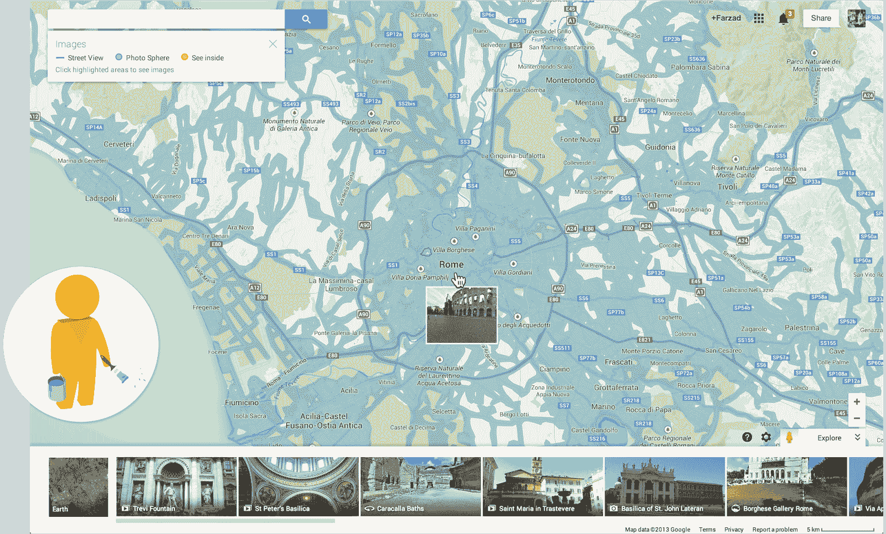
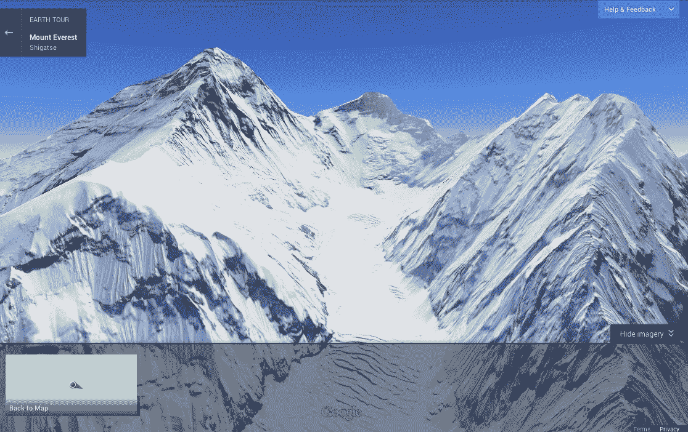

# 新的谷歌桌面地图带回了 Pegman，增加了 Waze 数据和 3D 地球之旅 TechCrunch

> 原文：<https://web.archive.org/web/https://techcrunch.com/2013/11/06/new-google-maps-for-desktop-brings-back-pegman-adds-waze-data-and-3d-earth-tours/>

# 新的谷歌桌面地图带回了 Pegman，增加了 Waze 数据和 3D 地球之旅

【YouTube = http://www . YouTube . com/watch？v=N6DrfYHVcXs&w=853&h=480]

谷歌今天[发布了](https://web.archive.org/web/20221206000908/http://google-latlong.blogspot.com/2013/11/from-where-you-are-to-where-you-want-to.html)其[新桌面版谷歌地图](https://web.archive.org/web/20221206000908/http://www.google.com/maps/about/explore/)的更新，首次将 Waze 的交通数据带到桌面上(T4 已经将集成到移动地图应用中)。这种整合将把谷歌今年早些时候收购的 Waze 中有关交通事故、施工区域和道路封闭的信息带到桌面上的谷歌地图中。

此外，这一更新使得在新的谷歌地图上查找街景图像变得更加容易。在很大程度上，这个功能在新版本中是隐藏的，用户必须点击一条道路才能打开它。就像以前的谷歌地图一样，现在你可以将谷歌地图[的 Pegman](https://web.archive.org/web/20221206000908/https://www.google.com/#q=pegman) 再次拖放到任何道路上，并调出街景。唯一不同的是，Pegman 现在住在谷歌地图的右下角，而不是左上角。

当你放大时，谷歌地图还会突出显示[室内商业照片](https://web.archive.org/web/20221206000908/http://goo.gl/oIr2Cr)和用户上传的图片，包括照片球体。

街景本身也有了一个新功能:你现在可以获得一步一步的方向卡，使用街景图像向你显示你路线的每一站，让你预览你的路线。

通过这次更新，谷歌还推出了新的“[地球之旅](https://web.archive.org/web/20221206000908/http://goo.gl/3MKsmm)”功能，就像导游一样，在谷歌地图中自动生成 3D 旅行，从而推动了谷歌地图移动版中“[导游](https://web.archive.org/web/20221206000908/http://google-latlong.blogspot.com/2012/06/take-virtual-tour-with-swipe-of-your.html)功能的想法。不过，目前还不清楚谷歌为什么决定给这项功能取一个新名字。本质上和手机上的导游是一样的体验。然而，在桌面上，这个特性只在支持 WebGL 的浏览器中可用。

