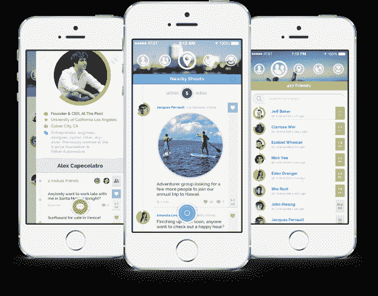

# 泳池社交网络在手机上重新启动，有一个应用程序可以更好地联系附近的朋友| TechCrunch

> 原文：<https://web.archive.org/web/http://techcrunch.com/2013/11/07/social-network-at-the-pool-relaunches-on-mobile-with-an-app-to-better-connect-nearby-friends/>

总部位于洛杉矶的初创公司[今天将重新推出其社交网络，作为一款新的移动应用，远离其早期在](https://web.archive.org/web/20230325175438/http://atthepool.com/)[的重点](https://web.archive.org/web/20230325175438/https://techcrunch.com/2012/07/14/social-network-at-the-pool-releases-techcrunch-pool-in-advance-of-mondays-launch/)，即根据共同兴趣匹配用户，首先是将人们与附近的朋友联系起来。此外，该公司还将成为一个仅限移动设备的产品，并放弃其网页版本，同时还取消了用户首先向脸书认证的要求。

当公司[在 2012 年年中](https://web.archive.org/web/20230325175438/https://techcrunch.com/2012/07/14/social-network-at-the-pool-releases-techcrunch-pool-in-advance-of-mondays-launch/)首次推出其产品时，首席执行官 Alex Capecelatro 当时将其描述为“Meetup 和 Match.com 之间的一种混搭”。该网站让用户加入“pools”(群组)，以帮助他们结识有共同兴趣的新朋友，或者想加入某种新活动的人，例如骑自行车或徒步旅行或瑜伽。这个网络不仅仅是为了约会，也是为了帮助人们结交新朋友或认识专业人士。

事实证明，用户仍然希望与他们真正的朋友联系。

“网站的功能是向你介绍与你有共同兴趣的新成员。虽然这被证明是有价值和有趣的，但我们不断听到反馈说，人们已经有太多的朋友，他们从来没有见过，”游泳池的商业开发负责人大卫·齐默曼解释说。“我们尝试把会员‘介绍’给他们已经有关系的人，结果令人震惊，”他说。

“人们在信中说‘我不知道凯文也住在芝加哥’，或者‘哇，大学毕业后我就没和莎拉联系过了，很高兴我们又联系上了。’”齐默曼补充道。因此，随着新版社交网络的推出，该公司重新调整了工具，更加重视现有的关系。

从网络到移动的转变也代表了该公司认为社交网络的发展方向——从台式电脑转向用户可以实时互动的智能手机。

该公司表示，早期的产品在 100 多个国家安排了 300 多万次介绍，但拒绝分享用户数量或活动。此外，85%的 At 会员年龄在 35 岁以下，而且男性和女性的人口分布相当均匀。如今，At the Pool 更加关注这一群体，将其新的移动应用定位于千禧一代，他们希望使用移动设备与线下的人联系，比如吃午餐、参加活动或在旅行中结识其他朋友。

这类似于脸书自己过去玩的功能，在手机上[引入了一个“查找附近的朋友”选项](https://web.archive.org/web/20230325175438/https://techcrunch.com/2012/06/24/friendshake-facebooks-new-mobile-feature-for-finding-people-nearby-and-a-highlight-killer/)，后来[取消了这个选项](https://web.archive.org/web/20230325175438/https://techcrunch.com/2012/06/25/you-wont-find-friends-nearby-anymore-facebook-pulls-its-location-aware-mobile-app/)。人们对所谓的“环境社交网络”的兴趣也出现了短暂的激增，比如 Banjo、Highlight、Glancee(已被脸书收购)、Sonar ( [deadpooled](https://web.archive.org/web/20230325175438/https://techcrunch.com/2013/09/17/rip-sonar/) )和其他网站——现在，人们似乎正试图恢复对这个平台的兴趣。

它的角度？该公司正在提供一个“开放的社交网络”，虽然它使用其算法将你与附近最好的人匹配起来——所以你会知道朋友是否在附近——但新的 At Pool 应用程序的主要限定条件是距离。这意味着你也可以公开向你周围的人大喊，这将自动提醒该地区的朋友以及其他可能对你的建议感兴趣的新朋友(例如，有人想参加篮球比赛吗？，在狗狗公园见面？等。).

所以从根本上来说，在游泳池仍然可以像以前一样帮助人们联系新朋友。

当然，像这样的网络，以及那些以前在游泳池失败过的网络，当周围有很多人在附近积极使用他们的智能手机时，仍然工作得最好。因此，大学校园、音乐会和其他大型社交活动是像游泳池这样的活动最有意义的地方。

该应用程序本身设计得很好，如果 a 可能有点太繁忙和丰富多彩。作为一个新用户，有很多东西需要接受，它有弹性的图标和五个不同的部分，菜单和屏幕出现在消息或新闻订阅类界面的下方，并作为侧边栏菜单弹出。但是理解起来并不是非常困难，也许只是有点激动人心。

但是，如果在泳池边的人越来越多，这可能会变得令人讨厌，因为无论你在哪里，随机的人仍然可以与你联系并给你发消息。事实上，该公司承认，这是一个以后可能会成为问题的问题。

齐默曼说:“我们实际上更关心的是过度饱和和必须过滤掉噪音，这种情况发生时我们会处理。”

该应用程序还缺乏在你忙碌或不想被发现时“隐藏”自己的能力，这可能是隐私或安全问题。

该公司是一个位于洛杉矶的四人团队，去年筹集了 75 万美元的种子资金，为其提供大约两年的跑道。

新的 At the Pool 应用程序[现已在 iTunes 应用商店](https://web.archive.org/web/20230325175438/https://itunes.apple.com/us/app/at-the-pool/id726603832?ls=1&mt=8)上架。

【YouTube = http://www . YouTube . com/watch？v=VBRe6aCrvpI&w=640&h=360]