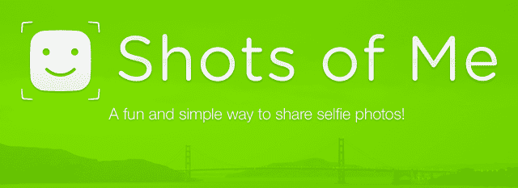
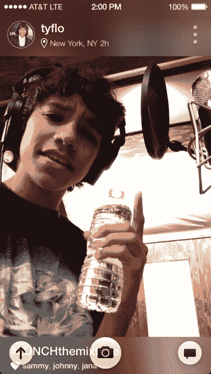
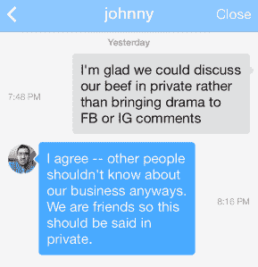

# 贾斯汀比伯支持的“我的照片”发布自拍分享应用| TechCrunch

> 原文：<https://web.archive.org/web/https://techcrunch.com/2013/11/12/justin-bieber-shots-of-me/>

日落？风景？拿铁艺术？回头看看你的旧照片，你会发现它们很无聊，除非里面有一张人脸。现在想想社交媒体上的青少年。不成熟助长了欺凌和充满戏剧性的评论卷轴。因此，RockLive 从贾斯汀比伯获得了资金，通过今天发布的自拍照片分享 iOS 应用来解决这些问题。

自拍——你自己拍的照片，通常是用前置摄像头拍的。你给我拍照的时候就是这样。自拍。将自拍分享到应用程序的 Instagram 风格的内部社交网络或 Twitter(insta gram 分享即将推出)。比如其他人的自拍。

是的，你没看错。完全是一个自拍的社交网络。前提很简单，但它隐藏了我拍摄时的工作量和细节。

“我们正在开发这些游戏，并且拥有一批优秀的年轻用户。总是高中生，”RockLive 首席执行官约翰·沙希迪告诉我。“我们咯咯地笑着说，我们知道如何向高中女生营销，所以让我们建立更大的东西，”他说。

给我拍照的想法来自 Shahidi，他看到了照片应用程序的热潮，意识到“人们喜欢看着人类。不只是你自己。人们喜欢看别人。它不会真的变老。看一杯咖啡或沙拉……”沙希迪的声音越来越小，但言外之意很明显。Instagram 是食物和无生命物体照片的家园，因为滤镜使它们看起来很有趣。但事实并非如此。人们厌倦了盯着你的午餐。

这个世界还需要另一个照片应用吗？也许不是。但是如果你暂时放下你的怀疑，多看看你朋友的笑脸可能并不是一件坏事。

## 自拍的 Instagram

RockLive 的五人团队从五月份开始制作我的照片，今天可以下载了。打开仅支持 iOS 的应用程序，你会发现一个全屏幕的自拍照，来自你拍摄的我的朋友和任何你从 Twitter 联系人中调出的人。

在一个很酷的变色龙设计技巧中，每张照片上下的名字/地点和标题/喜欢栏呈现照片的颜色，并随着你的滚动而改变。就像你透过一扇潮湿的窗户看一样。Shahidi 宣称“我们希望成为顶级产品。你花 500 美元买了一部手机。这款应用符合 iPhone 的质量吗，这感觉像是奔驰还是法拉利？”这可能是在推它，但这个应用有很多优点，比如让你选择导航浏览器的颜色。

为了执行只允许自拍的规定，你必须使用前置摄像头拍照。与 Snapchat 类似，你只能在应用程序中拍摄我的照片。不上传意味着你在新上传的我的照片中看到的情绪就是那个人现在的感受。

使我的照片在功能上独一无二的是它所缺少的:评论。“人们分享照片，因为他们在那一刻感觉如此积极，”沙希迪解释道。“戏剧扼杀了那一刻。”

如果有人取笑你的海洋照片，不管怎样。但是自拍让人变得脆弱。对你的脸的恶意评论可能真的会伤害到你，尤其是如果你是一个敏感的青少年。因此，与评论不同，Shots of Me 有一个直接的信息系统，你可以 ping 任何关注你的人，类似于 Twitter。这样的话，任何戏剧都是保密的，randos 就不能骚扰你了。

[更新:在现实世界中使用了一些之后，我发现自己真的认同这样一种观点，即与人在一起的照片更有趣。我想我可能在最后一天拍的两张死人的照片(一张[剧院天棚](https://web.archive.org/web/20230306060340/http://shots.me/joshconstine/p/y8ca53wkgclgl1u8)，一张[霸王龙雕像](https://web.archive.org/web/20230306060340/http://shots.me/joshconstine/p/t7shsuoqi6pn4p3b))配上我的傻脸要好得多。

尽管如此，我的照片还是有一些令人困扰的设计缺陷。正如你在上面看到的，导航按钮遮住了每张照片下面的标题和喜欢栏。此外，喜欢按钮太小，使它成为一个苦差事，这减少了互动和通知镜头的我需要增长。这也会导致其他喜欢自拍的人的账户被无意中点击。这些问题需要尽快解决。]

## 比伯认证印章

正是这种积极的哲学吸引了贾斯汀比伯为我拍照。这位流行歌星被介绍到了 RockLive 和我的照片，Shahidi 说“老实说，他很喜欢。他对其他平台有点恼火，“指的是贾斯汀在推特、脸书和其他社交网络上不断受到的恐同诽谤和仇恨。

评论是他真正关心的事情。不只是为了他自己，也是为了孩子们。他说‘我想要一个平台，让我的粉丝不用处理这些事情。我们没有向他要钱。他说‘我想参与其中。"

RockLive 已经从谢文·皮舍瓦、鲍克瑟·弗洛伊德·梅威瑟、苹果早期员工汤姆·麦金纳尼和 NALA 投资公司筹集了 160 万美元。NALA 已经设定条款投入更多资金，但 RockLive 在最后一刻让比伯加入，让他贡献 110 万美元第二轮的大部分资金。

这是比伯第一次公开宣布的个人投资，没有他的经纪人斯科特·布劳恩的帮助，他和他的经纪人[一起投资](https://web.archive.org/web/20230306060340/http://www.forbes.com/sites/zackomalleygreenburg/2012/05/16/biebers-business-brain-scooter-braun/)一些创业公司。沙希迪说比伯“做了很多尽职调查。他问了很多问题，还一直打电话给我。”虽然没有商业模式可以分析，但《我的镜头》只关注增长，这将是一场艰苦的战斗。

有些人无疑会说比伯没有投资科技的业务，但如果他能持续卖出数百万张唱片和大量音乐会门票，他一定有了解孩子们想要什么的诀窍。

## 一场照片应用大战

总的来说，我的照片令人耳目一新，因为每张脸都很迷人。没有拙劣的尝试在陈旧场景的巧妙照片杂乱的饲料。当然，我的照片可能会成为虚荣的载体，但这是人的本性。你可以说它会失败。你可以说它是愚蠢的。但这并不能改变人们正在以惊人的速度自拍的事实。有人会利用。有人说自拍是一种时尚，但我们已经画和拍摄肖像很久很久了。

现在的问题是，我专注于自拍的照片、无戏剧性的反馈以及比伯国家的援助是否足以在其他照片应用程序中开拓出一批观众。

最明显的是，我的照片会出现在 Instagram 及其 1.5 亿高度参与的用户身上。此外，还有忠实的脸书和 Twitter。Snapchat 已经成为分享愚蠢自拍的目的地，也许神秘的、[未推出的初创公司“自拍”](https://web.archive.org/web/20230306060340/https://techcrunch.com/2013/09/18/what-we-know-about-selfie-com/)会诱惑一些用户。

最大的威胁可能是最近推出的 [Frontback](https://web.archive.org/web/20230306060340/https://techcrunch.com/2013/10/29/buzzy-photo-app-frontback-shuns-twitter-interest-raises-millions-instead/) ，它巧妙地让你分享两张照片，其中一张正面自拍加一张背面照片，以显示你在哪里。自 8 月份推出以来，下载量已达 30 万次，获得了 300 万美元的新资金，Frontback 正在利用其独特的格式。它允许有趣的照片混搭，也禁止评论，并将引人注目的面孔与附加的上下文结合起来。击败所有这些应用将是一个严峻的挑战。

沙希迪仍然很有信心，他指出“拍一张照片已经是很大的工作量了”，而且前排的非自拍部分可能会变得陈旧，因为“人们通常每天都在做同样的事情”。如果你在办公室，办公室会有点无聊。RockLive 实际上考虑过提供双联风格，但得出的结论是“给自己拍照的机会比找出另一面要多。”

运气好的话,《我的照片》会让比伯在其应用程序上独家分享自拍，以吸引他的 4700 万 Twitter 粉丝和 5700 万脸书粉丝。如果这些人中只有 1%的人看我的照片，这可能会让我一败涂地。尽管如此，沙希迪希望他的产品能够自立。

“在 Instagram 之前，有几十个应用程序可以让你用滤镜拍照，但 Instagram 是第一个为你的过滤图片创建一个家的应用程序。你知道你会看到优雅的照片。”他希望我的照片也能为自拍带来同样的效果。“人们会喜欢通过应用程序记录自己的生活。它们是你的记忆。如果你不在照片里，那就没发生过。”

我的照片现在可以在 iOS 上免费下载。请注意，目前无法通过 iTunes App Store 搜索找到该应用程序，因此请使用[此链接](https://web.archive.org/web/20230306060340/https://itunes.apple.com/us/app/shots-of-me/id577357879?ls=1&mt=8)或 [shots.me](https://web.archive.org/web/20230306060340/http://shots.me/)