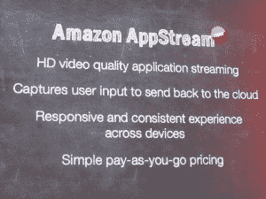
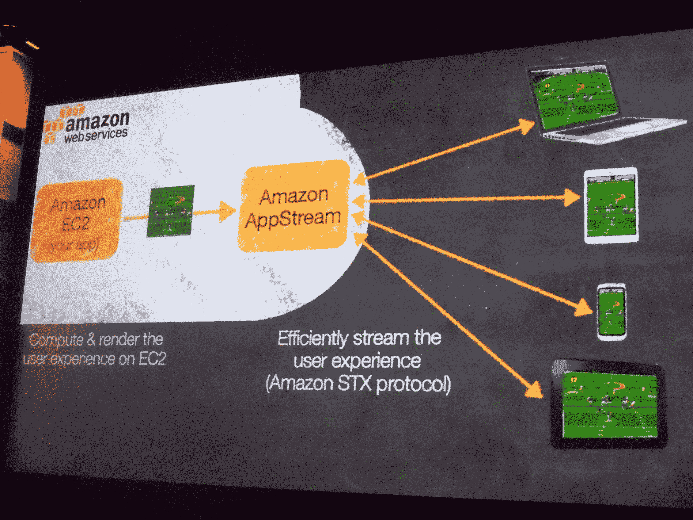

# 亚马逊新的 AppStream 服务让移动开发者可以将他们的游戏和应用从云端传输到任何设备上

> 原文：<https://web.archive.org/web/http://techcrunch.com/2013/11/13/amazon-launches-appstream-lets-mobile-developers-stream-their-apps-to-any-device/?utm_source=dlvr.it&utm_medium=twitter>

# 亚马逊新的 AppStream 服务允许移动开发者将他们的游戏和应用从云端传输到任何设备上

亚马逊今天[在拉斯维加斯的 re:Invent 开发者大会上宣布](https://web.archive.org/web/20230316041116/http://aws.typepad.com/aws/2013/11/amazon-appstream-deliver-streaming-applications-from-the-cloud.html)为移动开发者提供一项新服务。[亚马逊 AppStream](https://web.archive.org/web/20230316041116/http://aws.amazon.com/appstream/) ，使用该公司最近推出的 [g2 EC2 实例](https://web.archive.org/web/20230316041116/https://techcrunch.com/2013/11/05/amazon-launches-new-ec2-gpu-instances-for-high-performance-3d-graphics-in-the-cloud/)，允许开发者轻松地将他们的应用程序从云端高清传输到任何移动设备。亚马逊专门为移动开发者营销这项服务，但桌面应用也没有理由不能使用这项服务。

这项服务现在处于有限的预览阶段，开发者可以在这里注册进入。

亚马逊表示，这项新服务将允许开发人员“构建高保真、图形丰富的应用程序，这些应用程序可以在各种设备上运行，即时启动，并可以访问 AWS 云 的所有计算和存储资源。”

使用亚马逊 STX，一种由该公司工程师开发的新协议，开发人员现在可以直接从云传输任何内容，从复杂 3D 游戏的交互式高清视频到应用程序的计算密集型部分。使用亚马逊在 EC2 上的 g2 实例，开发者现在可以在云中渲染他们所有的图形。

使用 AppStream 的应用程序也可以使用设备的所有传感器，然后将这些数据发送回云端。

正如亚马逊网络服务副总裁 Andy Jassy 在今天的主题演讲中指出的那样，这意味着移动开发者现在可以轻松访问移动设备上无法获得的资源。他认为，随着移动设备变得越来越小，云变得更加重要。许多最受欢迎的应用程序已经运行在云之上(特别是 AWS)。该公司表示，这意味着“应用程序不受设备的计算能力、存储或图形渲染能力的限制。”